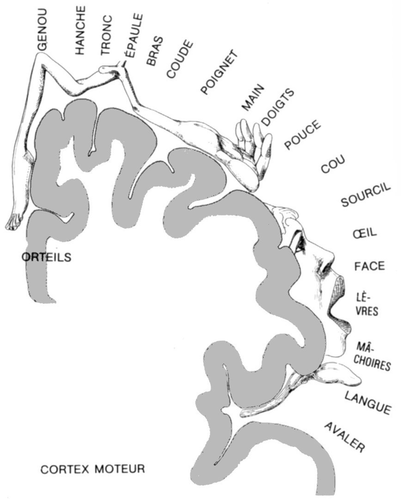
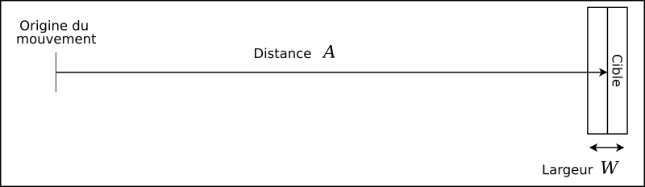
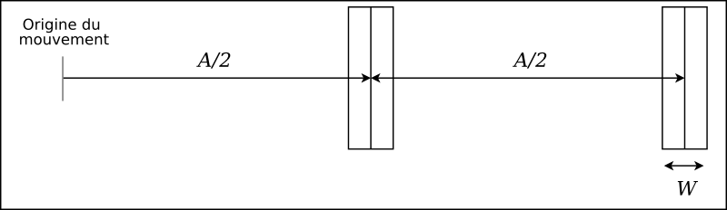
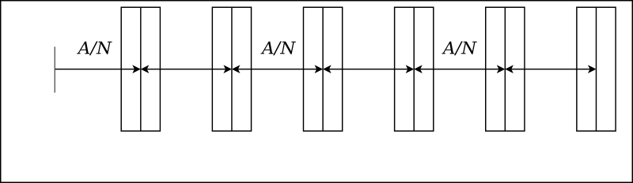

# (PART) L’homme et la machine : interactions {-}

# Le système haptique de l’homme

## Introduction

### Nos sens et la perception du monde

Avant d’aborder plus spécifiquement le sujet qui nous intéresse, nous
 allons passer en revue quelques classifications des systèmes de la perception
 humaine.

Il est d’usage de parler des cinq sens : la vue, l’ouïe, l’odorat, le goût
 et le toucher. Cette classification constitue une première approche de la
 perception du monde qui nous entoure ; comme nous allons le voir, la
 perception est bien plus complexe.

Pour commencer, j’ai choisi de citer le résultat d’une étude en
 psychologie [@turbiaux1996richelle] qui a abordé
 le problème de la perception des informations. Selon cette étude, ces
 dernières sont perçues par un sujet voyant à:

* 83 % par la vision ;
* 11% par l’audition ;
* 3,5% par l’odorat ;
* 1,5% par le toucher ;
* et 1% par le goût.

Pour autant, il faut rester prudent avec une telle approche. En effet, la
 perception *peut* être segmentée en cinq sens. Pourtant, le
 tableau \@ref(tab:perception) présente une classification
 des sensations. Il s’agit de la classification de Sherrington
 (1857-1952).

Table: (\#tab:perception) Classification des sensations de Sherrington
 [@calas2016precis]

|                                                                      |                                                                                             |                                                                                                                                                                                                    |
|----------------------------------------------------------------------|---------------------------------------------------------------------------------------------|----------------------------------------------------------------------------------------------------------------------------------------------------------------------------------------------------|
| **les extérocepteurs :** nous renseignent sur le monde extérieur     | **télérécepteurs :** perception à distance                                                  | récepteurs visuels                                                                                                                                                                                 |
|                                                                      |                                                                                             | récepteurs auditifs                                                                                                                                                                                |
|                                                                      |                                                                                             | récepteurs olfactifs                                                                                                                                                                               |
|                                                                      | **récepteurs de contact**                                                                   | récepteurs gustatifs                                                                                                                                                                               |
|                                                                      |                                                                                             | récepteurs cutanés du toucher                                                                                                                                                                      |
| **les intérocepteurs :** nous renseignent sur notre propre organisme | **viscérocepteurs :** disséminés dans les viscères                                          | nous renseignent sur un paramètre physiologique interne (la douleur par exemple)                                                                                                                   |
|                                                                      | **propriocepteurs :** regroupés (oreille interne) ou disséminés (fuseaux neuro-musculaires) | nous renseignent sur un paramètre lié au travail de relation : l’état de tension des muscles, sur la position relative des différentes parties du corps, et sur la position du corps dans l’espace |

Étudions plus précisément tout ce vocabulaire...

**La sensibilité intéroceptive :**

Elle comprend toutes les sensations qui viennent
 de l’estomac, de l’intestin. S’y ajoutent les sensations viscérales, ainsi
 que cette sensibilité générale du corps qu’on appelle la coenesthésie
 (sensations d’aise ou de malaise).

**La sensibilité proprioceptive :**

Celle qui nous renseigne sur les positions, attitudes, mouvements de
 notre corps et de nos membres. Cette sensibilité comprend :

1. le sens kinésique ou kinesthésique : il nous
 renseigne sur nos mouvements proprement dits (déplacements de nos
 membres et de notre corps dans l’espace) ;
2. le sens statique ou vestibulaire : sens qui a
 son organe dans l’oreille interne et qui nous donne le sens de la
 verticalité, des mouvements de rotation et de translation ; il préside à
 l’équilibration générale du corps.

**La sensibilité extéroceptive :**

 Elle nous informe sur les objets extérieurs. Les psychologues
 distinguaient les sens impressionnables par contact direct et les sens
 qui sont impressionnables à distance.

 1. Les sens impressionnables par contact direct :
	1. Les sensibilités cutanées : le toucher qui
	 suppose un contact direct avec l’objet à percevoir
		* le tact,
		* les sensations thermiques,
		* la douleur.
	2. Les sens chimiques : le goût et l’odorat
	 liés aux fonctions de nutrition.
2. Les sens impressionnables à distance : Ces sens
 sont plus indépendants du milieu extérieur que ceux qui exigent le
 contact direct. L’ouïe et la vue apportent à l’être vivant des messages
 lointains qui lui permettent une adaptation anticipée de son
 comportement.

Pour [@berthoz1997sens], « la
 perception n’est pas seulement une interprétation des messages sensoriels.
 Elle est également contrainte par l’action, simulation interne de l’action,
 jugement et prise de décision et anticipation des conséquences de l’action :
 il y a filtrage des informations données par les sens en fonction de ses
 projets propres. Un très grand nombre de mouvements exigent une anticipation
 ou une extrapolation fondée sur une estimation utilisant les expériences
 antérieures (rôle de la mémoire). »

Tout ceci nous donne une vision peu évidente de la perception. Et il n’est
 pas question ici d’aborder le côté philosophique de la question.

>
>  « Percevoir, c’est se rendre quelque chose de présent à l’aide du corps »
>
>
> Merleau-Ponty
>

Pour finir cette partie d’introduction, précisons que toutes les
 connaissances qui se rapportent au corps, évoluent en fonction des avancées
 de la compréhension des mécanismes mis en œuvre.

Nous allons tenter, dans ce qui suit, de définir la terminologie utilisée
 lorsqu’il est question d’interaction haptique.

### Première approche du système haptique

>
>  Our knowledge of touch consists of only fragmentary concepts and findings,
>  some dealing with basic functional properties (e.g., cutaneous sensitivity,
>  limits of kinaesthetic space perception) and others with capabilities of
>  the systems as a whole (e.g., the identification of three-dimensional
>  objects)
>
>
> [@loomis1986tactual], cité par
>  [@colwell2001non]
>

Tout d’abord, un petit peu d’étymologie. Le mot haptique vient du grec
 *haptestai* signifiant « toucher », et
 est originalement synonyme au sens tactile.

D’après [@appelle2013haptic], ce serait le
 psychologue [@revesz1950psychology] qui aurait le
 premier utilisé le terme haptique pour désigner le système
 tactilo-kinesthésique de la main, c’est à dire la synthèse

1. des perceptions des systèmes sensoriels de la
 main
1. et des mouvements d’exploration de la main.

Plus tard, pour [(Loomis et Lederman,
 1986)](047-bibliographie.html#Loomis1986), la perception haptique était celle qui impliquait les sens cutanés
 et kinesthésiques pour transmettre l’information sur un objet ou sur un
 évènement. Ils n’ont cependant pas restreint cette définition à la main. La
 sensation de la texture de la nourriture dans la bouche apparaît donc comme
 une partie de la perception haptique, au sens de Loomis et Lerdeman.

Une autre définition est celle de [(Gibson,
 1966)](047-bibliographie.html#Gibson1966) (toujours cité par [(Appelle,
 1991)](047-bibliographie.html#Appelle1991)). Pour lui, la pression, la force, la stimulation de la peau,
 l’activité des muscles, des articulations et des tendons étaient mises en
 œuvre lors de la manipulation d’objets. Pour Gibson, le système haptique
 inclue plusieurs sous-systèmes :

* Le toucher cutané: une stimulation de la peau sans
 mouvements des muscles ou des articulations.
* Le toucher haptique : une stimulation de la peau avec
 des mouvements des articulations.
* Le toucher dynamique : une stimulation de la peau
 avec des mouvements des articulations et des muscles.
* Le toucher orienté: une stimulation de la peau avec
 une stimulation vestibulaire ^[relatif notamment au sens de l’équilibre].

[@appelle2013haptic] a très justement noté
 que la prolifération des termes et des définitions liés à la perception
 haptique, indique que la compréhension dans ce domaine n’en est toujours qu’à
 ces débuts. Il est également fréquent de trouver des définitions
 contradictoires entre plusieurs recueils.

Dans ce chapitre et dans la suite de cette thèse, nous retiendrons la
 définition actuellement admise, à savoir :

le terme haptique
 se réfère à la combinaison :

1. [du système perceptif lié au toucher et à la
 kinesthésie](#somesthesie),
1. [et des mouvements d’exploration](#moteur).

## Le système haptique côté perception : la somesthésie {#somesthesie}

La somesthésie est liée à l’ensemble des sensibilités cutanées et
 internes. Elle est composé par :

* **le sens tactile**: il est relayé par
 les récepteurs sensoriels situés sous l’épiderme, et dont on relève la plus
 grande densité dans la main. Ces récepteurs relaient « le contact
 initial avec l’environnement », et permettent d’en appréhender la
 géométrie détaillée de la surface, la rugosité, la température (toujours de
 surface).
* **le sens kinesthésique**: du grec
 *kinêsin* signifiant « se mouvoir » et
 *aisthêsis* signifiant sensation , il se réfère à
 la kinesthésie, la sensation interne du mouvement des parties du corps
 assurée par le sens musculaire (sensibilité profonde des muscles) et par
 les excitations de l’oreille interne [Le Petit Robert]. Ce sens permet de
 connaître l’effort que font nos muscles par exemple lorsque nous soulevons
 (poids) ou lorsque nous poussons (résistance) un objet.

### La perception tactile

Les récepteurs physiologiques de la perception tactile se trouvent dans la
 peau \@ref(fig:Structure-de-la). La bande passante
 du sens tactile (c’est à dire la fréquence à laquelle les stimuli tactiles
 sont perçus) et de 0 à 400 Hz ([Shimoga,
 1992](047-bibliographie.html#Shimoga1992)). Elle peut cependant monter à des très hautes fréquences situées
 entre 5000 à 10000 Hz dans le cas de la reconnaissance de textures à très
 petits détails.

![(#fig:Structure-de-la) Structure de la
 peau (emprunté à [@reznik1996structure])](img/peau.png)

Nous pouvons distinguer 3 natures de récepteurs tactiles :

* les thermorécepteurs : liés aux sensations de chaud et de froid ;
* les nocirécepteurs : liés à la sensation de douleur ;
* les mécanorécepteurs : liés à la discrimination tactile.

On distingue 4 types de mécanorécepteurs [@cholewiak2013sensory],
[@kalawsky1993science], [@seow1988physiology] ; Il sont présentés dans le
 tableau \@ref(tab:tactile).

Table: (\#tab:tactile) Principaux récepteurs tactiles [@burdea1996force]

| Type de récepteur       | Taux d’adaptation | Fréquences des stimuli | Zone réceptrice      | Fonction                       | Sensibilité à la température |
|-------------------------|-------------------|------------------------|----------------------|--------------------------------|------------------------------|
| Disques de Merckel      | Lent              | 0-10 Hz                | Petite, bien définie | Pression localisée             | oui                          |
| Corpuscules de Ruffini  | Lent              | 0-10 Hz                | Grande, indéfinie    | Pression, étirement de la peau | oui, si >100Hz               |
| Corpuscules de Meissner | Rapide            | 20-50 Hz               | Petite, bien définie | Tact, vitesse                  | non                          |
| Corpuscules de Pacini   | Rapide            | 100-300 Hz             | Grande, indéfinie    | Vibration, accélération        | oui                          |

Tous ces récepteurs sont donc situés dans la peau, mais dans des
 concentrations différentes selon les endroits du corps.

On désigne par *homoncule* ou *homonculus* la représentation de notre propre corps à
 l’intérieur de notre cerveau. Mais comme les différentes parties de notre
 corps n’ont pas toutes la même importance pour notre cerveau, certaines
 prennent beaucoup de place et d’autres très peu. Par exemple, nos mains qui
 sont très utiles et capables de manipuler de très petits objets prennent
 beaucoup plus de place que nos jambes.

La perception sensitive donnée au niveau de la peau peut être ainsi
 représentée grâce à un homonculus (figures \@ref(fig:homa) et \@ref(fig:homb)).

Historiquement, c’est grâce au compas de Weber, formé de deux pointes
 sèches, qu’en 1835 il a été possible de déterminer l’acuité tactile
 individuelle comme étant la plus petite distance entre deux contacts
 simultanés perçus comme distincts. Les premiers homonculi ont été tracés à
 cette époque. Des études plus récentes ont montré des seuils de précision sur
 le sens tactile :

* Discrimination entre deux points de contact avec la
 peau : de 1 à 2,5mm.
* Seuil de détection d’une force : 63mg
* Seuil de perception d’un déplacement statique : 11,2
 µm

### La perception kinesthésique

Le sens kinesthésique intègre les informations sur les positions, les
 mouvements et les forces appliqués sur ou par le corps. Il est relayé par des
 récepteurs situés dans les tendons musculaires au niveau des articulations,
 ainsi que dans l’oreille interne. La bande passante de ces récepteurs est
 plus basse que ceux de la perception tactile soit de 20 à 30 Hz. Enfin, il
 s’appuie sur une utilisation de l’effet de mémoire des gestes.

La perception kinesthésique est composé par :

* **Le sens proprioceptif**: relatif aux
 stimuli se produisant dans l’organisme. Il fournit l’information liée à la
 position du corps, et est basé sur les récepteurs situés dans les tendons
 entres les muscles et les os, dans l’oreille interne, et sur les impulsions
 du système nerveux par effet de mémoire. C’est précisément ce sens qui nous
 donne la capacité de connaître la configuration de notre corps dans
 l’espace sans avoir à le regarder.
* **le sens extéroceptif**: relatif aux stimuli
 issus de phénomènes extérieurs aux corps humain. Par exemple, appréhender
 le poids, la forme ou la raideur d’un objet que l’on est en train de
 manipuler.

**Remarques :**

1. on trouve parfois dans la littérature la
 perception tactilo-proprio-kinesthésique pour désigner la perception
 haptique.
2. Nous considérerons par la suite, comme souvent
 dans la littérature, que le sens kinesthésique englobe le sens
 proprioceptif. En effet, d’après le Larousse, la proprioception se dit de
 la sensibilité du système nerveux aux informations sur les postures et les
 mouvements, venant des muscles et des articulations . Les trois domaines
 liés à la proprioception sont les sensibilités à la position dans l’espace,
 au mouvement du corps et aux forces exercées sur les muscles. Les deux
 premiers domaines correspondent au sens kinesthésique [@fuchs2006traite].

### En résumé

La perception des signaux spatiaux dépend de la fréquence du signal. La
 distinction entre "forme" et "texture" est liée aux caractéristiques des sens
 kinesthésiques et tactiles. La figure \@ref(fig:Le-spectre-de) illustre la
 notion de perception haptique, en terme de fréquence des stimuli.

![(#fig:Le-spectre-de)Le spectre de la perception haptique
 [@wall2004investigation]](img/hapticSpectrum.png)

## Le système haptique côté action : le système moteur {#moteur}

Nous allons maintenant présenter l’autre côté du système haptique tel que
 nous le considérons. La partie @\ref(somesthesie) concernait le sous-système
 perceptif. Ici, c’est donc le sous-système moteur qui va nous intéresser.

Et pour tenter de garder une cohérence lors de la présentation d’un
 système très complexe, nous allons découper le discours en plusieurs parties,
 depuis les définitions psychophysiques de bas-niveau, en remontant les
 abstractions, vers les définitions de l’aboutissement de l’exécution du
 système moteur : le mouvement, puis le geste.

### Un petit peu de psychophysique

Petit rappel de la définition du système haptique : il s’agit de la
 combinaison

1. du système perceptif lié au toucher et à la
 kinesthésie (vu en \@ref(somesthesie)),
1. et des mouvements d’exploration.

Cette combinaison confère au système haptique une propriété unique : un
 même système nous permet de connaître notre environnement (sous-système
 perceptif de la kinesthésie et du toucher), et d’agir sur lui (les mouvements
 d’exploration).

L’objet de cette partie est de donner quelques notions sur le sens du
 mouvement, lui-même lié au système moteur.

Le système moteur permet de contrôler la position du corps ainsi que les
 forces à mettre en jeu lors de l’interaction avec le monde extérieur.

Pour le définir un peu plus précisément, les bandes passantes relatives au
 système moteur vont suivre. La bande passante d’un système est la vitesse à
 laquelle nous répondons aux stimuli par une action. Elle s’exprime en Hertz
 (Hz), car nous parlons ici de fréquence ; pour obtenir le temps de réaction,
 il faut prendre l’inverse.

Pour le système moteur, la bande passante oscille selon les situations
 entre 1 et 10 Hz [@casiez2004contribution]:

* réponse à des signaux déstabilisant : entre 1 et 2 Hz
 (0,5 à 1s)
* réponse à des signaux périodiques : entre 2 et 5 Hz
 (0,2 à 0,5s)
* réponse à des trajectoires apprises : 5 Hz
 (0,2s)
* réponse de type réflexe : 10 Hz (0,1s)

Pour donner un ordre d’idée sur l’intensité des forces mises en œuvre,
 elles sont de l’ordre de 44N au niveau des articulations des doigts et de
 102N au niveau de l’épaule pour un homme.

De manière similaire à ce que l’on a pour la perception tactile, il a été
 possible de tracer un homonculus sur le système moteur humain
 (figure \@ref(fig:hom2)).

Toujours de manière parallèle à ce que l’on a observé pour la perception
 tactile, il faudra tenir compte des capacités physiologiques du système
 moteur lors de la conception de méthodes d’interaction haptique, et lors du
 choix et de la position d’utilisation des périphériques.

Notre discours va à présent s’élever d’un cran, en terme d’abstraction du
 système moteur : après la psychophysique, nous abordons le concept de
 mouvement, au travers de ses modélisations mathématiques.

### Les lois mathématiques liées au mouvement

La conséquence extérieure de la mise en action du système moteur, c’est le
 mouvement. Il n’est pas question ici de traiter en profondeur du mouvement,
 car il faudrait une thèse entière.

Nous survolons ici quelques lois mathématiques qui tendent à modéliser le
 mouvement. La loi de Fitts donne ainsi le temps nécessaire pour un geste de
 pointage ; la loi d’Accot précise le temps lorsque la tâche est plus
 spécifiquement un suivi de trajectoires ; la loi de puissance 2/3 et la loi de
 jerk minimal tendent à modéliser les trajectoires des gestes. Enfin, le
 modèle d’impulsion initiale modélise plus spécifiquement le geste de
 pointage.

#### La loi de Fitts {#fitts}

En 1954, Fitts a empiriquement développé un prédicteur quantitatif donnant
 le temps nécessaire pour effectuer une tâche de type “ acquisition et
 pointage d’une cible” [@fitts1954information]. Il a
 présenté le rapport suivant, connu sous le nom de loi de Fitts.

Le temps du mouvement *MT* requis pour
 sélectionner une cible de taille *W* situé à une
 distance *A* est :

\begin{equation}
 MT=a+b\log\_{2}(2A/W)\label{eq:fitts}
 (\#eq:fitts)
\end{equation}

 où *a* et *b* sont des
 constantes déterminées empiriquement. Le logarithme \(\log\_{2}(2A/W)\)
 représente l’indice de difficulté (*ID*) de la
 tâche et est exprimé en bits (sa base est 2). Plus élevée est la valeur de
 *ID* et plus difficile est la tâche. Si
 *MT* est exprimé en seconde, la constante
 *a* sera exprimée en seconde et *b* en seconde/bit. L’inverse de *b*
 (soit 1/*b*) est l’indice de performance
 (*IP*) et est exprimé en bit/seconde.

La figure \@ref(fig:LexperiencedeFitts) illustre
 l’expérience qui a permis à Fitts d’établir sa loi. La tâche que devaient
 accomplir les sujets était la suivante. Initialement, la main est placée à
 l’origine du mouvement ; alors, le sujet doit aller le plus vite possible
 toucher une cible distante de *A*cm et large de
 *W*cm.

La formulation originale de la loi de Fitts \@ref(eq:fitts) s’avère
 cependant inexacte pour les faibles valeur de l’*ID* (< 3bits), montrant une courbure de *MT* au dessus de la droite de régression linéaire. Une autre
 formulation, proposée en 1960 par Welford [@welford1960measurement], permet de corriger cet
 effet :

\begin{equation}
 MT=a+b\log\_{2}(A/W+0.5)
\end{equation}

 Enfin, en 1992, MacKenzie ([MacKenzie,
 1992](047-bibliographie.html#MacKenzie92)) a également proposé sa propre formulation :

\begin{equation}
 MT=a+b\log\_{2}(A/W+1)
 (\#eq:shannon)
\end{equation}

 Ces différentes équations ne diffèrent que par la formulation de
 l’*ID*. L’équation \@ref(eq:shannon), connue
 comme formulation de Shannon, est préférée pour les raisons suivantes
 [@mackenzie1992fitts] :

* elle s’ajuste un peu mieux aux observations,
* elle imite exactement le théorème de Shannon,
 sous-jacent à la loi du Fitts, et
* elle donne toujours un nombre positif pour l’indice
 de difficulté de la tâche.

Enfin, on peut citer quelques extensions à la loi de Fitts. En effet,
 cette loi ne concerne que les gestes allant d’un point à un autre en une
 seule fois. Mathématiquement, on peut déduire la formulation pour un geste
 effectué en deux parties (figure \@ref(fig:Tachepour2)),

auxquels cas, la formulation de l’indice de difficulté *ID* sera :

\[ ID\_{2}=2log\_{2}\left(\frac{A}{2W}+1\right)\]

et pour n parties (figure \@ref(fig:Tachepourn)):

où on aura :

\[ ID\_{N}=Nlog\_{2}\left(\frac{A}{NW}+1\right)\]

#### La loi d’Accot

La loi d’Accot ou *steering law* [@accot1997beyond] est beaucoup plus récente, et
 est utilisée pour les mouvements de suivis de chemin. L’application typique
 de cette loi est l’estimation du temps de sélection d’un item dans un menu
 déroulant à plusieurs niveaux (figure \@ref(fig:Lecheminemprunte)).

La loi s’exprime ainsi :

\begin{equation}
 T\_{c}=a+b\int\_{C}\frac{ds}{W(s)}
 (\#eq:accot)
\end{equation}

 où *T* est le temps moyen pour suivre le chemin,
 *C* est le chemin paramétré par *s*, *W*(*s*) est la largeur du chemin à l’abscisse curviligne
 *s*, et *a* et
 *b* sont des constantes empiriques. Dans le cas
 général, le chemin est complexe, avec une largeur *W*(*s*) variable.

Des chemins plus simples permettent des simplifications mathématiques. Par
 exemple, si le chemin est un tunnel droit avec une largeur *W* constante,
 l’équation \@ref(eq:accot) devient :

\[
 T=a+b\frac{A}{W}\]

 où *A* est la longueur du chemin. On peut
 observer une certaine similarité avec la loi de Fitts.

Il est également possible de dériver les deux côtés de l’équation
 \@ref(eq:accot) selon la variable *s*, et obtenir
 la formulation locale, ou instantanée de la loi :

\[
 \frac{ds}{dT}=\frac{W(s)}{b}\]

 qui dit que la vitesse instantanée est proportionnelle à la largeur du
 tunnel. Ceci parait logique si l’on considère l’analogie avec la conduite
 d’une voiture sur une route : plus la route est large, plus on peut
 ^[même si l’on ne doit pas, ceci restant une expérience de pensée]
 conduire vite, même s’il y a des virages.

#### La loi de puissance 2/3

Tout tracé curviligne peut être décomposé en parties dont chacune possède
 un rayon de courbure propre et est dessinée à une certaine vitesse
 tangentielle. L’analyse des mouvements d’écriture et de dessin a montré que
 la vitesse augmentait dans les parties les moins courbées de la trace et
 diminuait dans les parties les plus courbées. Malgré la variété de
 possibilités de moduler la vitesse d’exécution d’une lettre ou d’un trait,
 tous respectent une règle simple liant la vitesse tangentielle et le rayon de
 courbure de la trace suivant une loi de puissance de 2/3 [@lacquaniti1983law]. Cette
 covariation a donné lieu à une modélisation mathématique, telle que :

\[
 V(t)=kR(t)^{\beta}\]

 où *V* est la vitesse tangentielle, *R* le rayon de courbure et *k* une
 constante appelée gain de vitesse.

En d’autres mots, quand on tourne beaucoup, on va moins vite . On retrouve
 ici la même affirmation que la loi d’Accot (voir par :La-loi-d’Accot). Il
 s’agit des mêmes phénomènes.

Il a été montré que la valeur de l’exposant β était constante et fixée à
 une valeur de 1/3. La force de cette relation a été de montrer que la valeur
 de cet exposant β pouvait être retrouvée dans des conditions variées
 d’exécution (par exemple, différentes amplitudes du mouvement ; voir [@viviani1995minimum]). Ces auteurs ont alors
 postulé que cet invariant reflétait la planification et la programmation du
 mouvement en référence à une représentation

#### Loi de jerk minimal {#jerk}

Connaissant le point de départ d’un geste, le point d’arrivée, et la durée
 du geste, quelle est l’équation du geste ? Comment s’assurer que ce geste
 minimisera les efforts déployés (au moins au niveau de la trajectoire, de
 l’évolution de la vitesse) ?

La loi de jerk minimal a été proposée par [@flash1985coordination]. Elle tend à exprimer
 mathématiquement la trajectoire de la main (ou de tout autre extrémité du
 corps) la plus douce possible.

Pour ce faire, les auteurs ont montré que la douceur d’une trajectoire
 pouvait d’exprimer en fonction du jerk, c’est à dire la dérivée de
 l’accélération, ou encore la dérivée 3ème de la
 position.

Si on note *x*(*t*) la
 position d’un système, alors le jerk de ce système sera :

\[
 \dddot{x}(t)=\frac{d^{3}x(t)}{dt^{3}}\]

 La trajectoire optimale (au sens de la douceur ) doit alors minimiser le
 carré du jerk tout au long de la trajectoire. Mathématiquement, il s’agit de
 minimiser la grandeur :

\[
 H(x(t))=\frac{1}{2}\int\_{t=0}^{T}\dddot{x}^{2}dt\]

 où *T* est la durée de la trajectoire.

Après un calcul de variation, il s’ensuit que la trajectoire minimisant le
 jerk et allant d’un point $x_i$ à un point $x_f$ en $d$ secondes aura pour
 équation :

\begin{equation}
 x(t)=x\_{i}+\left(x\_{f}-x\_{i}\right)\left(10\left(\frac{t}{d}\right)^{3}-15\left(\frac{t}{d}\right)^{4}+6\left(\frac{t}{d}\right)^{5}\right)
 (\#eq:jerk)
\end{equation}

 Par exemple, la trajectoire pour une geste de 10cm durant 0,5sec
 sera :

\[ x(t)=800t³-2400t^{4}+1920t^{5},\quad0\leq t\leq0,5sec\]

 La figure \@ref(fig:Positionvitesseacceleration)
 trace cette fonction, ainsi que ses trois premières dérivées : vitesse,
 accélération et jerk. La forme en cloche de la courbe de la vitesse
 ẋ(*t*) est typique du principe de minimisation du
 jerk.

[@flash1985coordination] ont prouvé qu’en
 deux dimensions ou plus, l’équation \@ref(eq:jerk) décrivait la trajectoire
 assurant le jerk minimum pour chaque dimension. Par exemple, pour un
 mouvement en deux dimensions, la fonction à minimiser sera :

\[
 H\left(\underline{x}(t)\right)=\frac{1}{2}\int\_{t=0}^{T}\left(\dddot{x}^{2}+\dddot{y}^{2}\right)dt\]

 et la trajectoire en deux dimensions aura pour
 équation :

\begin{equation} \underline{x}(t)=\left[\begin{array}{cc} x(t)
 &
 =x\_{i}+\left(x\_{f}-x\_{i}\right)\left(10\left(\frac{t}{d}\right)^{3}-15\left(\frac{t}{d}\right)^{4}+6\left(\frac{t}{d}\right)^{5}\right)\\
 y(t) &
 =y\_{i}+\left(y\_{f}-y\_{i}\right)\left(10\left(\frac{t}{d}\right)^{3}-15\left(\frac{t}{d}\right)^{4}+6\left(\frac{t}{d}\right)^{5}\right)\end{array}\right]
 (\#eq:jerk2)
\end{equation}

 L’équation \@ref(eq:jerk2) implique qu’une trajectoire minimisant le jerk
 en deux dimensions sera toujours un segment de droite.

#### Le modèle d’impulsion initiale

Le modèle le plus satisfaisant quant à la modélisation des gestes, et
 notamment les gestes de pointages, a été proposé par [@meyer1988optimality]. C’est le modèle
 d’impulsion initiale. D’une manière algorithmique, le processus d’une tâche
 d’acquisition s’exprime ainsi :

1. Un mouvement initial est effectué pour atteindre
 la cible ;
2. Tant que le mouvement n’atteint pas la cible,
 faire
	1. refaire un mouvement pour atteindre la
	 cible

Le processus continue jusqu’à ce que la cible soit atteinte. L’objectif de
 la tâche étant d’atteindre la cible le plus vite possible, dans le cas idéal,
 le sujet touche la cible en un seul mouvement. Dans la réalité, cependant, la
 précision d’un tel geste sera très faible.

![(#fig:impulsion)Modèle d’impulsion
 initiale optimisée [@meyer1988optimality]](img/meyer.png)

Il a été montré [@meyer1988optimality] [@rosenbaum1991optimal] que la
 déviation standard *S* entre la fin du premier
 mouvement et la cible augmentait avec la distance *D* et diminuait avec la durée du mouvement *T*, selon la loi :

\[ S=k\left(\frac{D}{T}\right)\]

 où *k* est une constante.

Ceci signifie qu’un mouvement sur une longue distance, exécuté pendant un
 court laps de temps, est possible, mais aura une déviation standard élevée,
 soit une faible probabilité d’atteindre la cible. De manière similaire, une
 série de petits mouvements lents atteindrait très certainement la cible, mais
 le temps total serait extrêmement long.

La solution mathématique au problème consiste à jouer sur *D* et *T* de manière à minimiser le
 temps total [@rosenbaum1991optimal]. Dans
 les faits, le mouvement optimal consiste en un premier mouvement de grande
 amplitude et rapide, qui nous amène aussi proche que raisonnablement possible
 de la cible ; suivi par un ou plusieurs petits gestes correctifs, et plus
 lents, qui se trouvent être dans les possibilités du système de contrôle
 moteur.

Nous en terminons ici pour les aspects mathématiques du mouvement, et nous
 allons reprendre notre ascension des niveaux d’abstraction du système moteur
 : nous allons parler des gestes.

### Le geste : définitions {#définitions}

>
> **Geste :**Mouvement du corps
>  (principalement des mains, des bras et de la tête) volontaires
>  ou non, révélant un état psychologique, ou visant à exécuter
>  quelque chose.
>  Le Petit Robert - 2001
>

L’ACROE (Association pour la Création et la Recherche sur les Outils
 d’Expression) s’est intéressée au geste en le segmentant de la manière
 suivante :

1. Caractérisation quantitative de l’activité
 gestuelle :

**Geste digital (Poignet fixe) :**
c’est le geste du sculpteur, du pianiste, du
 violoniste, du dentiste. Il se caractérise par de petits déplacements
 (3 cm), des précisions élevées (2 mm, 10 mN), des forces élevées (80
 N) ;

**Geste de transport local (Coude fixe) :**
c’est le geste de positionnement de
 proximité par déplacement de l’avant bras sur environ 30 cm avec des
 précisions en force et en position assez faibles (0,5 cm, 10 N) ;

**Geste de déplacement large (Épaule fixe, ou hanche fixe ou libre) :**
c’est un geste d’approche de faible
 précision (5 cm, 100 N) par déplacement du bras ou du corps à partir de
 60 cm.
2. Caractérisation qualitative et fonctionnelle de
 l’activité gestuelle [@cadoz1994realites]:

**une fonction épistémique :**
le geste sert à connaître (un matériau, une
 surface, ...) et est relative au retour tactile ou haptique (activation
 du sens tactilo-kinesthésique) ;

**une fonction ergotique :**
le geste sert à déplacer, modifier,
 construire des objets matériels ; Le geste est lié à la manipulation
 directe du monde physique ;

**une fonction sémiotique :**
le geste sert à faire connaître : désigner,
 communiquer ; le geste véhicule une information (qui peut résulter de
 l’expérience culturelle).

La fonction sémiotique du geste a vu ses caractéristiques précisée par
 McNeill [@McNeill92]. Ainsi, un geste
 sémiotique peut être :

**Iconique :**
le geste est parallèle à un discours
 concret ;

**Métaphorique :**
le geste est parallèle à un discours
 abstrait ;

**Déictique :**
c’est un geste de pointage ou de sélection ; ces
 gestes ont reçu beaucoup d’attention car ils correspondent aux principales
 tâches sur les systèmes interactifs actuels.

**bâton :**
le geste est un battement rythmique.

>
>  Dans cette thèse, nous nous intéressons à la
>  fonction épistémique de l’activité gestuelle, ainsi qu’à la fonction
>  déictique. En effet, la première est relative au retour haptique, et la
>  deuxième aux gestes de pointage.
>

## L’exploration haptique : quand l’action et la perception se conjuguent sur le canal haptique {#conjuguent}

 Dans cette
 partie, nous allons nous intéresser à la fusion des capacités de perception
 **et** d’action du système haptique. Dans la littérature, il est alors
 souvent question d’exploration haptique, ou encore de processus
 exploratoires.

### Généralités

Le processus d’exploration haptique met en œuvre plusieurs sous-processus
 distincts.

**Petit exemple :**
pour déterminer la dureté d’un objet, nous
 pouvons appliquer une force normale à sa surface, ou bien malaxer l’objet
 dans la paume de la main si sa taille le permet. Une telle procédure
 provoquerait un flux d’informations supplémentaires, concernant la
 température, les capacités de conduction calorifique de l’objet, ainsi que
 la texture en surface de l’objet, précisément là ou la pression a été
 effectuée. De plus, si l’information obtenue est jugée insuffisante (pour
 la reconnaissance de l’objet, ou bien pour l’accomplissement d’une tâche),
 d’autres processus d’exploration peuvent être lancés.

Les sous systèmes concernés par une tâche d’exploration haptique sont :

* le système cognitif,
* les fonctions de prise de décisions,
* le système moteur,
* et les sensations psychophysiques issues de
 l’interaction avec les objets.

[@loomis1986tactual] et [@lederman1987haptic] ont proposé que le
 système haptique pourrait être composée de deux sous systèmes. Le système
 sensoriel, et le système moteur. Selon leur interprétation, le système moteur
 sert à augmenter les performances du système sensoriel, en optimisant
 l’efficacité de l’exploration haptique des objets. Dans cette vision des
 phénomènes, il est possible de concevoir le processus haptique comme la mise
 en œuvre de fonctions haptiques de haut niveau (fonctions cognitives), et de
 fonctions haptiques de bas niveau (fonctions psychophysiques). Les fonctions
 haptiques de haut niveau seraient amenées à diriger les fonctions haptiques
 de bas niveau ; mais pas uniquement.

**exemple :**
si l’on décide d’aller extraire une information
 de surface d’un objet, cela aura pour conséquences l’exécution d’une
 procédure exploratoire (optimale pour cette information), qui se
 manifestera par une série de mouvements de la main. L’interaction entre la
 surface de l’objet et la peau lancera la stimulation des sens haptiques,
 provoquant la perception de l’information recherchée, et par conséquent, un
 modèle mental concernant la nature la surface de l’objet, se forme.

Une telle opération de haut en bas se produit quand un observateur est
 dirigé vers la recherche d’une information particulière d’un objet.
 Cependant, l’exploration haptique peut être dirigée de bas en haut . Dans
 l’exemple précédent, et suivant les informations perceptuelles induites par
 l’exploration, l’opérateur peut être conduit à explorer plus loin pour
 trouver d’autres informations, qu’il ne cherchait pas nécessairement au
 départ.

Ainsi, la stimulation des mécanorécepteurs provoque une réponse neurale
 qui dicte l’exploration suivante. C’est la boucle comportementale [@taylor1973tactual].

La figure \@ref(fig:actionHaptique) illustre les boucles
 de rétroaction se produisant lors de l’exploration haptique. Dans la
 littérature, l’ensemble de ses boucles, ramené à la dualité de fonctionnement
 du système (de haut en bas / de bas en haut ) a mené aux notions du contact
 actif et passif . Ainsi, pendant le contact actif, un opérateur exécute
 l’exploration haptique sans contrainte, déplaçant la main en contact avec un
 objet. Réciproquement, pendant le contact passif, la main de l’explorateur
 demeure stationnaire, alors que l’objet est déplacé en contact avec la
 peau.

![(#fig:actionHaptique)Schéma de la perception/action haptique
(d’après [@wall2004investigation])](img/bouclesPerception.png)

Initialement, ces concepts étaient mutuellement exclusifs (Gibson, 1962).
 Pourtant, [@lederman1972fingertip]
 ont proposé que les concepts d’actif et de passif ne constituaient pas
 nécessairement une dichotomie, mais que le processus de contact pourrait être
 considéré comme ayant un certain degré de passivité . Ce degré dépendrait du
 niveau de contrôle qu’a l’opérateur sur le processus de contact.

Pour terminer, [@faineteau2003kinaesthetic] ont mené des expériences quant à la perception des distances avec
 le sens haptique. Les résultats de ces expériences peuvent se résumer de la
 manière suivante :

1. Les courtes distances sont généralement
 sur-estimées, et les longues distances sont sous-estimées.
1. La mémoire des distances est plus volatile que la
 mémoire des positions.
1. La reproduction d’un mouvement actif, en terme de
 distance et de position, est plus exacte que pour un mouvement passif
 (c’est à dire aidé par un dispositif).

### De l’utilisation d’outils

L’outil est très souvent le lien entre l’humain et la tâche.

On peut citer quelques exemples du triplet Opérateur-Outil-Tâche pour les
 métiers :

* Le couturier - l’aiguille - la couture,
* le chirurgien - le scalpel - l’incision,
* ou encore, le chirurgien - le forceps
 laparoscopique, la laparoscopie...

et d’autres exemples pour des tâches à base technologiques. On oublie ici
 la spécificité de l’opérateur : on obtient des couples Outil-Tâche :

* Tournevis - Vis,
* Ciseaux - Découper...

[@dennerlein2000force] ont proposé
 une taxonomie des prises d’outils avec la main, selon deux axes
 (figure \@ref(fig:differentesgeo)).

Les implications psychologiques de l’utilisation d’outils sur les
 processus d’exploration haptique à l’aide d’outils (le contact à distance ou
 *remote* *contact*) ont récemment été le centre de beaucoup
 d’intérêt. En effet, il semble qu’il y ait équivalence entre les sensations
 produites lors de l’utilisation d’un outil, et [celles ressenties à l’aide de
 dispositifs à retour de force](017-les-applications-du-retour-haptique.html#toc23).

### Les mouvements
 d’exploration

[@lederman1987haptic] ont
 identifié les différents modèles des mouvements d’exploration haptique. Dans
 la liste qui suit, sont indiqués entre parenthèse les propriétés associées à
 chaque mouvement d’exploration :

**Le mouvement latéral (textures) :**
Typiquement, les doigts frottent dans les deux
 sens une petite zone. Des surfaces intérieures sont explorées, plutôt que
 des bordures.

**La pression (conformité) :**
Une force ou un couple est appliqué à l’objet,
 ce dernier étant stabilisé.

**Le contact statique (température, étirements) :**
L’objet est soutenu, tandis qu’une main se
 repose passivement sur lui.

**Le maintient (poids) :**
L’objet est soulevé et maintenu dans la main,
 sans chercher à le serrer. Il s’agit typiquement d’un effort du bras ou du
 poignet.

**L’enveloppement (forme, volume global) :**
La main assure le plus de contacts possibles
 avec l’objet. Les doigts, la paume sont mis à contribution.

**Le suivi de contours (forme, volume exact) :**
Le mouvement est continu et non-répétitif sur un
 bord de l’objet. Une main peut maintenir l’objet en place.

Les résultats expérimentaux ont indiqué que dans une tâche libre
 d’exploration, le mouvement de la main dépendait de la caractéristique
 recherchée.

## Conclusion

Il s’agissait, dans ce chapitre, de se familiariser avec la très riche
 terminologie liée au geste et à la perception haptique.

Nous avons également relevé quelques propriétés psychophysiques qui nous
 intéresseront par la suite, comme le fait que nous ayons une meilleure
 mémoire des positions et une meilleure reproduction d’un mouvement actif. Il
 nous apparaît également important de souligner la dualité du système haptique
 : nous avons un système perpétuel (l’information va du monde extérieur vers
 nous) intimement lié au système moteur (l’information part de nous, et va
 vers l’extérieur).

Dans le chapitre suivant, le monde extérieur sera une machine ou un
 ordinateur : on parle alors d’interaction homme-machine, ou de communications
 homme-machine.

