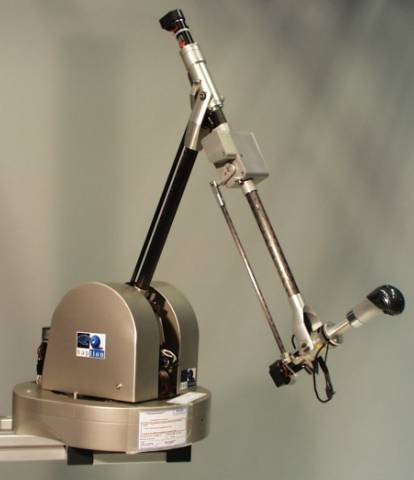

# Communications Homme-Machine {#communications-homme-machine}

## Introduction

Maintenant que nous avons passé en revue les définitions et concepts
 propres à l’humain, en matière de perceptions et d’actions basées sur les
 sensations haptiques, nous allons étendre dans ce chapitre, notre étude à la
 machine : nous allons donc glisser vers le domaine de l’interaction
 Homme-Machine, ou IHM.

Pour commencer, seront posées les principales définitions du domaine de
 l’IHM. La section suivante présentera les modélisations de l’utilisateur,
 dans un système interactif. Dans les deux parties suivantes, nous
 présenterons les moyens techniques d’interaction, basée sur la sensation
 haptique, d’abord dans le sens humain-machine (en entrée du système), puis
 dans le sens machine-humain (en sortie, donc).

Nous terminerons ce chapitre en présentant l’intégration du mode haptique
 au sein des systèmes interactifs, puis les applications existantes, mettant
 en œuvre cette interaction haptique.

## les systèmes interactifs

Un système interactif est une application informatique qui prend en
 compte, au cours de son exécution, d’informations communiquées par le ou les
 utilisateurs du système, et qui produit, au cours de son exécution, une
 représentation perceptible de son état interne [@beaudouin1997ingenierie].

Un système interactif est généralement composé de deux parties :
 l’interface utilisateur et le noyau fonctionnel
 (\@ref(fig:decompositiondunsysteme)). L’interface utilisateur est
 constituée des éléments logiciels et matériels qui sont mis en œuvre lors de
 la capture des entrées de l’utilisateur et lors de la restitution des sorties
 du système. Le noyau fonctionnel représente le système de traitement et de
 stockage de l’information.

Il est possible de modéliser un système interactif suivant plusieurs
 points de vue, selon que l’on s’intéresse au domaine de l’application, à
 l’architecture logicielle ou aux aspects ergonomiques et cognitifs entrant en
 jeu dans l’utilisation du système. La figure \@ref(fig:modelisationsdunsysteme)
 reflète différentes approches que l’on peut avoir d’un système

![(#fig:modelisationsdunsysteme)Modélisations d’un système
 informatique interactif. Les flèches indiquent les relations de
 dépendance de chaque modèle (tiré de [@baudel1995aspects])](img/I21.png)

Chacun des modèles présentés correspond à une vue que peut se former un
 observateur en fonction de son rôle dans l’élaboration.

* Le commanditaire du système est principalement
 préoccupé par l’activité (ou la tâche) que le système aidera à
 effectuer.
* Le concepteur de l’application a pour objectif de
 spécifier un système logiciel correspondant au modèle de l’activité.
* Le concepteur de l’interface propose une
 représentation des objets et des méthodes d’interaction efficaces et
 compréhensibles pour l’utilisateur, en fonction de l’application (modèle
 conceptuel) et du système informatique utilisé (modèle d’interaction).
* Enfin, l’utilisateur utilise un système en fonction
 de ses connaissances du domaine (activité) et du système (modèle
 d’interaction et modèle conceptuel de l’application).

Posons maintenant la terminologie de ce domaine.

### L’Interaction et l’Interface Homme-Machine

L’interaction homme-machine désigne l’ensemble des phénomènes physiques et
 cognitifs qui interviennent dans la réalisation de tâches avec le concours de
 l’ordinateur.

L’interface homme-machine désigne un assemblage de composants logiciels et
 matériels qui permet l’accomplissement de tâches avec le concours de
 l’ordinateur.

Les composantes de l’interaction homme-machine sont :

1. L’utilisateur
2. accomplit une tâche
3. dans un contexte particulier
4. en utilisant un système informatique.

### Quelques définitions de la communication multimodale

Les définitions qui font référence sont le fait de [@coutaz1991taxonomy].

**Mode de communication :**
D’après le petit robert, un mode est une norme
 particulière sous laquelle se présente un fait, s’accomplit une action. En
 grammaire, le mode est un trait dénotant la manière dont le locuteur
 présente le procès (on dit plus couramment action). Du point de vue
 système, un mode représente l’état dans lequel le système s e trouve à un
 moment donné. Un mode fait référence aux cinq sens de l’être humain : le
 toucher, l’ouïe, la vue, l’odorat, le goût (réception d’information), et
 aux différents moyens d’expression humains : le geste, la parole (émission
 d’information). Il définit la nature des informations servant pour la
 communication (mode visuel, mode sonore, mode gestuel etc.).

**Modalités :**
Une modalité est une forme concrète particulière
 d’un mode de communication. Par exemple, le bruit, la musique, la parole
 sont des modalités du mode sonore.

**Média :**
Dans la vie courante, un média désigne un
 support d’information (journal, disque audio...). En informatique, un média
 peut également être un support (vidéodisque, CD-ROM...), mais actuellement,
 par extension, il désigne le dispositif physique qui acquiert ou qui
 diffuse l’information : un écran vidéo, un système de synthèse de parole...
 Dans un sens large, les médias désignent les différents périphériques
 d’ordinateur (plutôt non conventionnels) qui permettent la communication,
 en entrée comme en sortie.

**Communication multimodale :**
une communication est dite multimodale si elle
 fait intervenir plusieurs modes de communications dans les échanges
 d’information. Cependant, en informatique, ce qualificatif s’applique
 également pour les communications ne faisant intervenir qu’un seul mode
 mais avec plusieurs modalités.

**Système multimodal :**
théoriquement, un système informatique
 multimodal est un système capable d’intégrer plusieurs modes de
 communication. Cependant, on désigne également par ce nom tout système
 capable d’intégrer plusieurs modalités de communication (même s’il
 n’intègre qu’un seul mode).

**Multimodalité :**
le terme de multimodalité fait référence à
 l’usage de plusieurs modalités pour la réalisation d’une même tâche.

**Multimédia :**
un système informatique multimédia est un
 système capable d’acquérir et/ou de restituer, par l’intermédiaire des
 médias, des informations de natures et/ou de formes différentes (parole,
 musique, image vidéo, etc.).

Ces trois notions sont dépendantes les unes des autres. En effet, à un
 mode correspond un ensemble de modalités et à une modalité est rattaché un
 ensemble de média permettant son expression.

**Exemple :** La modalité « Vibration » s’exprime par exemple sur le
 médium « Vibreur » et fait appel au mode Tactile .

### Les interfaces informatiques actuelles : les interfaces WIMP

Dans le champs de recherche de l’Interaction Homme-Machine (IHM),
 l’acronyme WIMP signifie *Windows, Icons, Menus, Pointing* pour
 fenêtres, icônes, menus et pointage. Il s’agit des interfaces graphiques que
 nous utilisons le plus souvent devant un ordinateur. Les interfaces WIMP ont
 été imaginées et développées au Xerox PARC en 1973 et ont été popularisée
 avec le Macintosh en 1984.

En anglais populaire, le terme WIMP est couramment utilisé pour insulter
 les personnes qui manquent de force et/ou de courage. Cet usage était courant
 avant l’arrivée des interfaces graphiques. Maintenant, il arrive que WIMP
 soit utilisé d’une manière dénigrante, en particulier par les personnes qui
 préfèrent les interfaces traditionnelles comme les interfaces à ligne de
 commande.

On parle enfin d’interface POST-WIMP pour les interfaces qui se basent sur
 d’autres paradigmes d’interaction ([van Dam,
 1997](047-bibliographie.html#Dam1997)).

## Les modèles de l’utilisateur

### Le modèle du processeur humain et les caractéristiques du corps humain {#processeur}

Dans leur modèle, The Model Human Processor , S. Card, T. Moran et A.
 Newell représentent l’individu comme un système de traitement d’informations
 régi par des règles ([Card et al.,
 1983](047-bibliographie.html#Card1983)). Le processeur humain comprend trois sous-systèmes interdépendants
 : les systèmes sensoriel, moteur et cognitif. Chacun d’eux dispose d’une
 mémoire et d’un processeur dont les performances se caractérisent à l’aide de
 paramètres (figure \@ref(fig:processorhumain)).

Pour une mémoire, les paramètres essentiels sont :

* µ (ou *m*), la capacité:
 le nombre d’éléments d’information mémorisés ;
* δ (ou *d*), la
 persistance : temps au bout duquel la probabilité de retrouver un élément
 d’information est inférieure à 0,5 ;
* κ (ou *k*), le type
 d’information mémorisée (physique, symbolique, etc.).

Pour un processeur, le paramètre important est

* τ (ou *t*), le cycle de
 base qui inclut le cycle d’accès à sa mémoire locale.

![(#fig:processorhumain)Le modèle du processeur humain (d’après
 [@booth2004human])](img/humanProcessor.png)

Ce modèle nous donne un certain nombre d’informations sur la mémoire à
 court terme :

* nous mémorisons 7 items (± 2 selon l’individu, la
 fatigue...) ;
* nous regroupons les mnèmes (ie les unités
 d’information) par motifs visuels, acoustiques, perpétuels ;
* lors d’une recherche d’information, celle-ci a lieu
 de manière séquentielle ;
* enfin, l’oubli de la mémoire à court terme est de
 l’ordre de 15 à 30 secondes.

Et ceci peut se retrouver dans une conception des interfaces de systèmes
 interactifs :

* limiter les items de menus à 7
* établir des liens entre éléments (couleurs, format,
 emplacements) pour faciliter le filtrage cognitif
* écrire des messages concis
* ne pas présenter d’informations inutiles

![(#fig:coutaz)Le système sensoriel visuel et sa relation avec le système
cognitif (tiré et adapté de [@coutaz1988interface])](img/systemecognitif.png)

##### Par rapport au système moteur

Outre le modèle de l’homonculus déterminé expérimentalement, le modèle du
 processeur humain propose une mesure quantitative des performances motrices
 humaines en fonction des organes considérés. Il est ainsi possible de
 déterminer les principales zones fonctionnelles de l’être humain par ordre
 d’importance et d’utilité dans l’interaction (extrait de [@baudel1995aspects]):

* *la* *main dominante, constituée des 5
 doigts et de la paume, présente 23 degrés de liberté (sans les poignets).
 Ces degrés ne sont bien sûr pas interdépendants. La main et les doigts sont
 les organes les plus utilisés et vraisemblablement les plus utiles à
 l’interaction.*[...]([Sturman, 1992](047-bibliographie.html#Sturman1992))
* *la main non dominante, identique à la main
 dominante, mais ayant un contrôle moteur moins précis.*
* *les lèvres et langue, les muscles faciaux
 présentent un grand nombre de degrés de liberté utilisés de façon très
 subtile dans la communication humaine. Ces degrés de liberté sont cependant
 difficilement exploitables : ils sont déjà utilisés pour la communication
 vocale, leur emploi est fortement stéréotypé, dépendante du milieu
 socioculturel et sont difficile à interpréter.* [...]
* *les poignets et bras (coude): Le poignet est lié
 à la main et ne peut être utilisé indépendamment de celle-ci lorsqu’elle
 est déjà mise à contribution. Certaines machines-outils utilisent le coude
 comme moyen d’actionnement d’interrupteurs.*
* *les pieds : Que ce soit en position assise ou
 debout, le pied est assez précisément contrôlable et peut être utilisé*
 [...] *(pédalier de l’orgue* [...] *contrôle du volume ou du
 vibrato sur un harmonium ou un orgue électronique, accélérateur d’une
 voiture...). De nombreux outils et instruments utilisent des pédaliers et
 des pédales à course pour remédier à l’occupation des membres supérieurs
 par d’autres contrôles. De plus, le pied peut être utilisé lorsque la force
 requise pour actionner un effecteur doit être assez importante.*
* *les jambes : Les jambes ne peuvent être
 facilement utilisées lorsque le pied est mis à contribution. Certaines
 machines outils utilisent cependant des interrupteurs activés par le
 genou.*
* *le tronc présente autant de degrés de liberté
 qu’il y a de vertèbres et de côtes, mais ces dimensions sont assurément
 difficiles à utiliser activement dans l’interaction avec un ordinateur.
 Tout au plus une mesure de l’état général de relâchement du corps peut-il
 indiquer une fatigue de l’utilisateur et une baisse de son
 attention.*

### Autres modèles de l’utilisateur

**GOMS**
(*Goal, Operator, Method, Selection*)
 [@card2018psychology] se contente de
 modéliser le comportement observable de l’utilisateur (approche
 béhavioriste) et ne cherche pas à décrire les états mentaux et les
 traitements internes (approche cognitiviste).
**KeyStroke**
([Card et al.,
 1983](047-bibliographie.html#Card1983)) est une version simplifiée de GOMS. Il permet de prédire le temps
 d’exécution de cette tâche par un utilisateur expert. On suppose que la
 méthode est unique, on ne prend pas en compte l’opération de choix s’il y a
 plusieurs méthodes candidates pour le même but.

**La théorie de l’action**
[@norman1988psychology] est une approche cognitiviste de la modélisation de l’utilisateur
 : l’individu élabore un modèle conceptuel du système informatique. Le
 comportement est conditionné par l’environnement et par la représentation
 interne que l’utilisateur se fait du système. La figure \@ref(fig:norman) illustre ce modèle de l’action. Le point fort de
 cette approche est qu’elle permet d’expliquer les réussites, difficultés et
 erreurs de l’utilisateur.

## Les périphériques d’entrée

### Petit point historique

Pour manipuler un point dans l’espace virtuel de la mémoire de
 l’ordinateur, nous avons besoin d’un dispositif dit de pointage. Le plus
 commun de ces dispositifs, c’est la souris. La figure
 \@ref(fig:Lapremieresouris) montre la première souris de l’histoire,
 créée par Douglas Engelbart et William English en 1964.

### Taxonomie des périphériques d’entrée

**Comment classer les différents périphériques qui ont été imaginés pour
 interagir avec l’ordinateur ?**

Certains périphériques sont conçus pour un mode d’utilisation reposant sur
 un changement d’états discrets : par exemple, une touche est enfoncée ou non ;
 ou encore, la position d’un capteur est une valeur entière comprise entre 1
 et 10. Ce sont les périphériques à états discrets. Le clavier en est
 l’exemple type.

D’autres périphériques, comme la souris, sont dénommés à entrée continue.
 Ils produisent un échantillonnage, ou une trace du geste réalisé pour
 actionner le périphérique.

Les premières classifications des périphériques d’entrée sont le fait de
 Foley, Wallace et Chan ([Foley et al.,
 1984](047-bibliographie.html#Foley1984)) et de Buxton [@buxton1983lexical].
 Foley et ses collègues se sont basés sur les tâches graphiques que chaque
 périphérique est capable de réaliser. Buxton a classifié les périphériques
 d’entrée selon leurs propriétés physiques et leur nombre de degrés de
 libertés. Finalement, Card et ses collègues [@card1991morphological] ont repris la
 classification de Buxton et l’ont étendue à l’ensemble des périphériques à
 degrés de liberté continus et discrets. Dans un premier temps, le
 tableau [2.1](#cap:Inventaire-des-grandeurs) récapitule les
 grandeurs que l’on utilise pour classer les périphériques à retour d’effort,
 selon la nature des degrés de liberté.

|          |                   |                    |            |
|----------|-------------------|--------------------|------------|
|          | Degrés de liberté |                    |            |
| Linéaire | Rotatif           |                    |            |
| Position | absolue           | Position *P*       | angle *R*  |
| relative | mouvement δ *P*   | delta angle δ *R*  |            |
| Force    | absolue           | Force *F*          | couple *T* |
| relative | delta Force δ *F* | delta couple δ *T* |            |

Table 2.1 : Inventaire des grandeurs
 mesurables sur un périphérique d’entrée continu en fonction de la
 nature du degré de liberté

Le modèle de [@card1991morphological] se
 propose de placer les périphériques d’entrée dans un espace permettant de les
 comparer. Le nombre de dimensions de cet espace n’est pas fixé. Tout critère
 de comparaison entre deux dispositifs peut en fournir une. Les dimensions les
 plus importantes sont le nombre et le type des degrés de liberté des
 dispositifs d’entrée considérés. Le tableau suivant est constitué de 5
 axes :

* dispositif de translation ou de rotation.
* dimension de l’espace (x, y, z ou lacet, tangage et
 roulis) captée.
* déplacement absolu ou relatif.
* capteur de mouvement ou de force.
* résolution (entre 1 bit et l’infini).

La figure \@ref(fig:Espacedeconception) reprend la taxonomie de
 [@card1991morphological], ainsi que celle de chacun de ses prédécesseurs.

![(#fig:Espacedeconception)Espace de conception des dispositifs d’entrée (tiré de
 [@card1991morphological])](img/cards.png)

### Les performances en entrée des périphériques de pointage {#performances}

Pour évaluer les performances des dispositifs de pointage, les recherches
 ont souvent utilisé la loi de Fitts (voir \@ref(fitts)). La
 figure \@ref(fig:accot) montre les performances de différents
 dispositifs de pointage selon la loi d’Accot (voir par :La-loi-d’Accot).

![(#fig:accot)Les performances des périphériques de pointage selon la loi d’Accot (tiré
 de [@accot1999performance])](img/steering.png)

##### Comment lire ce graphique ? {-}

L’axe horizontal indique l’indice de difficulté de la tâche. Comme il
 s’agit de la loi d’Accot, l’indice de difficulté est relatif ici à la largeur
 de la trajectoire à suivre, et à sa rectilinéarité (est-elle très courbée ou
 non).

L’axe vertical indique le temps du mouvement (en ms).

Donc, plus le segment de droite est bas sur ce graphique, plus le
 dispositif correspondant est efficace dans une tâche de suivi de
 trajectoire.

La souris apparaît comme un des périphériques les plus performants, avec
 la tablette graphique. Ensuite, le trackpoint (le petit joystick disponible
 sur certains portables pour manipuler le pointeur), le touchpad (le petit
 écran tactile des ordinateurs portables) et le trackball, sont beaucoup moins
 performants.

Une autre étude [@mackenzie2001accuracy] confirme ce résultat (figure \@ref(fig:performances)).

![(#fig:performances)Les performances de dispositifs de pointage (adapté de [@mackenzie2001accuracy]](img/comparaison.png)

##### La tâche effectuée et l’interprétation de ce graphique {-}

Les sujets devaient aller pointer le plus vite possible, différentes
 cibles placées sur un cercle. La figure \@ref(fig:Latache) précise l’ordre des
 mouvements à réaliser.

Sur le graphique de la figure \@ref(fig:performances), on retrouve bien le fait
 que la souris est bien plus efficace que les autres dispositifs de pointage. Il
 y a également un effet d’apprentissage qui apparaît (le temps du mouvement
 diminue au fur et à mesure de l’expérience), mais ce n’est pas le sujet de
 notre discussion.

Enfin, d’un point de vue ergonomique, [@zhai1996influence] a démontré que les
 périphériques d’entrée manipulés avec les doigts, obtiennent de meilleures
 performances lors d’une tâche de pointage, que les dispositifs qui nécessitent
 la mise en action du poignet et/ou du coude et/ou de l’épaule.

>
>  Ceci doit nous amener à inciter les utilisateurs
>  à se placer dans une position leur intimant d’utiliser la précision de
>  leurs doigts, avec le bras le plus reposé possible.
>
### Le geste dans les systèmes interactifs

[@baudel1995aspects] a relevé trois
 paradigmes d’utilisation du canal haptique en entrée dans les systèmes
 interactifs. Il a défini l’entrée haptique comme tout mode d’interaction
 faisant intervenir les divers modes d’action liés aux sens haptiques . Ce que
 nous pouvons considérer comme le geste vers la machine .

#### Entrée haptique simple

[@baudel1995aspects] parle d’entrée haptique
 simple lorsque la sémantique d’une action est entièrement décrite par des
 changements d’état discrets du dispositif.

Par exemple, pour tracer un rectangle avec une souris, le bouton enfoncé
 fournit une première position d’ancrage, le relâchement une deuxième. Ces
 deux positions suffisent à elles seules à fournir les paramètres de création
 du rectangle ; la façon avec laquelle l’utilisateur déplace la souris n’a pas
 d’incidence sur la signification engendrée par le geste.

#### Reconnaissance de marques et de tracés

On appelle reconnaissance de marques et de tracés, la prise en compte de
 la trajectoire réalisée avec le dispositif de pointage.

Dans l’exemple du rectangle, on peut imaginer une autre façon de faire :
 avec la souris, on peut tracer directement les 4 côtés du rectangle. Le
 système se chargera de paralléliser les tracés forcément approximatifs, en
 fonction de ce qu’il a reconnu.

Cette technique possède un autre avantage : il n’y a plus de déclaration
 d’intention. Dans notre exemple, il n’est plus nécessaire de choisir l’outil
 dessine un rectangle puis de le tracer ; on peut dessiner directement.

La reconnaissance de marques, ou de tracés, permet d’enrichir la
 sémantique des actions élémentaires de l’utilisateur.

Ce type d’interaction est déjà utilisé dans quelques applications. Par
 exemple, le navigateur internet Opera, dispose d’une reconnaissance de
 marques. Par exemple, un geste avec la souris vers la gauche, tout en
 maintenant le bouton du milieu enfoncé, rechargera la page précédente.

Dans un éditeur d’objets en deux dimensions, [@kurtenbach1991issues] ont utilisé
 toute une variété de gestes qui simplifiaient la sélection, l’effacement, le
 déplacement ou la duplication d’un objet ou d’un groupe d’objets. La
 figure \@ref(fig:gestes1) présente ces gestes. Par
 exemple, effacer un objet est réalisé en barrant cet objet (a) ; effacer un
 groupe d’objets consiste en dessinant une zone autour de ces objets puis en
 terminant le tracé à l’intérieur de cette zone (b)  ; le déplacement d’objets
 commence comme l’effacement de groupe, mais le tracé se termine à l’extérieur
 du tracé, à l’endroit où l’on souhaite déplacer ce groupe (c)  ; enfin, le
 geste de copie (d) consiste en un geste circulaire autour des objets à
 sélectionner, terminé par un c .

![(#fig:gestes1)Les gestes pour l’édition graphique. (tiré de
 [@kurtenbach1991issues])](img/BarfieldF16.png)

Pour les artistes, l’entrée gestuelle peut faciliter l’interaction
 créative. [@buxton1995chunking] a montré un
 simple ensemble de gestes pour transcrire la notation musicale. Comme montré
 sur la figure \@ref(fig:gestes2), les formes des notes les plus communes (en haut de la
 figure) trouvent un équivalent dans l’ensemble des gestes à réaliser (sous
 chaque note).

![(#fig:gestes2)Les gestes pour transcrire la notation musicale (tiré de
 [@buxton1995chunking])](img/BarfieldF17.png)

#### Interaction gestuelle pure

Toujours pour [@baudel1995aspects], la
 reconnaissance de tracés reste limité à reconnaître l’échantillonnage de la
 trajectoire d’un point dans le plan (ou l’espace). Le geste effectif réalisé
 par l’utilisateur n’est toujours pas pris en compte. Par exemple, la machine
 ne distinguera pas si le geste a été effectué de la droite ou de la main
 gauche.

Pour accentuer la compréhension du geste par la machine, les dispositifs
 de pointage deviennent clairement insuffisants. Il s’agit alors d’utiliser
 des gants, ou un système de vision par caméra ; on parlera respectivement de
 dispositif intrusif, et non-intrusif : en effet, dans le cas des gants, on
 doit porter un périphérique, tandis qu’avec la caméra, on agit librement.

Une dernière classe d’interaction peut venir s’ajouter. Il s’agit des
 systèmes de prise en compte des gestes inconscients. En effet, une partie des
 gestes sont de nature inconsciente, et peuvent néanmoins contenir du sens. On
 parle alors de dispositifs de suivi du regard, et toujours de vision par
 caméra.

## Les périphériques de sortie à retour haptique

### Historique {#historique}

La télé-robotique est le domaine technologique qui a nécessité la création
 de périphériques à retour de force. Le schéma classique est le couple
 Maître-esclave . Sheridan [@sheridan1992musings] a défini le système
 télé-opérateur Maître-esclave comme suit :

Un télé-opérateur Maître-esclave est constitué de 2
 sous-parties :

* Le dispositif maître, généralement un dispositif
 mécanique plus ou moins anthropomorphique et autorisant de multiples degrés
 de liberté, actionné directement par l’opérateur humain  ;
* Le dispositif esclave, isomorphique au maître, la
 plupart du temps équipé d’une main robotisé ou d’un outil
 spécialisé .

Le retour haptique (uniquement kinesthésique aux débuts  ; on voit
 apparaître de plus en plus l’ajout du retour tactile) permet une immersion
 beaucoup plus efficace. L’opérateur a de plus en plus l’impression de
 manipuler directement l’outil que manipule le périphérique esclave
 distant.

Nous pouvons considérer que le premier périphérique à retour de force
 vient du monde de la télé-robotique : en 1952, Groetz et Thompson de l’Argonne
 National Laboratory [@goertz1952fundamentals] créent
 l’Argonne (voir la figure \@ref(fig:argonne)), un système
 de télémanipulation maître-esclave permettant à un humain de diriger un bras
 robotisé dans un milieu hautement dangereux (centrale nucléaire, espace,
 fonds sous-marins).

Par la suite, d’autres périphériques ont été conçus pour la
 télé-robotique, mais il ne s’agit ici que de simuler à distance une
 interaction physique qui a lieu dans le monde réel. En 1965,
 sous l’impulsion de Ivan Sutherland, Fred Brooks Jr. et ses collègues de
 l’université Chapel Hill de Caroline du Nord, se sont lancés dans le projet
 GROPE, visant à atteindre une simulation en temps réel pour la manipulation
 tridimensionnelle de molécules virtuelles, en ayant le retour des forces
 moléculaires. C’est plus de 20 ans plus tard que Brooks et ses collègues ont
 pu atteindre leur but initial (voir figure \@ref(fig:MDVI)), grâce à la montée
 en puissance des ordinateurs [@brooks1990project].

Enfin, vers la fin des années 70, est apparu le premier prototype de
 périphérique effectuant le retour tactile d’une simulation graphique : le
 Sandpaper system développé au MIT [@minsky1995computational]. Il s’agit d’un
 joystick offrant 2 degrés de liberté et rendant à
 la fois le retour de force et le retour tactile. Ainsi, il était possible de
 faire bouger un curseur au-dessus de divers échantillons de papiers virtuels
 et de sentir leurs textures. Cependant, par rapport aux périphériques de
 télé-robotique, on note une perte de liberté, puisque l’utilisateur doit
 garder une main sur le joystick. En retour, les dispositifs pouvaient
 embarquer des outils et mécaniques lourds, puisqu’ils sont posés sur leur
 support (en général, le bureau).

### Les périphériques à retour haptique

Sans prétendre à l’exhaustivité, nous allons présenter quelques
 périphériques à retour haptique. Précisons tout d’abord la terminologie
 employée (tableau [2.2](#cap:Correspondance-terminologique-entre)).

| Perception    | Périphérique                 |
|---------------|------------------------------|
| Kinesthésique | à retour de force / d’effort |
| Tactile       | à retour tactile             |

Table 2.2 : Correspondance
 terminologique entre la perception et les périphériques

On peut noter une différence fondamentale entre les deux retours
 haptiques : le retour de force peut s’opposer à un mouvement volontaire de
 l’utilisateur, jusqu’à l’empêcher (s’il est suffisamment fort) ; le
 retour tactile ne le peut pas ([Burdea
 et al., 1992](047-bibliographie.html#Burdea1992)) .

#### Les périphériques à retour de force

Nous pouvons distinguer deux grandes familles de périphériques à retour de
 force [@casiez2004contribution]:

**les périphériques à base non fixe**
(*man based*) : ce sont les périphériques
 portés par l’utilisateur, de type gant ou exosquelette.

**les périphériques à base fixe**
(*ground
 based* ou *desk based*) : ils
 regroupent les périphériques de type bras, stylos (*probe*), manches
 ou souris

Nous allons maintenant voir les principaux dispositifs utilisés dans la
 recherche sur l’interaction haptique.

##### Les gants

Les gants doivent saisir les mouvements complexes de la main. Ils
 autorisent en général un grand nombre de degrés de liberté. En effet chaque
 doigt dispose de 4 degrés de liberté, auxquels il faut ajouter les mouvements
 de la paume et parfois du poignet. Le retour d’effort permet de ressentir la
 rigidité de l’objet mais ne permet pas de ressentir son poids.

Nous pouvons citer le Rutgers Master II qui est basé sur les travaux de
 [@burdea1992portable], et le
 CyberGrasp commercialisé par la société Immersion . Ces deux dispositifs se distinguent par
 l’emplacement de la structure mécanique. Ainsi, la structure est intérieure à
 la paume de la main pour le Rutgers Master II, ce qui empêche l’utilisateur
 de fermer totalement la main (figure \@ref(fig:rutgers)).

##### Les bras maîtres

Les bras maîtres sont principalement utilisés dans les applications de
 télé-opérations. Sur la figure \@ref(fig:dextros)
 apparaît le Dextrous Arm Master créé par SARCOS, l’une des entreprises
 pionnières dans le domaine. Ces systèmes, placés soit sur une table ou sur le
 sol, sont capables de fournir des forces puissantes à l’utilisateur. Ils sont
 également utilisés dans les applications de réalité virtuelle.

##### Les stylos à retour de force

Ce sont des périphériques proposant au minimum trois degrés de liberté en
 entrée (le déplacement du stylet dans l’espace), mais le plus souvent six ; et
 3 degrés de liberté en sortie (c’est à dire sur le retour de force), et
 parfois six. La figure \@ref(fig:degres) illustre
 les différentes possibilités en terme de degrés de liberté.

Le périphérique le plus utilisé dans les laboratoires est le PHANTOM
 (figure \@ref(fig:PHANTOM)), créé et commercialisé par
 Sensable Inc.

Son maniement s’effectue grâce un stylet situé à l’extrémité du
 périphérique ou en insérant le bout de son doigt dans un dé. Il est alors
 possible, grâce à une excellente résolution spatiale de ressentir les
 sensations que l’on aurait à toucher un mur lisse, un coin pointu, une sphère
 caoutchouteuse ou encore une surface texturée.

Nous pouvons citer le Virtuose 3D, le Delta Haptic et le Freedom 6S
 (figures \@ref(fig:virtuose), \@ref(fig:deltahaptique) et
 \@ref(fig:freedom6s)), également utilisés dans les laboratoires.

Précisons que les périphériques de type PHANTOM sont à la 3D ce que la
 souris à la 2D : des **périphériques de pointage** : seul un point est
 déplacé dans l’espace.

##### Les souris à retour de force

Les souris à retour de force sont des dispositifs à deux degrés de
 liberté. Nous pouvons citer la Wingman Force Feedback Mouse
 (figure \@ref(fig:wingman)), conçue par Immersion, et
 commercialisée par Logitech.

La souris proprement dite est solidaire de son socle. De fait, la surface
 de travail de cette souris est très réduite : 1,9 cm par 2,5 cm. Enfin,
 la souris peut générer des forces pouvant atteindre 1N.

La souris Wingman force Feedback a originalement été conçue pour les jeux
 vidéos, mais ses possibilités et son faible coût l’ont rendue populaire dans
 les recherches sur l’accessibilité auprès des personnes non-voyantes
 [@yu2001haptic] [@gardner2001smart] [@tornil2004use]).

#### Les périphériques à retour tactile

Les dispositifs tactiles sont bien entendu basés sur [les perceptions
 tactiles](007-le-systeme-haptique-cote-perception-la-somesthesie.html#toc3).
 Nous pouvons par exemple rappeler, que la perception
 tactile est le fait de trois classes de récepteurs : les thermorécepteurs,
 les nocirécepteurs et les mécanorécepteurs. Du côté de la machine, ce sont
 surtout des dispositifs répondant aux mécanorécepteurs, et donc à nos
 capacités de discrimination tactile, qui ont été conçus. On peut pourtant
 citer les travaux du Dr Suichi Ino, de l’université d’Hokkaido, qui cherche à
 créer un système de rendu de la température. Le Temperature Display, par
 exemple autorise un intervalle de température allant de 10°C à 60°C à une
 précision de 0.1°C pour un dispositif ne pesant que 30 grammes.

Pour le reste, donc, les dispositifs sont surtout axés sur la
 discrimination tactile. Et la principale approche pour rendre un élément
 tactile est celle visible sur la figure \@ref(fig:afficheur).On peut y voir
 une cellule d’affichage tactile. Cette cellule est composée de petits picots
 capables de monter ou descendre sur leur axe. Il ainsi possible de dessiner
 des petits motifs en relief.

Les afficheurs brailles (figure \@ref(fig:plagebraille)) utilisent
 ces cellules. Comme un caractère
 braille est composé de 8 points (pour le braille informatique), une cellule
 est composée de 8 picots. Il s’agit ensuite d’accoler un certain nombre de
 cellules (selon les modèles, de 20 à plus de 80 cellules) pour afficher
 plusieurs caractères brailles, et donc, un mot, une phrase.

Toujours dans la même approche, les sociétés ABTIM^[http://www.abtim.com] et
KGS^[http://www.kgs-america.com/dvs.htm] ont équipé de cellules des surfaces
plus grande. Il ont ainsi réalisé des systèmes capables de reproduire des
dessins en relief (figure \@ref(fig:tactiledisplay)).

Pour terminer cette partie, nous pouvons évoquer une autre classe de
 périphériques, qui exploite les capacités tactiles en sortie (de l’ordinateur
 vers l’humain), et les capacités kinesthésiques en entrée (de l’humain vers
 la machine). Il s’agit souvent d’adapter une cellule braille sur un
 dispositif de pointage ([Lecolinet et
 Mouret, 2005](047-bibliographie.html#Lecolinet2005)). D’autres exemples sont visibles sur la
 figure \@ref(fig:couplage).

## Les applications du retour haptique

### La perception via une interface haptique {#perception}

D’un point de vue général, il s’avère que les dispositifs actuels
 limiteront les procédures d’exploration haptique. L’utilisateur est en effet
 obligé d’adopter des stratégies afin d’extraire les propriétés des objets. Et
 ceci est particulièrement notable sur les dispositifs nécessitant la
 manipulation d’un activateur comme le manche du joystick ou le stylet du
 PHANTOM [@jansson1999phantom]. De plus, la technologie même est un facteur
 limitant : [@wall2004investigation] a ainsi montré que les moteurs du
 PHANTOM étaient inadéquats pour générer des textures très fines nécessitant
 des hautes fréquences.

En se référant aux [procédures d’exploration haptique](#conjuguent) proposées
 par [@lederman1987haptic], [@wall2004investigation] a dressé le
 tableau \@ref(tab:possibilite), qui montre les possibilités et les
 impossibilités, lorsque l’on manipule un dispositif de pointage. Finalement,
 [@lederman2004haptic] ont également montré que la rigidité du stylet limitait
 également la perception (par rapport à un stylet flexible).

Table: (\#tab:possibilite) Les possibilités des mouvements d’exploration avec un
 périphérique  de pointage

|                                 |                                                                 |
|---------------------------------|-----------------------------------------------------------------|
| **Mouvements d’exploration**    | **Possibilité avec un dispositif de pointage**                  |
| Le mouvement latéral (textures) | Possible, bien que les caractéristiques des textures varient    |
|                                 | temporellement (vibration) et non pas spatialement              |
| La pression                     | Possible                                                        |
| Le contact statique             | Possible, bien qu’il n’y ait pas de retour de température,      |
|                                 | ou de forces distribuées pour générer des étirements            |
| Le maintient                    | Possible en attachant l’objet simulé à la place de l’activateur |
| L’enveloppement                 | Non possible en l’absence de plusieurs points de contact        |
| Le suivi de contours            | Possible, mais très difficile du fait d’une zone de contact     |
|                                 | réduite à un point                                              |

Pour l’anecdote, [@jansson2000haptic] a
 suggéré qu’ obtenir une information par l’intermédiaire d’un affichage
 haptique tel que le PHANTOM, était semblable à obtenir de l’information d’un
 écran d’ordinateur en déplaçant sur celui-ci une feuille de papier percée
 d’un simple petit trou .

Concernant la mémorisation, [(Jansson et
 K., 1999)](047-bibliographie.html#Jansson1999) ont montré qu’une phase, même très courte, d’initiation à
 l’utilisation d’un dispositif comme le PHANTOM, permettait une nette
 amélioration des performances.

Comme nous allons maintenant le voir, les applications utilisant de tels
 dispositifs, malgré leurs défauts, se multiplient dans de nombreux
 domaines.

### L’intégration du mode haptique dans l’interaction avec la machine

Le système haptique humain a un rôle important à jouer dans l’interaction
 homme-machine. **A l’inverse des systèmes visuels et auditifs, le sens
 haptique est capable à la fois de percevoir et d’agir sur l’environnement**
 et est une partie importante de la plupart des activités humaines. La
 figure \@ref(fig:interactionhaptique) illustre la double boucle d’interaction
 liée au système haptique : l’homme et la machine agissent et perçoivent sur
 le mode haptique, en même temps. Les schémas de fonctionnement pour l’homme
 et pour la machine sont très similaires : il y a dans les deux cas une boucle
 action-réaction entre le monde extérieur, et le système de décision  ; c’est
 à l’intersection des deux boucles que se situe l’interaction.

![(#fig:interactionhaptique)Interaction haptique entre l’homme et la machine
 (tiré de [@casiez2004contribution])](img/retourhaptic.png)

Dans cette partie, nous allons passer en revue quelques applications
 concrètes basées sur le mode haptique. On pourra revenir à
 [cette page](#historique) pour un historique sur les débuts du retour de
 force. On rappelle qu’initialement, c’est en télé-robotique que les
 dispositifs à retour de force sont apparus.

#### Le retour haptique comme technique d’interaction

[@miller1999design] ont identifié 4 utilisations possibles du retour haptique :

1. *Anticipation* (Anticipation): force
 résistante annonçant l’imminence d’un événement.
2. *Indication* (Suivi) : force donnant
 l’indication qu’une action est en cours.
3. *Follow-through* (Accomplissement): force
 donnant l’indication à l’utilisateur qu’un événement s’est produit.
4. *Guidance* (Guidage): guidage/contrainte du
 geste de l’utilisateur.

#### Le retour haptique : aspect logiciel

Afin de manipuler les dispositifs, les fabriquants ont mis à la
 disposition des programmeurs, des bibliothèques de programmation
 spécialisées.

Immersion Corporation™, le fabriquant de la souris Wingman Force Feedback
 Mouse™, propose ainsi l’Immersion Touchsense SDK. Cette bibliothèque permet
 de piloter tout un ensemble de périphériques (souris, joysticks, volants
 et manettes de jeux) chez de nombreux constructeurs (Microsoft™, Logitech™,
 Genius™, ThrustMaster™, Saitek™, Gravis™). De plus, une des particularités de
 ce SDK (*Software Developpment Kit*) est qu’il dispose d’un plugin
 pour les navigateurs Web. Ainsi, il est possible d’augmenter une page Web,
 avec des retours de force. Les navigateurs supportés sont Microsoft™Internet
 Explorer et Netscape™. Une version pour les navigateurs basés sur le moteur
 Gecko (Mozilla™, Firefox) existe, mais est encore en phase de
 développement.

Sensable™, le concepteur des PHANTOMs, propose plusieurs bibliothèques de
 programmation : Le Ghost SDK, et les HDAPI et HLAPI. Le Ghost SDK est basé
 sur un moteur de rendu du toucher, à partir d’une scène 3D. Par exemple, il
 dispose d’un lecteur de fichiers VRML (Virtual Reality Markup Language :
 langage de description de scènes 3D), et l’on peut très rapidement toucher
 les objets de la scène, avec un PHANTOM. Cependant, il peut être intéressant
 de se passer d’une base tridimensionnelle pour générer des effets. Ainsi,
 Sensable™a proposé les bibliothèques HDAPI et HLAPI (pour *Haptic Device
 API* et *Haptic Library API*). La bibliothèque HDAPI permet un
 contrôle direct des paramètres de fonctionnement du périphérique : les
 positions, orientations et vitesses des différents éléments du dispositif,
 l’accès aux systèmes de coordonnées internes des moteurs, les températures
 des moteurs... Comparé au Ghost SDK, le HDAPI autorise beaucoup plus de
 liberté et de précision lors de la création des effets. Il peut cependant
 s’avérer fastidieux de créer des effets à partir d’autant de paramètres.
 C’est pour cette raison que Sensable™a conçu le HLAPI. Il s’agit d’un
 bibliothèque intermédiaire entre les deux autres. À l’instar du GHOST SDK, on
 part d’une scène 3D, mais cette fois, la scène est décrite en OpenGL. Ceci
 permet un contrôle encore très précis.

Nous pouvons également citer le H3D API de SenseGraphics^[http://www.sensegraphics.se].
 C’est une bibliothèque de programmation haptique open-source (licence GPL
 dans un cadre de recherche), basée sur le format de fichier X3D (il s’agit du
 format de description de formes 3D, basé sur XML ; c’est le successeur du
 VRML). Pour le moment, cette bibliothèque ne supporte que les PHANTOMs.

#### Le retour haptique : à quoi cela ressemble ?

Jusqu’ici, nous avons discuté de périphériques à retour de force, mais
 nous n’avons pas dit en quoi consistait le retour de force. La partie
 précédente a présenté quelques bibliothèques de programmation qui permettent
 de concevoir des effets de retour de force, effets dont nous allons
 maintenant présenter les grandes familles (en notant bien, que les
 bibliothèques de programmation permettent de combiner ces différents
 effets).

**Le contact ponctuel :**
il s’agit de l’effet le plus classique, mais
 aussi le plus étudié. L’idée est de générer une force dans un dispositif à
 retour de force, pendant qu’on le manipule, de manière à simuler le contact
 avec un objet du monde virtuel, comme s’il existait. Par exemple, avec un
 périphérique type PHANTOM, imaginons que la manipulation du stylet amène le
 curseur au contact d’une forme virtuelle  ; à cet instant, les moteurs du
 PHANTOM se durcissent afin de limiter les mouvements de l’utilisateur selon
 certaines directions. On aura alors l’illusion de rentrer en contact avec
 un objet physique.

**Le cloisonnement :**
Il s’agit de définir une zone (souvent
 rectangulaire ou elliptique), qui aura une frontière entièrement
 paramétrable. Cet effet possède alors une notion d’intérieur et
 d’extérieur. On peut par exemple donner la possibilité ou non, au pointeur
 de rentrer ou de sortir de la zone. Il peut s’agir également de définir une
 zone d’attraction, qui attirera le curseur en son centre lorsqu’il passe à
 une certaine distance.

**Les effets dynamiques :**
Ce sont des effets dont les paramètres évoluent
 dynamiquement selon les propriétés du geste de l’utilisateur. Par exemple,
 une certaine friction peut être simulée, en fonction de la vitesse
 instantanée, ou du rayon de courbure. Autre exemple, le périphérique peut
 empêcher l’utilisateur des changements de direction trop brusques : on
 simule ainsi l’inertie du déplacement d’un objet lourd.

**Les effets de texture :**
Ces effets permettent de simuler des textures.
 Celles-ci peuvent être synthétisées grâce à un certain nombre de paramètres
 (fréquence, amplitude, directions...), ou bien simulée depuis une image
 réelle de façon similaire à ce que réalise une bump-map en image de
 synthèse, c’est à dire une image ou l’intensité d’une nuance (du noir au
 blanc par exemple) code l’altitude ou la profondeur.

### Quelques applications du retour haptique

#### La médecine et la rééducation

Depuis le début des années 90, la médecine est devenue un champ
 d’application du retour haptique. Plusieurs pratiques peuvent nécessiter
 l’utilisation de dispositifs à retour de force.

**La palpation des tissus :**
Elle correspond à la première étape d’une
 consultation : le diagnostic. Et la forme la plus traditionnelle de
 diagnostic est la palpation des organes et des tissus du patient. En 1994,
 [@langrana1994dynamic] ont pour
 la première fois utilisé un périphérique à retour haptique, [le Rutger
 Master](016-les-peripheriques-de-sortie-a-retour-haptique.html#sub:Les-gants), pour palper un genou virtuel. Depuis, les
 outils ont évolués, et les applications de télé-diagnostic se
 généralisent.

**La télé-chirurgie :**
La télé-chirurgie est un des grands axes de la
 recherche sur les périphériques haptiques. Le praticien peut ainsi
 intervenir au cours d’une opération alors qu’il ne se trouve pas sur
 place.

**La rééducation :**
Cette approche de l’utilisation des dispositifs
 à retour de force est très intéressante. En général, les dispositifs de
 rééducation utilisent des périphériques sortis de leurs contextes habituels
 d’utilisation. [(Reinkensmeyer
 et al., 2000)](047-bibliographie.html#Reinkensmeyer2000) ont par exemple utilisé un joystick à retour de
 force tel qu’on peut en trouver dans le commerce, pour rééduquer l’acuité
 motrice d’un patient ayant subit un accident cérébral.

#### La modélisation d’objets virtuels

Un logiciel de modélisation tridimensionnelle nommé
FreeForm^[http://www.sensable.com/products/3ddesign/concept/index.asp], a été
présenté par Sensable Technologies Inc. Ce système se base sur une métaphore du
sculpteur : l’utilisateur se sert du PHANTOM pour sculpter une pierre
virtuelle présentée à l’écran, et rendue par un retour de force.

De manière similaire, InTouch [@gregory2000intouch] est un logiciel de
modélisation 3D. Il permet également le dessin sur un volume
(figure \@ref(fig:intouch)).

#### Le travail collaboratif

L’utilisation du mode haptique dans une collaboration en environnement
 virtuel, peut permettre une amélioration, notamment de la conscience que l’on
 doit avoir de travailler avec quelqu’un [@basdogan2000experimental].

[@sallnas2003collaboration] ont montré
 également une diminution du taux d’erreur lors d’une tâche de pointage
 collaboratif lorsqu’un retour haptique était rendu (pour des temps identiques
 avec ou sans retour haptique).

On peut noter qu’il s’agit d’une classe d’application qui nécessite des
 recherches pluridisciplinaires : rendus haptiques, bien sûr, mais aussi
 réseaux et traitement du signal. Par exemple, lorsque la collaboration se
 fait via un réseau, il faut anticiper, afin d’atténuer le délai temporel
 qu’il peut y avoir entre les deux machines. [@belghit2003amelioration] a ainsi utilisé une forme
 modifiée du LPC (Linear Prediction Coding) pour améliorer l’ergonomie du
 télégeste.

#### L’entraînement

Un des intérêts du retour haptique est qu’il peut simuler l’utilisation
 d’outils du monde réel. C’est donc tout naturellement que des simulateurs, ou
 des plate-formes d’entraînement, ont pu être conçues.

[@williams2004implementation] ont par
 exemple mis au point un système d’entraînement au diagnostic du mal de dos.
 Leurs recherches les ont amené à créer un moyen de playback haptique. Le
 playback haptique consiste à enregistrer les mouvements réalisés par une
 personnes, puis de les refaire exécuter par le dispositif haptique (dans ce
 cas, il s’agit du PHANTOM). De cette manière, les étudiants pouvaient suivre
 les mouvements d’un expert, avant de réaliser leur propre exercice. On peut
 quasiment parler de retour de geste, de la part de la machine.

Le centre lavalois de ressources
technologiques^[CLARTE : <http://www.clarte.asso.fr/>] a proposé le système VTT
 (*Virtual Technical Trainer*) qui est un simulateur de machine outils.
 Ce simulateur a comme raison d’être l’actuelle utilisation quasi systématique
 de machines à commandes numériques. Or ces dernières ont pour particularité
 d’introduire une distance à la matière telle que l’apprenant perd toute
 notion des contraintes mécaniques dans les tâches réalisées par les machines
 d’usinage.

#### Le domaine artistique

Le retour de force a souvent été utilisé dans les domaines artistiques.
 Comme dans la partie précédente, cela peut consister en la simulation d’un
 instrument réel, comme pour le projet dAb (figure \@ref(fig:dab)) :
 le dispositif utilisé est un PHANTOM, et il s’agit d’imiter les sensations
 que l’on a lors du maniement de pinceaux.

Dans une approche très différente, le projet PHASE (Plate-forme Haptique
 d’Application Sonore pour l’Eveil Musical (figure \@ref(fig:phase))
 propose un moyen de création complètement nouveau. Le retour haptique est
 utilisé pour faire sentir les éléments d’un monde virtuel que l’on rencontre
 pendant l’exploration de celui-ci.

![(#fig:dab)Le système dAb
 [@bill2001interactive]](img/dab_system_scheib_baxter-cropped.jpg)

![(#fig:phase)La Plate-forme PHASE [@rodet2005phase]](img/InstalPhaseCGP.jpg)

## Conclusion

Dans ce chapitre, nous avons parcouru quelques aspects de l’interaction
 homme-machine, en orientant notre discours vers le potentiel, les
 utilisations et les défauts, des interactions basées sur le mode haptique.
 Une dernière utilisation reste cependant à détailler : il s’agit de l’aide
 aux personnes non-voyantes, mais tout ceci sera étudié et défini dans le
 chapitre [4](025-chapitre-4-vers-l-accessibilite.html).

Pour le moment, nous avons vu que le retour haptique était une possibilité
 d’amélioration de l’immersion dans un monde virtuel, un outil d’entraînement,
 ou encore un nouveau moyen d’expression artistique.

Nous allons maintenant nous rappeler qu’à l’origine, le retour de force a
 été utilisé dans le but d’améliorer les performances motrices humaines dans
 les environnements virtuels et télé-robotiques [@rosenberg1993virtual]
 [@sheridan1992musings]. Aussi, nous allons étudier cet
 aspect sur un simple bureau virtuel, dans un schéma d’interaction WIMP, où
 l’action gestuelle principale, est le geste de pointage. En effet, sur les
 systèmes informatiques courant (Windows, Mac OS, Linux), la l’interaction est
 basée sur les mouvements de la souris et les cibles à cliquer (boutons,
 menus, fenêtres). Aussi, un des axes de recherches phare dans le domaine de
 l’IHM, consiste à essayer d’améliorer les gestes de pointages, c’est à dire,
 réduire le temps d’acquisition d’une cible à l’aide d’un dispositif de
 pointage.

