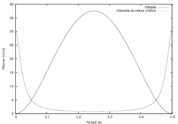

# Performances du retour de force sur le pointage

## Introduction : améliorer la vitesse de pointage

Du fait des interfaces WIMP (*Windows, Icons, Menu, Pointing
 Devices)*, une grande partie de l’interaction avec les ordinateurs est
 actuellement effectuée à l’aide de la souris. La tâche typique est :

1. repérage de la cible
2. déplacement de la souris au dessus de la
 cible
3. clic sur la cible

La cible pouvant être une icône, un élément d’un menu, une partie d’une
 fenêtre. Les moyens quantitatifs avec lesquels nous pouvons évaluer les performances
 motrices humaines lors d’une tâche d’acquisition de cible sont basés sur les
 recherches de Fitts (voir par :Loi-de-Fitts).

Pour rappel, la loi de Fitts énonce que le temps du mouvement *T* requis pour sélectionner une cible de taille *W* situé à une distance *A* est :
 [@fitts1954information]

 \[ MT=a+b\log\_{2}(A/W+1)\]

Le problème de l’amélioration du temps de pointage est un domaine de
 recherche actuellement très actif. On pourra se rapporter à [@balakrishnan2004beating] pour une étude
 exhaustive des moyens employés pour diminuer ce temps. En considérant
 l’équation ([2](022-protocole-de-test.html#eq:mackenzieID)), réduire
 *MT* peut s’obtenir en diminuant la distance
 *A*, en augmentant la taille *W*, ou adaptant les deux en même temps.

Par exemple, pour diminuer la distance *A*, on
 peut utiliser des menus circulaire (*pie menus*). [@callahan1988empirical] ont comparé ces
 menus aux traditionnels menus linéaires que l’on retrouve dans tous nos
 systèmes d’exploitation, et a observé une amélioration des temps de pointage
 de 15 à 20%. [(Baudisch et al.,
 2003)](047-bibliographie.html#Baudisch2003) ont, quant à eux, proposé de diminuer temporairement cette
 distance, en étirant les icônes cibles vers le curseur de la souris
 (figure [3.1](#cap:Diminution-de-la)).

Figure 3.1 : Diminution de la
 distance entre l’icône et ses cibles

Pour augmenter la taille de la cible *W*, il y a
 eu plusieurs façons de faire : [(Worden
 et al., 1997)](047-bibliographie.html#Worden1997) ont proposé l’utilisation d’un curseur-région
 (figure [3.2](#cap:Les-curseurs-r=E9gion-de)), à l’inverse
 d’un curseur-point tel que nous utilisons en manipulant notre souris. Il y a
 aussi la possibilité de dilater la cible à l’approche du curseur [@mcguffin2002acquisition], à l’instar de
 ce qui se passe sur la barre d’application (le Dock) du système MacOSX
 d’Apple.

Figure 3.2 : Les curseurs-régions de [@worden1997making] ; à gauche :
 la sélection avec un curseur-point a lieu lorsque l’intersection des
 deux segments est sur la cible ; au milieu : la sélection avec un
 curseur-région a lieu dès qu’une partie du curseur intersecte la
 cible ; à droite : lorsque plusieurs cibles se trouvent sous le
 curseur-région, c’est le comportement d’un curseur-point qui est
 utilisé

Enfin, [@blanch2004semantic] ont
 joué sur l’adaptation du gain entre l’espace moteur et l’espace visuel
 (*Control-Display gain*). Ce gain augmente quand le curseur s’approche
 d’une cible, et diminue lorsqu’il s’en éloigne. Le curseur semble alors
 magnétisé par la cible : il est facile de l’atteindre, et difficile de la
 quitter. Pourtant, ils ont également noté qu’une telle technique perdait tout
 son intérêt en présence de distracteur(s) entre la position initiale du
 curseur et la cible à atteindre, chaque distracteur attirant le curseur.

Cette notion de distracteurs va revenir dans notre approche, comme nous
 allons le voir.

## Travaux
 antérieurs intégrant le retour d’effort dans une tâche de pointage

Plusieurs études ont évalué l’utilisation de périphériques haptiques dans
 une tâche de pointage, en particulier pour interagir avec un bureau
 virtuel.

Dans un premier temps, cependant, nous citons les résultats obtenus dans
 le domaine de la simulation physique. Pour rappel, ce fut [un des domaines
 précurseurs dans recherche sur l’interaction haptique](016-les-peripheriques-de-sortie-a-retour-haptique.html#sub:La-simulation-physique). Et dans ce contexte, l’apport du retour de force
 est flagrant en terme d’efficacité. Avec le retour de force, il est 30%
 plus rapide de placer une molécule correctement, et les trajectoires
 moléculaires sont 41% plus courtes ([Brooks
 et al., 1990](047-bibliographie.html#Brooks1990)).

Retrouvons maintenant nos tâches de pointage dans un environnement
 virtuel...

En 1996, Akamatsu et MacKenzie ([Akamatsu
 et Mackenzie, 1996](047-bibliographie.html#Akamatsu1996)) ont étudié une souris tactile à retour de force. Ils
 ont montré des réductions significatives du temps de mouvement *MT* lorsque la modalité tactile est employée. L’effet est
 particulièrement prononcé pour les petites cibles. Cependant, ils ont
 également noté une augmentation du taux d’erreur. De plus, l’emploi de la
 modalité kinesthésique seule ne fait pas baisser significativement les temps
 d’acquisition d’une cible. Enfin, l’ indice de performance *IP* lors de l’emploi du retour de force n’est pas
 significativement différent de celui observé sans retour de force.

Eberhardt ([Eberhardt et al.,
 1997](047-bibliographie.html#Eberhardt1997)) et Hasser ([Hasser et Goldenberg,
 1998](047-bibliographie.html#Hasser1998)) ont étudié, les effets de bassins d’attraction autour des cibles.
 Ces bassins amènent le pointeur de la souris au centre de la cible. Dans ces
 cas, les performances observées lors d’une tâche de pointage sont réellement
 meilleures (de l’ordre de 25%)que sans retour de force.

Pour Wall, l’étude s’est focalisé sur l’indice de performance *IP* (soit l’inverse de la pente de régression linéaire) au
 cours d’une tâche de pointage effectuée avec un PHANTOM [@wall2000quantification]. En 2000,il a ainsi retrouvé
 les résultats de Akamatsu et MacKenzie, à savoir que le retour de force, bien
 qu’améliorant les temps d’acquisition des cibles, n’a pas d’effets sur
 l’indice de performance *IP*. Par contre, pour les
 mouvements balistiques (*IP*<3*bits*), ils ont montré une amélioration significative de
 l’indice de performance de la tâche.

Enfin, Dennerlein a également étudié l’apport du retour de force. Dans une
 première étude ([Dennerlein et al.,
 2000](047-bibliographie.html#Dennerlein2000)) réalisé en 2000, c’est le suivi de courbes. Le retour de force
 prenait la forme d’une attraction du curseur sur la courbe grâce à une sorte
 de tunnel haptique. Il s’est avéré que les mouvements effectués avec un
 retour de force étaient 52% plus rapides que sans. Dans une deuxième étude,
 [@dennerlein2001haptic] se sont
 intéressés aux mouvements d’acquisition de cibles. Pour le retour de force,
 généré par une souris, c’est le concept de bassins d’attractions autour de la
 cible qui a été retenu. Les résultats sont similaires à ceux de Eberhardt et
 d’Hasser : une amélioration de 25% des performances est observée avec
 l’utilisation du retour de force. Il a également montré que cette différence
 s’amoindrissait lorsque d’autres bassins d’attraction haptiques étaient
 générés, en plus de celui généré par la cible. Enfin, son étude montrait que
 le confort perçu lors d’une tâche de pointage était meilleur avec un retour
 haptique.

En conclusion, il apparaît que le retour de force tend à améliorer les
 performances. Les temps d’acquisition d’une cible s’améliorent de 25% lorsque
 le champs de force agit au delà de la cible; par contre, lorsque la force
 n’est déclenchée qu’au survol de la cible, les temps ne sont pas
 significativement différents. De plus, dans le cas de perturbations issues
 d’autres cibles potentielles qui génèrent leur propre retour de force, comme
 dans le cas d’un bureau haptiquement augmenté (par exemple l’immersion haptic
 desktop [@ImmersionCorporation2005]),
 les performances baissent.

Nous allons maintenant étudier comment ces perturbations influent sur les
 performances, dans le cas d’un retour de force restreint à la cible, et avec
 un espace de travail entièrement rempli de distracteurs haptique (cas qui
 pourrait se retrouver avec le bureau visible sur la figure [3.3](#cap:Voici-le-bureau)).

Figure 3.3 : Voici le bureau
 encombré de Benoit...

## Protocole
 de test

### Sujets

Neuf sujets volontaires (8 hommes et 1 femme, âgés de 21 ans à 40 ans) ont
 participé au test. Tous les sujets sont familiers avec l’utilisation d’une
 souris; deux d’entre eux avait déjà utilisé une souris à retour de force.

### Matériel

Nous utilisons la souris à retour de force Wingman Force Feedback Mouse
 (Figure cap :mouse) conçue par [@ImmersionCorporation2005] et commercialisée par
 Logitech.

La manipulation d’un périphérique de pointage à retour de force, comme
 notre souris, est basée sur la perception kinesthésique du bras, de la main
 et des doigts. La perception cutanée n’est que peu stimulée dans cette
 interaction. En d’autres mots, ici, il ne s’agit pas de ressentir une
 texture.

L’ ordinateur utilisé est un PC 1GHz. Les données ont été collectées par
 le serveur (Apache 2 tournant sur un PC à 733 Mhz) sous forme de feuilles de
 calcul. Les sujets sont accompagnés par un expérimentateur durant toute la
 durée du test.

### Procédure

Pendant l’expérience, chaque sujet doit aller cliquer sur un petit rond en
 haut à droite de l’écran : l’origine. Une fois le clic effectué sur l’origine,
 une cible hexagonale apparaît à l’écran. Il lui faut aller cliquer le plus
 vite possible sur cette cible. Le sujet peut préparer son geste aussi
 longtemps qu’il le souhaite, tant que le curseur de la souris ne quitte pas
 l’origine. Quand il a cliqué sur la cible, celle-ci disparaît et il doit
 retourner à l’origine afin de générer une nouvelle cible.

L’ensemble de l’expérience est divisée en 4 phases, correspondants à 4
 conditions de retour haptique :

* condition MT : aucun retour de force.
* condition MTF : un champs de force se déclenche quand
 le curseur de la souris passe au dessus de la cible. À ce moment, la souris
 est attirée au centre de la cible.
* condition MTDF : l’ensemble de l’écran est une
 mosaïque hexagonale. Lorsqu’il est survolé par le curseur, chaque hexagone
 déclenche un champs de force attirant le périphérique en son centre.
* condition MTDFH : même chose que la condition MTDF,
 mais l’intensité du retour de force dépend de la vitesse de la souris selon
 la loi
\[
Intensit\acute{e}=\frac{Intensit\acute{e}\_{max}}{vitesse+1}\]

 L’intensité sera ainsi plus faible lorsque la vitesse de la
 souris est élevée (voir figure [3.4](#cap:Dans-la-condition)).

Figure 3.4 : Dans la
 condition MTDFH, l’intensité du retour de force dépend de la vitesse
 du pointeur. Dans le cas idéal d’une trajectoire minimisant le jerk
 (voir par :Loi-de-jerk), on aurait le résultat ci-dessus.
 Avant chaque phase chronométrée, une phase d’entraînement permet au sujet de
 s’habituer à manipuler le périphérique dans les différentes conditions.

Il y a 10 cibles différentes. Chacune est présentée 4 fois au sujet par
 phase. Ainsi, chaque sujet aura 160 mouvements origine-cible à réaliser pour
 un ensemble de 1440 mouvements pour l’ensemble des sujets.

Les paramètres de l’expérience sont résumés dans la table [3.1](#table1).
|                           |                                                      |
|---------------------------|------------------------------------------------------|
| DISTANCES À LA CIBLE      | 21, 72, 92, 138, 205, 233, 415, 586, 831, 938 pixels |
| TAILLE DE LA CIBLE        | 40 pixels                                            |
| CONDITIONS EXPERIMENTALES | * MT : sans retour de force,                         |
|                           | * MTF : retour de force sur la cible,                |
|                           | * MTDF  retour de force sur le damier,               |
|                           | * MTDFH : retour de force adaptatif sur le damier    |

Table 3.1 : paramètres de
 l’expérience.

Ces conditions forment un ensemble homogène de tâches de pointage. Dans ce
 protocole de test, nous utilisons la formulation de l’indice de difficulté de
 la tâche proposée par MacKenzie ([MacKenzie,
 1992](047-bibliographie.html#MacKenzie92)) :

 \begin{equation}
ID=\log\_{2}(A/W+1)\label{eq:mackenzieID}\end{equation}

 où *A* est la distance à la cible, et
 *W* la taille de la cible (en l’occurrence sa
 largeur). En utilisant l’équation \eqref{eq:mackenzieID}, nous
 obtenons des indices de difficultés compris entre :

\[
ID\_{min}=\log\_{2}\left(\frac{21}{40}+1\right)=0.61bits\]

 et

\[
ID=\log\_{2}\left(\frac{938}{40}+1\right)=4.61bits\]

 Au final, l’interface de l’expérimentation est présentée sur la
 figure [3.5](#cap:protocole). (nous noterons que le choix de
 l’interface provient de nos recherches sur la représentation instantanée de
 la musique, voir la section [Music’Haptic](036-application-a-la-musique-music-haptic.html)).

``
Figure 3.5 : Origine et cibles du protocole## Résultats
 et discussion

L’analyse de la variance (ANOVA) sur les temps de pointage, permet de nous
 prononcer sur la significativité des facteurs jouant sur nos mesures : les
 différentes conditions expérimentales et l’indice de difficulté. Il apparaît
 que le facteur conditions expérimentales est très significatif (*F*9,39=24.96,  *p*<0.0001), ainsi que le facteur indice de difficulté
 (*F*3,39=10.3,  *p*<0.0001). De plus, les deux facteurs n’influent pas l’un
 sur l’autre (*F*27,39=0.35, 
 *p*=1.0000).

Les moyennes des temps pour les 4 conditions de retour haptique sont dans
 le tableau [3.2](#table3).
| MT     | MTF     | MTDF     | MTDFH    |
|--------|---------|----------|----------|
| 585 ms | 584 ms  | 723 ms   | 676 ms   |
| -      | (−0,2%) | (+23,6%) | (+15,6%) |

Table 3.2 : Moyennes des temps des
 mouvements dans les 4 conditions; les pourcentages donnent l’écart
 par rapport à la condition MT

Nous pouvons déjà observer qu’il n’y a pas de différence significative
 entre cliquer sur une cible sans retour de force (MT) et avec retour de force
 (MTF). Ceci rejoint les observations de Akamatsu [@akamatsu1996movement] et s’explique par
 le fait que le retour de force sur la cible n’est activé que lorsque le
 pointeur s’y trouve, à la différence d’autres expériences qui élargissaient
 le bassin d’attraction au delà de la taille de la cible [@hasser1998user] [@eberhardt1997force] [@wall2000quantification]. Par contre, le fait qu’il y
 ait des champs de force entre l’origine et la cible (MTDF et MTDFH) génère
 une hausse significative des temps (respectivement +23,6% et +15,6% par
 rapport au mouvement sans retour de force). Enfin, l’adaptation du retour de
 force sur la vitesse du curseur permet de réduire cette perte de performance
 de 6,5% .

Nous aurions pu espérer une amélioration plus nette des temps de pointage
 dans la condition MTDFH. Cependant, [le modèle d’impulsion initiale optimisée de Meyer](008-le-systeme-haptique-cote-action-le-systeme-moteur.html#htoc17) nous apporte une explication
 possible : Le geste le plus fréquent lors d’une tâche d’acquisition de cible
 consiste en un premier mouvement initial qui peut dépasser ou ne pas
 atteindre la cible, suivi de plus petits mouvements correctifs pour parvenir
 réellement sur la cible. Avec notre retour de force adaptatif, le geste de
 pointage pouvait se retrouver « emprisonné » sur une zone proche de la
 cible.

Les régressions linéaires sur les moyennes des données nous donnent les
 coefficients de régression linéaire de l’équation ([3](008-le-systeme-haptique-cote-action-le-systeme-moteur.html#eq:mackenzie)) pour les différentes conditions de retour
 haptique. Ainsi, la table [3.3](#table2) présente les
 différents modèles de la loi de Fitts selon ces conditions. Chaque modèle a
 été calculé en effectuant une régression linéaire entre les 10 indices de
 difficulté (*ID*), calculé en utilisant
 l’équation [2](022-protocole-de-test.html#eq:mackenzieID), et les temps
 observés.
|            |                           |      |
|------------|---------------------------|------|
| Conditions | Modèle de la loi de Fitts | *R*2 |
| MT         | *MT*=0,25+0,122*ID*       | 0,93 |
| MTF        | *MT*=0,25+0,120*ID*       | 0,91 |
| MTDF       | *MT*=0,38+0,123*ID*       | 0,96 |
| MTDFH      | *MT*=0,31+0,130*ID*       | 0,90 |

Table 3.3 : Modèles de la loi de Fitts.
 MT est le temps du mouvement(ms), ID est l’indice de
 difficulté(bits)

Les différentes conditions ne diffèrent de manière significative que de
 par leurs ordonnées à l’origine. Les pentes de chaque modèle sont très
 proches. Enfin, nous pouvons noter, grâce aux valeurs élevées des
 *R*² que la loi de Fitts explique plus de 90% des
 variations dans les observations.

Nous pouvons maintenant tracer la synthèse des mesures de notre expérience
 (figure [3.6](#cap:test)).

Figure 3.6 : Temps du mouvement pour les 4 conditions de retour
 haptique

La méthode statistique de Bonferroni permet de grouper les observations en
 groupes significativement différents. Dans notre cas, cette méthode regroupe
 les observations MT et MTF en un premier groupe non-significativement
 différent, et les conditions MTDF et MTDFH en un deuxième. Notre proposition
 d’adapter le retour haptique à la vitesse de la souris (condition MTDFH)
 n’apparaît donc pas significativement différent de la condition sans
 adaptation (*p*>0.15).

## Conclusion

Il est donc apparu que le retour de force pouvait améliorer les
 performances, mais dans des cas peu applicables à des situations complexes :
 une seule cible haptiquement augmentée. Dans le cas d’une multiplication des
 cibles potentielles, le retour haptique devient même un facteur de perte de
 performances. Dans notre cas, les temps de pointage ont augmenté de 23%
 lorsque l’écran est compétement rempli de distracteurs haptiques.

Nous avons proposé ici un retour de force adaptatif, calculé en fonction
 de la vitesse courante du pointeur. Les performances s’améliorent alors de
 6,5%.

Pour aller plus loin, nous pouvons imaginer tester d’autres adaptation
 dynamiques des forces, basées sur l’accélération du curseur, par exemple. De
 plus, nous pourrions tester des zones d’attirance englobant plusieurs cibles,
 et ce, de manière à éviter au curseur de tomber dans une mauvaise cible.

Notons que dans un contexte d’accessibilité, l’intérêt de l’utilisation de
 dispositifs à retour de force a déjà été prouvé, par exemple auprès de
 personnes handicapés moteurs [(Keates
 et al., 2002)](047-bibliographie.html#Keates2002).

Au final, cette étude nous a permis d’étudier la partie action du mode
 haptique, et plus précisément [les gestes **déictiques**](008-le-systeme-haptique-cote-action-le-systeme-moteur.html#toc8) [@McNeill92]. Dans tout ce chapitre, en effet, il s’agissait
 d’utiliser une souris à retour de force dans un registre classique pour une
 souris : le pointage. Le retour de force essayant d’améliorer la vitesse de
 pointage.

Dans la seconde partie de cette thèse, nous allons passer aux gestes
 **épistémiques** de [@cadoz1994realites],
 c’est à dire aux gestes effectués pour prendre des connaissance du monde
 extérieur. Ce sont ces gestes, et leurs retours de forces associés, qui vont
 nous permettre d’envisager une utilisation de la modalité haptique, dans un
 but d’accessibilité des personnes non-voyantes aux documents numériques.
