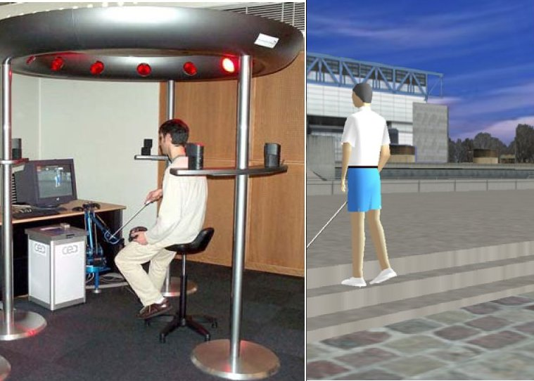

# (PART) Haptique et Accessibilité {-}

# Vers l’accessibilité

## Introduction

Avec les interfaces graphiques à manipulation
 directe (GUIs), l’utilisateur interagit avec l’ordinateur à l’aide
 d’un écran, d’un dispositif de pointage - en général une souris -
 et d’un clavier. Ces interfaces sont dites faciles à apprendre et à
 utiliser, grâce à une spatialisation de l’information qui réduit la
 charge cognitive de l’utilisateur. Toutefois, ce schéma
 d’interaction est incomplet : il exclut les utilisateurs
 non-voyants.

Dans ce chapitre, nous allons tâcher de synthétiser ce que la littérature
 nous indique quant à l’accès des non-voyants aux systèmes interactifs, tout
 d’abord dans un cadre général; puis dans un contexte d’utilisation du système
 haptique.

## L’interaction non-visuelle

### Définitions du handicap

La déclaration des droits des personnes handicapées proclamée par
 l’assemblée générale de l’Organisation des Nations Unies le 9 décembre 1975
 indique que « toute personne dans l’incapacité d’assurer par elle-même tout
 ou partie des nécessités d’une vie individuelle ou sociale normale, du fait
 d’une déficience, congénitale ou non, de ses capacités physiques ou mentales »
 est une personne handicapée.

En 1980, l’organisation Mondiale de la Santé [@world1980international], dans
 le rapport du rhumatologue britannique, Philip WOOD, introduit une
 clarification conceptuelle dans la définition du handicap, reprise en France
 sous le titre de " Classification internationale des handicaps (CIH) :
 déficiences, incapacités, désavantages. Il y est défini le handicap comme
 la conséquence des maladies sur la personne suivant trois plans :

* **la déficience**, correspondant à l’altération
 d’une structure ou d’une fonction psychologique, physiologique ou
 anatomique. La déficience peut-être temporaire ou définitive;

* **l’incapacité**, qui est une réduction partielle
 ou totale de la capacité d’accomplir de façon normale une activité.
 L’incapacité est en quelque sorte la conséquence fonctionnelle de la
 déficience mais elle ne dépend pas obligatoirement de celle-ci. D’autre
 part, une déficience peut très bien ne s’accompagner d’aucune
 incapacité;

* **le désavantage** ou **le handicap**,
 conséquence de la déficience ou de l’incapacité sur les conditions
 d’insertion sociale, scolaire ou professionnelle.

Dans l’union européenne, c’est près d’un tiers de la population qui
 souffre de troubles divers (voir le tableau \@ref(tab:population)).

Table: (\#tab:population) Population souffrant de troubles
 dans les états membres de l’Union Européenne (adapté de [TIDE 96]).

| Type de troubles     | Estimation (en millions) | % des personnes handicapées | % de la population |
|----------------------|--------------------------|-----------------------------|--------------------|
| Physique             | 24.80                    | 68%                         | 7.7%               |
| Visuel               | 6.50                     | 15.80%                      | 2%                 |
| Auditif              | 8.70                     | 23.90%                      | 2.7%               |
| Mental               | 7.40                     | 20.30%                      | 2.3%               |
| Communication verbal | 3.60                     | 10%                         | 1.1%               |

Le tableau \@ref(tab:malvoyants) montre les
 statistiques sur les populations mal-voyantes et non-voyantes. En France, sur
 18000 aveugles en âge de travailler, environ 6000 travaillent, dont 1500
 manuels (les 2/3 en secteur protégé), 1500 standardistes, 1300 masseurs
 kinésithérapeutes, 600 enseignants (en milieu spécialisé ou ordinaire), 400
 sténodactylos, 300 musiciens professionnels, 300 divers (juristes, cadres de
 la fonction publique, informaticiens); plus de 50% ne peuvent trouver du
 travail. [Quid 2005]

Table: (\#tab:malvoyants) Populations non et mal-voyantes en France et dans le monde

|                              | Troubles visuels | Aveugles + mal-voyants |
|------------------------------|------------------|------------------------|
| Monde (OMS février 2000)     | 160 000 000      | 45 000 000             |
| France (1997)                | 1 500 000        | 110 000 + 250 000      |                                   |                  |                        |
| % de la population française | 2.6%             |                        |

Enfin, la France a voté le 12 février 2005 la loi n°102-2005 pour
 l’égalité des droits et des chances, la participation et la citoyenneté des
 personnes handicapées, dont l’article 47 rend obligatoire l’accessibilité des
 sites Web du secteur public.

### Les capacités sensorielles chez les non-voyants

[@grant2000tactile] ont conduit
 une étude sur des personnes non-voyantes et voyantes. Il s’agissait
 d’apprécier la précision de la perception tactile des deux populations, et
 établir un éventuel lien entre le handicap et les capacités sensorielles. En
 fin de compte, cette étude a prouvé que les non-voyants obtenaient de
 meilleurs résultats que les voyants au début des tests, mais que cet avantage
 diminuait au fur et à mesure, jusqu’à disparaître.

En fait, il a été souvent dit que les aveugles développaient des capacités
 sensorielles supra-normales, telles que l’acuité auditive, ou somesthésique.
 Dans la pratique, cependant, il a été prouvé que l’acuité haptique
 [@heller1989texture] était équivalente chez les
 non-voyants congénitaux, chez les non-voyants accidentels et chez les
 personnes voyantes.

### La représentation mentale d’un document par une personne non-voyante

Une personne aveugle se sert énormément de sa mémoire et relativement peu
 de ses sens, alors que l’activité d’une personne voyante est essentiellement
 basée sur la vue et la coordination oeil-main.

Pourtant, les travaux de [@hatwell1993images] et de [@martial1998representation]
 ont montré que la représentation mentale des non-voyants est identique à celle
 des voyants. En effet, même si l’on parle habituellement de mémoire visuelle,
 lorsque l’on considère la représentation mentale de quelque chose, tout est
 basé sur l’expérience de l’espace. En d’autres mots, pour se construire une
 représentation mentale de ce qui leur est décrit, une personne aveugle
 s’appuiera sur les notions qu’il a de l’espace : en haut, à droite, à l’est,
 derrière.

Dans une autre expérience, [@manghi2003composantes] a demandé à ses sujets
 (l’étude portait sur des voyants et des non-voyants, et explorait également les
 effets de l’âge) de décrire un trajet dans une ville à quelqu’un. Les résultats
 se sont révélés très intéressants :

1. Les personnes non-voyantes ont obtenu des
 résultats équivalent quant au taux de réussite de la tâche,
2. Leurs descriptions d’itinéraires ont été surtout
 jugées plus pertinent, avec notamment l’utilisation
	* de repère absolus (le nord, le banc sur le
	 trottoir...)
	* de précisions dans les mesures (angles,
	 distances),
	* de repères multimodaux (le carrefour, le
	 marteau-piqueur...)

Il y a cependant, entre un voyant et un non-voyant, une différence très
 importante, lors de l’accès aux documents textuels : le non voyant ne peut pas
 se faire une idée globale de la forme du texte. Inversement, lors d’une tâche
 de lecture, une personne voyante peut parcourir l’ensemble du document très
 rapidement, et par exemple, repérer rapidement l’item qui l’intéresse.

Pour se faire une idée assez rapide du texte avant la lecture, les
 non-voyants utilisent une synthèse vocale réglée sur un débit rapide.
 Cependant, la mémoire auditive demande une grande concentration. Ainsi,
 l’utilisation d’une autre modalité, comme le toucher, peut permettre de
 réduire la charge mentale.

En conclusion, un non-voyant se construit une image mentale identique en
 tout point à celle d’une personne voyante. Cependant, la construction d’une
 telle représentation mentale nécessite une description de la disposition
 globale, ou des mécanismes de navigation dans le document. Enfin, on pourra
 s’appuyer sur une grande précision dans les descriptions.

### Modalités non-visuelles disponibles en sortie

Contrairement à ceux de l’être humain, les médias non visuels en sortie
 restent limités (tableau \@ref(tab:media-non-visuels)).
 Les systèmes basés sur les sens de l’odorat et du goût restent très rares.
 Maintenant, les périphériques de pointage à retour d’effort se démocratisent
 de plus en plus (voir [2.5](016-les-peripheriques-de-sortie-a-retour-haptique.html)).

Table: (\#tab:media-non-visuels)Sens perceptifs humain et médias informatiques
 (adapté de [@truillet1999modelisation])

| Sens perceptifs humain | Médias informatiques                                             | Stimuli                         | Récepteurs                    |
|------------------------|------------------------------------------------------------------|---------------------------------|-------------------------------|
| Ouïe                   | Haut-parleurs, casque audio                                      | Parole, bruit, son              | Oreilles                      |
| Haptique               | Afficheur braille, sondes chauffantes, système à retour de force | Texture, température, mouvement | Peau, Muscles, tendons, corps |
| Odorat                 | ?                                                                | Odeurs                          | Nez                           |
| Goût                   | ?                                                                | Saveur                          | Langue                        |

### Utilisation et justification de la multimodalité

[@dufresne1995multimodal] ont montré
 l’impact et l’intérêt de la bimodalité audio-haptique pour les utilisateurs
 non-voyants. Le tableau \@ref(tab:modalite) indique le
 pourcentage de bonnes réponses dans trois situations modales; pour 12 voyants
 et 12 non-voyants. Il est à noter que dans cette expérience, les sujets
 non-voyants ont obtenus de meilleurs scores : leur concentration était
 supérieure.

Table: (\#tab:modalite) Bonnes réponses dans différentes situations modales

| Modalité         | Testeurs non-voyants : 12 | Testeurs voyants : 12 | Total : 24 |
|------------------|---------------------------|-----------------------|------------|
| Audio            | 68%                       | 62%                   | 64%        |
| Haptique         | 78%                       | 71%                   | 74%        |
| Audio + haptique | 83%                       | 78%                   | 80%        |
| Total            | 76%                       | 70%                   | 73%        |

## L’accessibilité : définitions

>
>  The power of the Web is in its universality. Access by everyone regardless of
>  disability is an essential aspect.
>
>  Tim Berners-Lee, l'inventeur du World Wide Web
>

### L’accessibilité par Tim Berners-Lee, directeur du W3C et inventeur du World Wide Web

>
>  Mettre le Web et ses services à la disposition de tous les individus, quel
>  que soit leur matériel ou logiciel, leur infrastructure réseau, leur langue
>  maternelle, leur culture, leur localisation géographique, ou leurs
>  aptitudes physiques ou mentales.
>
>  L’accès à l’information et à la communication est un droit universel. Le
>  web est devenu un média majeur, et il se doit d’être accessible à tous sans
>  discrimination. Concevoir dans le cadre du design for all (conception pour
>  tous), c’est anticiper sur les usages, répondre à une logique de
>  développement durable et surtout, utiliser la technologie dans le respect
>  des individualités.
>

### L’accessibilité par Denis Chêne, France-Télécom R&D

>
>  Être accessible c’est avant tout permettre l’accès. L’accès aux
>  informations (documents, nouvelles, bases de données) ; l’accès aux
>  échanges, qu’il s’agisse des échanges en terme de communication (audio,
>  vidéo, texte...) ou des échanges de biens de consommation (achats divers,
>  gestion monétaire...).
>
>  Mais, être accessible c’est aussi permettre l’utilisation, car rien ne
>  sert d’accéder si l’on ne peut utiliser. Consulter , c’est bien, mais faire
>  , c’est mieux.
>
>  La richesse du numérique, c’est sa malléabilité. La malléabilité permet
>  en effet de reformuler les données échangées de façon à correspondre à
>  chaque type d’utilisateur et de situations. Il existe en effet de nombreux
>  types d’utilisateurs différents, qui accèdent à l’information de façons
>  diverses, selon des contextes variés (absence de visibilité, d’audition, de
>  motricité, de compréhension). Rendre l’information et les échanges
>  accessibles, c’est optimiser, pour chaque individu, pour chaque contexte
>  d’usage, l’acquisition, la production, et la manipulation d’informations et
>  d’éléments pouvant être atteints sur ou via le web.
>
>  La richesse du web c’est son gigantisme. D’aucun diront qu’il est
>  impossible, sur une telle masse, de gérer toutes les individualités et tous
>  les contextes, et que ’faire du spécifique’ est coûteux et peu rentable.
>  Certes, mais l’objet n’est justement pas de faire du spécifique, mais du
>  générique qui puisse servir à tous, sans exception. Ce faisant,
>  l’accessibilité est moins coûteuse : l’araignée gagnera à tisser une toile
>  solide plutôt qu’une toile fragile aux nombreuses rustines ; et plus
>  rentable : davantage d’utilisateurs pourront y accéder dans plus de
>  contextes d’usages.
>
>  Au final, l’accessibilité résulte d’une conception pour tous . Or, la
>  richesse de l’être humain, c’est sa diversité.
>

### La *Web Accessibility Initiative* (WAI) du *World Wide Web Consortium* (W3C)

Le *World Wide Web Consortium*, abrégé W3C^[http://www.w3.org], est
 un consortium fondé en octobre 1994 pour promouvoir la compatibilité des
 technologies du *World Wide Web* telles que HTML, XHTML, XML, CSS,
 PNG, SVG et SOAP. Le W3C n’émet pas des normes, mais des recommandations.

Le consortium laisse le soin aux fabricants de suivre les recommandations.
 Contrairement à l’Organisation internationale de normalisation ou d’autres
 corps internationaux de standardisation, le W3C ne possède pas de programme
 de certification, et beaucoup de standards ne définissent pas formellement un
 niveau de conformité. Ils sont ainsi souvent implantés partiellement.

Concernant l’accessibilité, le W3C a créé des recommandations à travers le
 projet WAI (*Web Accessibility Initiative*) en 1996. Ces
 recommandations s’adressent à tous les distributeurs de contenu numérique par
 Internet : navigateurs, documents HTML, logiciels d’édition de HTML, logiciel
 du publication de site Web créant le code HTML.

Les recommandations de la WAI actuellement en vigueur sont :

* les *Authoring Tool Accessibility Guidelines*
 (ATAG) qui posent les règles d’accessibilité pour les outils
 d’édition.
* les *Web Content Accessibility Guidelines*
 (WCAG) qui montrent comment créer des documents Web avec un contenu
 accessible aux utilisateurs souffrant de handicaps.
* les *User Agent Accessibility Guidelines*
 (UAAG), enfin, posent les règles pour l’accessibilité des agents
 utilisateurs.

On pourra se référer aux [annexes](#accessibilite), pour plus de détails.

### Autres aspects de l’accessibilité

>
>  L’accessibilité n’est pas une fonctionnalité, mais bien un processus (une
>  méthode) que l’on intègre tout au long du cycle de vie d’un projet.
>
>  Pierre Guillou (responsable de la cellule accessibilité de l’association
>  BrailleNet)
>

### Accessibilité: notre positionnement

>
>  Nous nous positionnons pour une accessibilité au
>  sens large. Il s’agit d’une approche visant à étendre la démarche
>  d’accessibilité au delà d’un public spécifique. En employant
>  l’illustration du <<qui peut le plus peut le moins>>,
>  concevoir un site Web accessible pour une personne non-voyante, rendra ce
>  site Web plus simple d’usage pour l’ensemble des utilisateurs. La
>  problématique de cette thèse traite de l’utilisation de dispositifs à
>  retour de force en matière d’accessibilité, à priori pour les personnes
>  souffrant d’handicap visuel; maintenant, quand nous proposerons des
>  solutions techniques utilisables spécifiquement par des personnes
>  handicapées, les concepts utilisés, et les solutions techniques retenus
>  peuvent (et doivent) être reprises dans des contextes plus larges; dans
>  des situations où le sens de la vue serait mobilisé sur une autre tâche,
>  par exemple.
>

Nous allons cependant passer en revue ce qui a déjà été réalisé
 spécifiquement pour des personnes souffrant d’un handicap visuel, en matière
 d’accessibilité, et mettant en œuvre des dispositifs haptiques. Nous
 retiendrons que ces approches peuvent être reprises sans public spécifique,
 avec une interaction augmentée par le sens haptique.

## L’accessibilité des personnes non-voyantes et mal-voyantes grâce à un dispositif à retour haptiquetitre")

L’idée de base de l’utilisation de périphériques à retour haptique pour
 des utilisateurs non-voyants, est de palier, autant que raisonnablement
 possible, à l’absence de canal visuel. Dans cette approche, plusieurs
 contextes d’utilisation ont été explorés.

Nous allons les étudier plus précisément, afin de dégager des pistes pour
 notre propre approche.

### Identifier le contenu et l’agencement d’un document

D. Offen et B. Thomlinson ont développé une librairie de programmation
 permettant d’identifier l’agencement d’un document [@offen2001good].
 L’OPENBook (c’est le nom
 de la librairie) est ainsi capable d’identifier les colonnes, les titres, les
 blocs de texte, les illustrations, les légendes, les tableaux, les entêtes et
 les pieds de pages. Un synthétiseur vocal permet de lire le contenu du
 document. Le périphérique utilisé est la souris Wingman Force Feedback de
 Logitech. L’utilisateur pourra alors accéder à l’information de plusieurs
 manières :

1. Le mode « Page Layout Summary » (pour
 *résumé de la disposition de la page*) rapportera le nombre
 d’éléments de chaque type visibles sur la page. Par exemple 1 titre, 2
 colonnes, 1 illustration .
2. Le mode « Guided Layout » (pour
 *disposition guidée*) , l’utilisateur sera passif, et se laissera
 guider (ainsi que sa main avec la souris à retour de force) dans un ordre
 logique dans la lecture du document. Le synthétiseur vocal annonçant le nom
 de chaque élément.
3. Avec le mode « Explore Layout » (pour
 *disposition explorée*), l’utilisateur est actif, et contrôle le
 mouvement d’un élément à un autre, en entendant la synthèse vocale lui dire
 de quoi il s’agit.

### Toucher un document graphique

C. Ramstein est un des pionniers dans les interfaces utilisateur haptiques
 pour des personnes ayant un handicap visuel [@ramstein1996touching]. Il a été à
 la tête de Haptic Technologies Inc. qui fabriquait et vendait les systèmes de
 PenCAT/MouseCAT et de TouchDesktop (c’est la couche logicielle qui gère les
 périphériques de Haptic Technologies). Le travail de Ramstein s’appuie sur
 des interfaces multimodales. L’information haptique est combinée avec
 l’information sonore et l’affichage Braille.

J. P. Fritz et K. E. Barner [Department of Electrical and Computer
 Engineering at the University of Delaware] ont travaillé depuis l’apparition
 du PHANTOM, sur un système haptique de visualisation pour des personnes avec
 handicap visuel [@fritz1996design] [@fritz1999design]. Le cœur du
 projet n’est pas basé sur une traduction des interfaces utilisateurs en
 information haptique mais sur l’utilisation de formes haptiques virtuelles.
 Ainsi, leurs travaux visent à transcrire de l’information non-textuelle,
 telle que des figures mathématiques, ou des tableaux contenant des données
 scientifiques. Leur approche consiste à générer une forme tridimensionnelle,
 et à lui donner une existence haptique grâce au PHANTOM.

Les laboratoires de British-Telecom ont étudié l’utilisation d’un
 affichage haptique couplé au VRML (Virtual Reality Markup Language), le
 format pour l’affichage des graphiques 3D sur le Web [@hardwick1998tactile].
 Le travail est basé sur une expérience acquise du développement d’un navigateur
 capable de piloter un retour de force à partir d’un fichier VRML. On retrouve
 ici l’approche de la bibliothèque de programmation Ghost™SDK de Sensable : le
 dispositif de pointage remplace le doigt de l’utilisateur dans l’espace
 virtuel, et permet de toucher les objets.

Dans ces trois premières approches, il s’agit de découvrir un objet
 tridimensionnel à l’aide d’un dispositif de pointage à retour de force. On
 retrouve ainsi les limitations suivantes issues du
 tableau \@ref(tab:possibilite) :

|----------------------|-------------------------------------------------------------|
| L’enveloppement      | Non possible en l’absence de plusieurs points de contact    |
| Le suivi de contours | Possible, mais très difficile du fait d’une zone de contact |

J. A. Gardner et V. Bulatov [@gardner2001smart] se sont appuyés sur le format
 SVG (Scalable Vector Graphics) qui est le format XML pour les images
 vectorielles. Associé à une souris à retour de force et à un retour sonore, des
 images peuvent être rendue accessibles, tant qu’elles ne sont pas trop
 complexes aux non-voyants. Il s’agissait par exemple de localiser les
 positions des différentes régions
 sur une carte géographique, grâce au rendu d’une texture particulière et d’un
 retour sonore, quand le pointeur de la souris passe au centre d’une chaque
 région. Cette approche est très similaire à ce que nous avons réalisé, voir
 la section \@ref(geogrhaptique).

Wai Yu, de l’université de Glasgow a beaucoup étudié l’utilisation d’une
 souris à retour de force ou du PHANTOM dans les problèmes d’accessibilité. Il
 a proposé tout d’abord une méthode permettant aux non-voyants d’accéder à des
 graphiques mathématiques à l’aide du PHANTOM [@yu2001haptic]. La
 figure \@ref(fig:haptiquement) est issue de cette application : lorsqu’il
 passe à proximité d’un des segments, le pointeur du dispositif est attiré sur
 lui.

Plus tard, il a continué son travail en proposant cette même accessibilité
 dans un contexte Web : l’application tourne dans un navigateur internet et
 utilise la souris Wingman Force Feedback. Pour cela il a exploré la
 construction automatique de graphiques haptiques [@yu2002automatic], puis, il
 a donné à l’utilisateur non-voyant, la possibilité de créer ses propres
 graphiques [@yu2003web].

Enfin, [@sjostrom2002non] a également
 étudié le rendu de graphiques mathématiques, mais uniquement à l’aide d’un
 PHANTOM. Son approche cherche à être plus proche d’une réelle situation
 pédagogique. On peut citer les histogrammes haptiques, obtenus par effet de
 cloisonnement, ou les courbes mathém’haptiques , qui comme pour Wai Yu, sont
 issues d’un effet d’attirance sur la courbe.

### Permettre d’appréhender les formes et les textures

[@fritz1996design] ont développé une
 méthode synthétisant des textures haptiques perceptiblement distinctes en
 utilisant des techniques de modélisation stochastiques. Leur but était de
 créer un ensemble de textures qui pourraient alors être utilisées pour
 décrire des illustrations complexes de données.

Dans ces travaux, les périphériques utilisés sont
 [des PHANTOMs](\@ref(fig:PHANTOM))
 ou l’Impulse Engine 3000 (figure [4.2](#cap:L'impulse-engine-3000)). En effet,
 pour générer des textures
 probantes, il est nécessaire d’utiliser du matériel disposant d’une
 résolution spatiale très fine : 0.03mm et 0.01mm respectivement pour le
 PHANTOM et l’Impulse Engine 3000.

[@colwell1998haptic] a étudié la
 perception des textures, des formes et des objets virtuels par des sujets
 voyants et non-voyants à l’aide de l’Impulse Engine 3000
 (figure \@ref(fig:impulse)). Ces travaux font partie des grandes références
 du domaine (voir les [Recommandations de conception].

Enfin, [@sjostrom2001designing] a étudié la
 perception de textures issues du monde réel. Les travaux précédents
 utilisaient des méthodes stochastiques pour générer leurs textures. Sjöström
 s’est inspiré de la technique du Bump-Mapping pour générer ses textures.

Au final, toutes ces études soulignent le fort potentiel de l’utilisation
 de textures dans les systèmes interactifs, du fait de bonnes capacités
 psychophysiques pour discriminer deux textures différentes.

### Interface graphique haptiquement augmentée

C’est la piste qu’ont suivis [@dufresne1995multimodal],
 [@ramstein1996combining], [@o1997moose] et [@rosenberg1997feelit].

Il s’agit d’opérer une traduction de ce qui apparaît à l’écran en effets
 haptiques via un périphérique adapté. Les périphériques utilisés sont du type
 souris. Quelques exemples d’effets proposés par le FEELiT DeskTop d’Immersion
 Corporation, par The Moose de Guillepsie ou le Multimodal User Interface
 System de Ramstein :

* Le passage du pointeur de la souris au-dessus d’une
 icône ou d’un item d’un menu déroulant provoque un choc dans la main de
 l’utilisateur ou encore un effet magnétique est ressenti. Guillepsie a
 utilisé la notion d’hapticon.
* Le glisser-déposer trouve sa métaphore
 enrichie : on a réellement l’impression de porter quelque chose avec
 sa souris, puisque qu’elle semble avoir beaucoup d’inertie lorsque l’on
 porte un document. Le raffinement peut même aller jusqu’à rendre l’inertie
 du périphérique maniant du pointeur, proportionnelle à la taille (en Mo) du
 dossier/fichier déplacé.
* Les bords des fenêtres deviennent apparents
 (toujours haptiquement), avec des notions d’intérieur et d’extérieur.

Cette approche permet de rajouter le retour haptique en tant que modalité
 parallèle et redondante à celles déjà utilisées : le retour visuel tout
 d’abord, et le retour sonore ensuite dans le cadre d’une utilisation par des
 non-voyants. Cependant, l’approche consistant à prendre comme base
 l’interface graphique pour la traduire en retour haptique, bien qu’étant la
 plus intuitive, reste bridée. En effet, l’interface graphique n’a été conçue
 ni pour une utilisation par des non-voyants, ni pour être traduite en effets
 de force. Les éléments à faire apparaître haptiquement sont trop nombreux et
 les effets finissent par se chevaucher, et s’annulent ou s’amplifient par
 phénomène de résonance.

### L’accessibilité à l’Internet, via le mode haptique

Très récemment, Wai Yu et ses collègues ont proposé un système multimodal
 de présentation de pages Internet [@yu2005improving]. Il s’agissait d’appliquer
 l’approche qu’il a utilisée
 sur les graphiques mathématiques, au pages Internet. Par exemple, la
 proximité du pointeur de la souris avec une image ou un lien, se
 matérialisait par un retour sonore (synthèse sonore ou sonification) et
 haptique (par une souris à retour de force). L’intérêt de leur approche vient
 de l’utilisation de logiciels et de matériels courants : Internet Explorer ou
 Mozilla Firefox pour les navigateurs employés, la souris Wingman Force
 Feedback et son WebPlugin pour le dispositif haptique.

### L’accessibilité dans le monde réel : Homere

Homere est un système qui a été réalisé par la société
ONDIM ^[http://www.ondim.fr/], en partenariat avec le Commissariat à
l’Energie Atomique et PSA Peugeot Citroën [@lecuyer2003homere]. Il s’agit
 d’un système d’assistance à la reconnaissance d’itinéraires urbains pour
 aveugles et malvoyants. Le dispositif haptique revient à simuler une canne
 blanche virtuelle. L’ensemble du système permet la reconnaissance d’un
 itinéraire au sein de la Cité des Sciences et de l’Industrie.

## Recommandations de conception

[@colwell2001non] a déduit de ses
 expériences une série de recommandations quant à l’utilisation du mode
 haptique pour les non-voyants : ^[(1) et (2) concernent les textures virtuelles,
 (3) à (7) sont sur les objets virtuels, (8) à (9) concernent les objets
 complexes et leurs orientations et enfin (10) et (11) traitent de l’espace
 haptique et de sa navigation.]

1. Les utilisateurs doivent être capables d’une
 discrimination aisée entre les différentes textures simulées; il ne faut
 pas partir de l’hypothèse comme quoi les variations des paramètres de
 génération d’une textures sont facilement détectables par autrui.
2. La perception des textures peut varier d’un
 utilisateur à l’autre, tant sur la perception des éléments de la texture,
 que sur la manière dont la texture est ressentie (i.e. qu’est-ce qui est
 plus dur, qu’est-ce qui est plus doux ?).
3. La perception des dimensions est plus précise sur
 un grand objet virtuel que sur un petit.
4. La taille d’un objet virtuel est perçue comme
 étant plus grande lorsque l’objet est exploré de l’intérieur, et plus
 petite lorsque l’objet est exploré de l’extérieur. ^[Les recommandations
 (3) et (4) suggèrent que si la taille des objets est un paramètre important,
 il peut être nécessaire de biaiser la taille de l’objet virtuel par rapport
 à sa taille réelle.]
5. Les objets virtuels n’ont pas besoin de suivre les
 lois de la physique de la même manière que dans le monde réel. Notamment,
 les utilisateurs peuvent passer à travers la surface d’un objet. Ce sont
 les contraintes technologiques qui ne permettent pas de rendre tous les
 aspects physiques d’un objet sur son avatar virtuel. Pour autant, cela ne
 semble pas déranger les utilisateurs pour pousser un objet même en passant
 au travers de sa surface, mais un soin particulier doit être apporté pour
 respecter le maximum des autres lois de la physique.
6. Les utilisateurs peuvent rencontrer des
 difficultés pour orienter des objets virtuels dans l’espace; si cela
 s’avère important dans la tâche, d’autres mécanismes peuvent être utilisés
 (par exemple, en ajoutant un sol ou des murs à l’espace virtuel).
7. Les utilisateurs peuvent avoir besoin d’apprendre
 des stratégies d’exploration avec un périphérique particulier. Ceci n’est
 certainement pas long, mais autant proposer de telles stratégies aux
 utilisateurs.
8. Les utilisateurs peuvent ne pas appréhender des
 objets trop complexes depuis une information purement haptique; une
 information multimodale peut alors être utilisée pour donner un sens aux
 objets complexes.
9. Les objets virtuels complexes sont souvent
 constitués de plusieurs composants. La modélisation tridimensionnelle peut
 générer des petits vides entre ces composants. Lors de l’exploration
 haptique, le curseur peut s’y coincer. Tout ceci ne peut que perdre
 l’utilisateur lors de l’exploration haptique d’un objet virtuel.
10. Les utilisateurs peuvent se perdre dans l’espace
 haptique. Il est nécessaire de proposer un mécanisme donnant des
 informations sur la navigation, afin d’éviter ce problème.
11. Les utilisateurs peuvent avoir différents modèles
 mentaux de ce qu’est l’espace virtuel et de quelle partie du périphérique
 est en train de toucher l’objet virtuel. Il faut veiller aux conséquences
 de ces facteurs.

De même, [@sjostrom2002non] a proposé
 ses recommandations plus spécifiquement dédiées la conception de
 l’interaction haptique non-visuelle :

1. **L’objet :** Élaborer un objet virtuel en
 tant que tel : l’objet peut ressembler à un objet réel, mais il faudra
 aussi tenir compte des caractéristiques de la perception pendant sa
 conception.
2. **La navigation :** Faciliter la
 navigation ainsi que la vue générale : en proposant des points de
 références pour éviter à l’utilisateur de se perdre (c’est à dire de mettre
 le pointeur de son dispositif à retour de force, à un endroit privé de
 retour de force)
3. **Le contexte :** Proposer des
 informations contextuelles
4. **La multimodalité :** Utiliser
 toutes les modalités disponibles (plage braille, synthétiseur
 vocal...)
5. **L’apprentissage :** Proposer un support,
 voire même des cours pour la phase d’apprentissage de la méthode
 d’interaction, pour la prise de connaissance de l’environnement et pour le
 fonctionnement du programme.

## Conclusion

Dans ce chapitre, nous avons présenté le public auquel nous nous
 intéressons en premier lieu, à savoir les utilisateurs non-voyants.

Nous avons également défini ce que nous attendons d’une démarche
 d’accessibilité : les concepts mis en œuvre pour une application visant un
 public spécifique, doivent pouvoir être reprises dans des applications sans
 public spécifique. L’interaction s’en trouvera, selon les cas, augmentée,
 améliorée, ou simplifiée.

Pour finir, et afin de positionner notre proposition (voir chapitre
 suivant), nous avons posé l’état de l’art des réalisations utilisant
 l’interaction haptique dans une démarche d’accessibilité, ainsi que les
 recommandations qui ont été émises.

