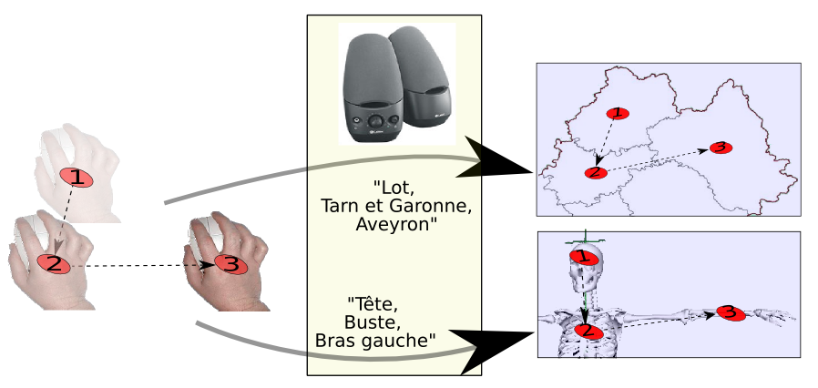
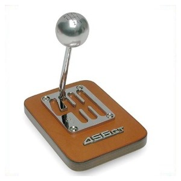
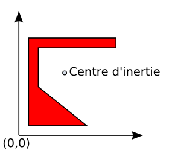
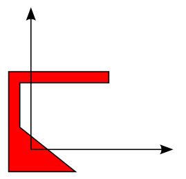
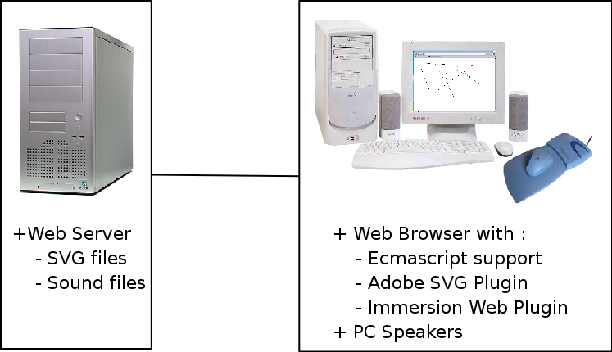
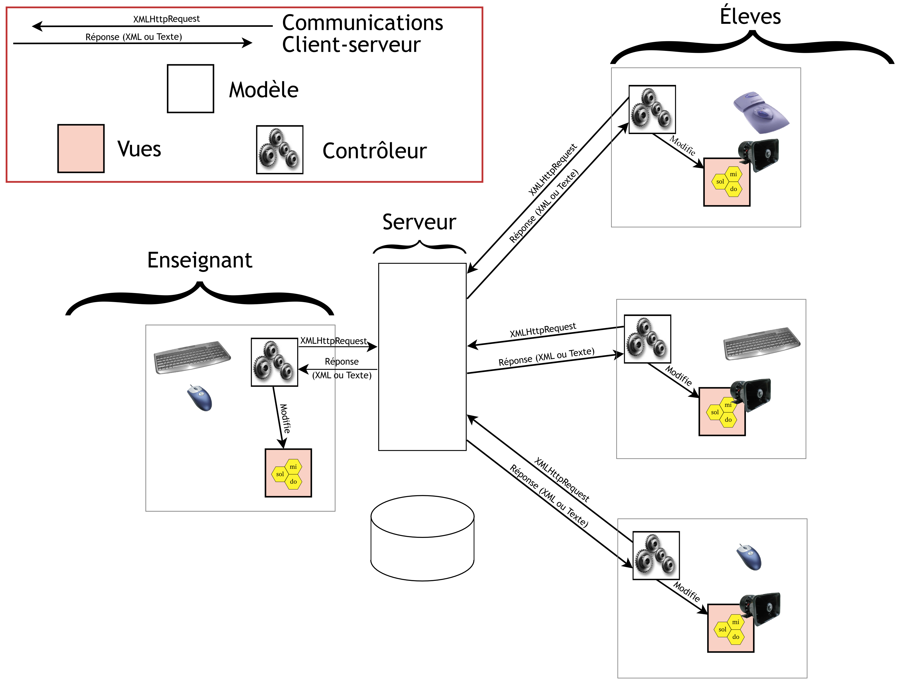
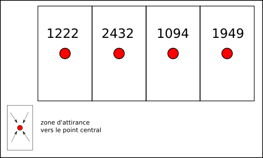
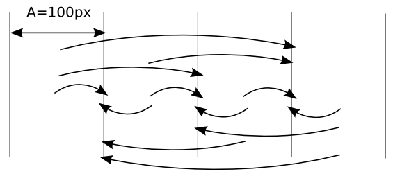
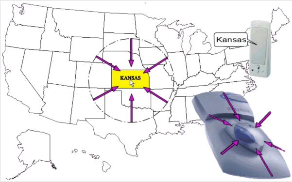
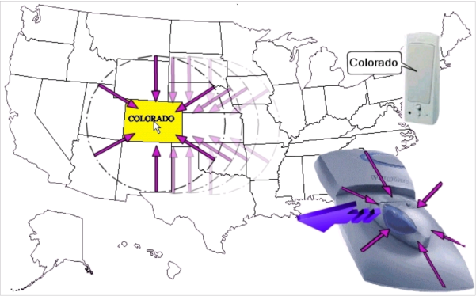

# La localisation relative


## Introduction


Nous allons proposer dans ce chapitre un cadre d’utilisation des
 périphériques de pointage à retour de force. Nous avons déjà abordé les
 limites de ce type de dispositif dans le chapitre
 \@ref(communications-homme-machine).


Maintenant, du potentiel du système haptique (voir \@ref(conjuguent),
\@ref(performances) et \@ref(perception)), nous pouvons déjà édicter
plusieurs règles :


**Règle 1 :**
la précision des doigts en terme de positions,
 et de mémorisation [@zhai1996influence]. Ceci implique l’utilisation des périphériques type PHANTOM en
 mode stylo, de manière à ne pas trop baser l’interaction sur le couple
 épaule-coude. De plus, une souris peut rester préférable car elle est plus
 simple à manier en 2D.

**Règle 2 :**
la mémoire sur la position est meilleure que
 celle sur les distances. [@faineteau2003kinaesthetic]

**Règle 3 :**
l’apprentissage par geste actif donne de
 meilleurs résultats que celui par geste passif. En d’autres mots, il faudra
 préférer des phases d’apprentissage de l’interface basées sur
 l’exploration, plutôt que sur la présentation.

De plus, les modèles de l’utilisateur (en particulier [le modèle du
 processeur humain](#processeur)) nous indiquent quelques règles à
 respecter sur l’ergonomie des interfaces :

**Règle 4 :**
limiter le nombre d’items de menus

**Règle 5 :**
établir des liens entre éléments (couleurs,
 format, emplacements) pour faciliter le filtrage cognitif

**Règle 6 :**
écrire des messages concis

**Règle 7 :**
ne pas présenter d’informations inutiles


## La localisation relative


### L’idée sous-jacente


C’est grâce à la mémoire sensorielle associée à notre perception
 kinesthésique, que nous pouvons nous représenter mentalement la position des
 objets que nous sommes en train de manipuler. Nous allons associer cette
 approche à une utilisation de périphériques de pointage à retour de force et
 à un retour audio (synthèse vocale et son). C’est ce que nous nommerons par
 la suite la localisation relative .


Par exemple, sur la figure \@ref(fig:localisation), un
 utilisateur non-voyant pourra reconnaître les positions relatives de
 départements français de la région Midi-Pyrénées (l’exemple en haut de la
 figure) ou bien la disposition des membres d’un être virtuel (l’exemple du
 bas de la figure).




Afin d’illustrer ce concept d’interaction, nous proposons **la métaphore
 du levier de vitesse** (figure \@ref(fig:levier))), qui comprend nombre de
 similitudes avec la localisation relative :


* l’action de l’utilisateur est le déplacement d’un
 point dans l’espace ;
* le feedback de l’action est constitué par un retour
 haptique (guidage et cran) et sonore (bruit du moteur) ;
* l’interaction est réalisée sans regarder le levier
 (ou alors, il faut penser à apprendre à conduire) ;
* une phase d’apprentissage est nécessaire, ainsi
 qu’une mise à niveau quant aux spécificités des différents modèles. Par
 exemple, la marche arrière est en haut à gauche, ou encore, la boite compte
 6 vitesses.




### Mise en œuvre technique


#### Cahier des charges


Le système devra respecter au mieux les points suivants :


* Se baser sur des formats de fichier les plus
 pérennes possible
* Être extensible pour s’adapter à d’autres
 domaines
* Permettre une traduction haptique la plus
 automatique possible


#### Le format de fichier


Nous avons décidé de baser notre système sur le formalisme XML. Nous
 avançons plusieurs raisons à ce choix :


1. Le format XML est un format ouvert et
 normalisé.
2. Il existe toute une panoplie d’outils pour la
 manipulation des fichiers XML : XSL, XPath...
3. Certains formats issus du XML peuvent être utilisé
 dans un contexte Web : SVG, MathML, X3D...
4. Certains domaines disposent de leur formalisme XML
 : CML pour la chimie, SVG pour les graphismes vectoriels, MathML pour les
 mathématiques...
5. Quasiment tous les langages de programmation
 disposent d’outils permettant la lecture, la manipulation ou la création de
 fichiers XML. Pour notre part, nous avons utilisé Perl et PHP côté serveur.
 Côté client, c’était du javascript qui pouvait générer le SVG, javascript
 parfois lui-même généré par une programmation server-side .
6. Le XML est scriptable . En d’autres mots, il
 permet une interaction avec l’utilisateur, et ce, de manière relativement
 facile; de plus, grâce au DOM (*Document Objet Manager*), il est
 possible d’agir sur la structure même du document XML, par exemple en
 ajoutant dynamiquement un objet.


En pratique, c’est le format de fichiers SVG (*Scalable Vector
 Graphics*) que nous utilisons. Il s’agit du formalisme XML pour produire
 des images vectorielles. Mais pourquoi un format qui code des images ?
 La question est à poser, surtout lorsque les applications basées sur notre
 approche, ciblent les utilisateurs non-voyants. En fait, le SVG va nous
 donner les informations spatiales dont nous avons besoin pour générer les
 effets de retour de force. Et ce, de manière beaucoup plus automatique
 qu’avec un fichier binaire codant une image bitmap (comme les fichiers jpeg
 ou gif).


Par exemple, considérons le code SVG suivant :

```xml
<rect x="1" y="1"
      width="1198" height="398"
      fill="none" stroke="blue"
      stroke-width="2" />

```

Il s’agit de la déclaration d’un rectangle dont le coin supérieur gauche
 est aux coordonnées (1,1), dont la largeur est 1198 et la hauteur 398. En
 connaissant ces données, il est simple de générer une force sur un
 périphérique adapté, de manière à amener le dispositif au centre de ce
 rectangle (en l’occurence, en *x*=599 et *y*=296).


#### Le retour de force


Notre retour de force est généré via la souris Wingman Force Feedback
 Mouse. De plus, nous utilisons le Web Plugin d’Immersion™pour disposer du
 retour de force dans un navigateur Internet. En l’occurence, il s’agit de
 Internet Explorer, car c’est un des seuls qui accepte le plugin.


L’effet que nous utilisons pour situer un point haptique est illustré sur
 la figure \@ref(fig:aimant). Il s’agit d’un
 effet d’encloisonnement elliptique, déclenché lorsque le curseur passe au
 dessus de certaines zones. Le tout étant de placer judicieusement cet effet,
 rapport aux coordonnées que nous lisons dans le ficher SVG.


#### Une approche manuelle


La première approche que nous avons utilisée pour placer l’effet en
 relation avec l’affichage, a été purement manuelle. Il s’agissait de créer un
 tableau contenant les coordonnées des points en question. Ces coordonnées,
 ont été préalablement relevées, dans un logiciel d’édition de fichiers SVG, à
 la main. Il fallait de plus, conserver un certain ordre afin de retrouver
 quelles coordonnées allaient avec quel point.


#### Des approches plus automatiques

##### L’emplacement de l’effet est calculé au chargement du SVG :

À la lecture du fichier SVG, il est possible de calculer un couple de
 coordonnées symbolisant le centre d’une forme. En reprenant notre exemple
 précédent, qui code le rectangle, une fonction javascript peut facilement
 calculer le centre de la primitive <rect>, en l’occurence, dans le
 système de coordonnées du SVG, $x_c=599$, et $y_c=199$. Nous avons
 ainsi développé plusieurs fonctions permettant le calcul du centre d’inertie,
 pour un rectangle, une ellipse.


Le problème s’est compliqué lorsque nous nous sommes penché sur les
 primitives <polygon> et <path>. La primitive <polygon> code
 une suite de point de la forme "$x_1,y_1 
 x_2,y_2... x_n,y_n$" afin de dessiner
 un polygone. La primitive <path> dessine un chemin, en donnant par
 exemple le point de départ, puis une liste de vecteurs. Le calcul en soi du
 centre d’inertie ne pose pas de problème. Par contre, il est également
 possible de tomber sur un centre d’inertie extérieur à la forme.


**exemple avec la primitive <polygon>**


```xml
<polygon points="10,10 10,100 100,100 100,90 20,90 20,50 70,10"
         style="fill: red; stroke: black"/>
```

La figure \@ref(fig:centre) illustre cette forme, ainsi que le centre
d’inertie calculé : $x_c=47,14$ et $y_c=137,14$.




Pour cette raison, et pour éviter d’avoir à se lancer dans de fastidieux
 calculs qui visent à déterminer le centre géodésique de la forme, nous avons
 finalement opté pour une autre approche.


##### Utilisation de l’attribut translate :


L’approche que nous avons le plus utilisée, est toujours automatique.
 Néanmoins, elle présuppose un travail préalable lors de la création du
 fichier SVG; dans notre cas, le travail se fera lors de la génération du
 fichier.


L’approche consiste en :


1. la création de formes vectorielles, centrée en
 (0,0),
2. l’utilisation de ces formes en les plaçant dans un
 fichier SVG. Le placement de ces formes sera réalisé par l’attribut
 translate


**dans l’exemple précédent :**


Nous allons centrer la forme en (0,0); cette origine sera le point de
 retour haptique. Le code suivant


```xml
<polygon points="-20,-20 -20,70 70,70 70,60 -10,60 -10,20 40,-20"
         style="fill: red; stroke: black"/>
```

nous donne la figure \@ref(fig:centre2):




Par la suite, il nous suffira de réutiliser cette forme, en la plaçant
 grâce à une translate avec la balise adéquate. Par exemple, pour placer notre
 forme en (50,150), on aura :


Finalement, nous n’avons plus qu’à lire la valeur de la translation pour
 positionner correctement l’effet. Le gros avantage de cette approche est
 également sémantique : nous manipulons ici un élément graphique, dont
 l’origine se trouve être un élément haptique. Notre forme devient un
 intéracteur bimodal : visuel et haptique.


#### Le retour audio


Dans nos prototypes, le retour audio n’est effectué que d’une seule façon,
 par sons pré-enregistrés (format wav ou mp3) inclus dans le fichier SVG lors
 de la génération. Pour autant, d’autres possibilités sont envisageables,
 telles qu’utiliser un lecteur d’écran et une synthèse vocale, de manière à
 faire prononcer des mots-clés inclus dans le fichier SVG. Autre approche, de
 même que nous générons dynamiquement le SVG, il est également possible de
 synthétiser le retour audio côté serveur, en créant un fichier midi, par
 exemple.


Enfin, quel que soit la façon dont nous disposons de la modalité audio,
 cette dernière se déclenche lorsque le pointeur de la souris passe au dessus
 d’une forme donnée, en même temps que le déclenchement de l’effet
 haptique.


#### Une architecture client-serveur basée sur MVC


Nous avons choisi un contexte d’application orienté Web-Application. Nos
 prototypes sont donc basés sur une architecture client-serveur.


Côté serveur, c’est le serveur Web Apache qui est utilisé. Côté client,
 nous utilisons le navigateur Microsoft Internet Explorer : en effet, Il
 est actuellement le seul à disposer du support de l’Immersion Web Plugin pour
 diriger la souris à retour de force.





Et d’un point de vue logiciel, nous nous sommes appuyé sur l’architecture
 Modèle-Vue-Contrôleur (MVC). Il s’agit d’un motif de conception pour le
 développement d’applications logicielles, qui sépare le modèle de données,
 l’interface utilisateur et la logique de contrôle. Ce motif a été mis au
 point par [@Reenskaug:1979a:ext], qui travaillait alors sur Smalltalk dans
 les laboratoires de recherche Xerox PARC.


Ce modèle d’architecture impose la séparation entre les données, les
 traitements et la présentation, ce qui donne trois parties fondamentales dans
 l’application finale : le modèle, la vue et le contrôleur :


* Le Modèle représente le comportement de
 l’application : traitements des données, interactions avec la base de
 données, etc. Il décrit les données manipulées par l’application et définit
 les méthodes d’accès.
* La Vue correspond à l’interface avec laquelle
 l’utilisateur interagit. Elle représente donc l’interaction côte entrée.
 Les résultats renvoyés par le modèle sont dénués de toute présentation mais
 sont présentés par les vues. Plusieurs vues peuvent afficher les
 informations d’un même modèle. Ce sera notre cas, puisque les données que
 nous afficherons seront diffusées via plusieurs media : l’écran, la souris
 à retour de force et les haut-parleurs.
* Le Contrôleur prend en charge la gestion des
 événements de synchronisation pour mettre à jour la vue ou le modèle.

Par extension, et dans un cadre d’utilisation enseignant-élève, nous
 aurions un système avec un côté enseignant




D’un point de vue technique, le XMLHttpRequest est une fonction javascript
 invoquée par le contrôleur vers le modèle. L’avantage de cette fonction est
 qu’elle dispose d’un mode asynchrone, et donc, l’interaction peut continuer
 côté client, sans attendre la réponse du serveur. C’est ce qui est nommé AJAX
 pour Asynchronous Javascript And XML (on pourra se référer
 à [l'annexe sur AJAX](#ajax) pour plus de détails).


Les réponses du serveur, enfin, permettent l’extensibilité et la
 flexibilité de l’application. En effet, deux formes de réponses peuvent
 survenir :


* la réponse est sous une forme XML : dans ce cas, le
 contrôleur parse le XML, et en extrait les données nécessaires à
 l’interaction via la Vue.
* la réponse est sous forme de texte : dans ce cas, le
 texte peut contenir des commandes pour le contrôleur sur chaque client,
 commandes pouvant étendre les possibilités du Contrôleur. Par exemple, dans
 un cadre typiquement enseignant-élève, le contrôleur de chaque poste doit
 se tenir à jour informé des traitements effectués par le modèle. Une
 réponse sous forme de texte peut contenir un nouvelle version de la
 fonction de mise à jour, pour ralentir ces dernières (gestion de la bande
 passante par le serveur par exemple, si le trafic devient trop
 important).


#### En résumé


Nous avons présenté notre approche technique. Il faut souligner que le
 meilleur reste à venir. En effet, pour le moment, le développement reste
 tributaire du bon vouloir des entreprises : le web plugin d’Immersion
 Corporation n’est plus développé depuis plusieurs années. Ainsi, il n’est pas
 possible de l’utiliser sous les navigateurs basé sur Gecko comme mozilla ou
 firefox. Or, ces navigateurs nous auraient permis d’améliorer la souplesse
 lors de la programmation, avec par exemple la possibilité d’inclure
 directement dans le code XML (XHTML en l’occurence) d’une page internet, une
 partie de SVG, sans avoir besoin de plugin externe pour l’affichage.


Au final, d’ici 2 à 3 ans, les choix techniques discutés ici pourront
 paraître assez lourds, mais les recommandations conceptuelles resteront
 valides.


### Effet de la nature de la modalité audio sur la mémoire


Nous avons conçu une expérimentation, qui vise d’une part à valider notre
 approche, mais aussi à démontrer ses limites.


Nous allons chercher à montrer que la nature du retour audio influe sur le
 temps mis pour explorer une carte haptique, et donc sur la mémorisation de
 cette dernière. Par nature du retour audio, nous comprenons le type de son :
 un son contenant un sens écrit , et un son musical. Pour une personne non
 musicienne, par exemple, il est plus compliqué de mémoriser des notes de
 musique, que des chiffres, des lettres ou même des phrases.


#### Sujets


Nous avons pu faire passer notre test à 19 personnes (5 femmes, 14
 hommes), âgés de 25 à 34 ans. Tous avaient déjà utilisé une souris. Enfin,
 quatre d’entre eux avait déjà manipulé la souris à retour de force.


#### Matériel


Le test a été effectué à l’aide de la souris Wingman Force Feedback Mouse.
 Pour le reste, une architecture client-serveur était en place, à savoir un
 serveur Apache, avec PHP activé, et un client avec Microsoft Internet
 Explorer pour lire les données envoyées par le serveur. Dans notre cas, le
 serveur et le client tournaient sur la même machine, un portable équipé de
 512 Mo de mémoire, et d’un processeur Pentium 4 à 2 Ghz. Enfin le retour
 sonore se faisait via un casque audio.


#### Procédure


La tâche que nous avons mise au point est la plus générique possible. Il
 s’agit de compter des points haptiques à l’aide de la souris Wingman et sans
 retour visuel. Un point haptique est un effet d’attirance en un certain
 endroit de l’espace de travail de la souris.


L’espace de travail de la souris est ainsi divisé en un certain nombre de
 régions. Chaque région est donc pourvue d’un retour de force (un point
 haptique), et d’un retour sonore. Nous avons utilisé différents retours
 sonores, à savoir, des notes de musique, des lettres de l’alphabet
 pré-enregistrées, et le silence.


Les différents paramètres de l’expérience sont précisés dans le
 tableau \@ref(tab:conditions).

Table: (\#tab:conditions) Les conditions expérimentales

|                                   |                            |
|-----------------------------------|----------------------------|
| **Conditions audios :**           | Notes, Lettres, ou Silence |
| **Nombre de régions à trouver :** | 3, 6 ou 9                  |


La répartition des points haptiques sur la surface de travail de la souris
 est générée par une programmation côté serveur, de manière à construire des
 fichiers SVG, eux-mêmes interprétés, par une programmation javascript côté
 client, afin de générer le retour de force. Enfin, les positions de ces
 points haptiques sont choisies lors de la génération, parmi 18 positions
 pré-établies. À noter, enfin, que l’espace non-occupé par les formes SVG,
 génère une vibration avec la souris, indiquant au sujet qu’il est sorti de la
 zone d’intérêt. La figure \@ref(fig:configurations)
 montre quelques configurations que les sujets ont dû explorer.


Une session consiste en une phase d’exploration avec 3, 6 ou 9 points
 haptiques, et une des conditions audios. Les sessions sont chronométrées. Et
 à la fin de chaque session, deux questions sont posées au sujet :


1. Combien y-a-t-il de points haptiques ?
2. Comment sont-ils agencés les uns par rapport aux
 autres ? (question ouverte : nous n’avons pas utilisé de formulaire de
 réponse, mais nous avons consigné les réponses orales, écrites ou
 gestuelles)


L’ordre des différentes sessions selon le nombre de points, et le type de
 retour audio, est aléatoire. Ceci afin de limiter les effets de
 l’apprentissage d’une session à l’autre, par rapport à la difficulté de la
 tâche (c’est à dire le nombre de points à trouver).


Avant de commencer, un exemple de chaque condition sonore est proposé,
 afin d’habituer les sujets au maniement de la souris, et au déroulement du
 test.


Pour terminer, nous avons noté les remarques que les sujets pouvaient nous
 faire.


#### Résultats et Discussion


##### Le temps nécessaire pour compléter la tâche : la mémorisation


La première donnée mesurable que nous pouvons commenter est le temps mis
 pour achever la tâche, en fonction du nombre de points et de la nature du
 retour audio. Le tableau \@ref(tab:moyennes) nous
 indique ces résultats, que la figure \@ref(fig:resultats) illustre.

Table: (\#tab:moyennes) Moyennes des
 temps (en ms), selon les conditions audios (axe horizontal) et le
 nombre de points (axe vertical)

|          | Notes | Lettres | Silence | Moyenne |
|----------|-------|---------|---------|---------|
| 3 points | 55,8  | 48,9    | 56      | 53,6    |
| 6 points | 117,6 | 87,6    | 144,4   | 116,5   |
| 9 points | 162   | 117,4   | 183,1   | 154,2   |
| Moyenne  | 111,8 | 84,7    | 127,8   | 108,1   |


Nous remarquons immédiatement que les performances sont nettement
 meilleures avec les lettres. En moyenne, la tâche avec les notes de musique
 est 31,8% plus lente qu’avec les lettres ; et la tâche sans retour audio est
 50,8% plus lente.


À présent, la figure \@ref(fig:moyennes-difficulte) présente ces
 mêmes résultats, en les groupant selon le nombre de points présentés.


Les temps évoluent clairement en augmentant avec le nombre de points, et
 ce d’une manière pratiquement linéaire. De plus, on retrouve un comportement
 très similaire dans les trois cas : la reconnaissance est plus rapide quand
 ce sont des lettres qui sont présentées, puis viennent les notes de musique,
 et le silence.


Petite remarque, néanmoins : lorsqu’il n’y a que trois points, les
 différences de performances sont relativement faibles (de l’ordre de 15%). On
 peut expliquer ceci par le fait que trois éléments à mémoriser reste de toute
 façon une tâche facile, même si on remarque déjà des différences de
 performance.


##### La mémorisation de l’agencement spatial


Grâce aux questions posées après chaque essai, nous avons pu noter sur 10,
 la qualité de l’agencement reconnu des points.


La note est calculée de la manière suivante :


1. la première réponse concerne le nombre de points
 reconnus. Sur cette partie, on notera *N**c* le nombre reconnu
 de points, et *N**r* le nombre réel de points. L’ensemble de la note
 devra tenir compte du nombre d’éléments à retrouver *N**r* : en effet, il
 serait étrange de sanctionner d’avantage 7 points trouvés sur 9 , que 2
 points trouvés sur 3 .
2. la seconde réponse concerne l’agencement des
 points. La note est ici plus difficile à formaliser afin d’éviter une
 certaine subjectivité : nous devons compter avec la disposition générale
 des réponses données (il y a un élément en haut, et un autre à droite ),
 ainsi qu’avec une certaine exigence de précision (l’élément du haut est
 deux fois plus éloigné du centre que celui de droite ). Nous notons cette
 partie de la note $a$*g*, entre 0 et 10.


Nous allons chercher à obtenir une note *N*, sur
 10, dans tous les cas de figure (3, 6, et 9 points). Le comportement de la
 notation doit suivre la qualité de la réponse.


La note *N* sera alors calculée selon la formule :


\[
N=A\_{g}\left(\frac{N\_{c}}{N\_{r}}\right)\]

 Ce comportement de la notation nous semble conforme à la qualité des
 réponses.


Au final, le tableau \@ref(tab:moyennesaudio)
 présente la synthèse de ces notes, et la figure \@ref(fig:notations2) illustre
 le comportement des notes, selon la nature du retour audio.


Table: (\#tab:moyennesaudio) Moyennes des notations, sur 10,
 selon les différentes conditions audios, et en fonction du nombre de
 points à trouver

|          | Notes | Lettres | Silence | Moyenne |
|----------|-------|---------|---------|---------|
| 3 points | 9,48  | 9,75    | 9,18    | 9,48    |
| 6 points | 7,28  | 8,03    | 6,33    | 7,21    |
| 9 points | 5,33  | 6,82    | 4,98    | 5,71    |
| Moyenne  | 7,39  | 8,20    | 6,83    | 7,46    |


D’une manière similaire à ce que l’on a observé avec les temps, au
 paragraphe précédent, nous notons que le retour Lettres obtient les
 meilleures notes. Le retour audio notes obtient des notes 9,5% plus faibles
 que le retour lettre ; quant au retour silence , ses notes sont 16,7% plus
 faibles.


Nous notons également que les notes s’effondrent très rapidement avec
 l’augmentation du nombre de points à découvrir. Cela peut provenir de notre
 méthode de notation, mais nous pensons qu’il s’agit de la difficulté
 intrinsèque de la tâche : une reconnaissance, et une localisation à l’aide
 d’une souris à retour de force, reste une tâche ardue, du fait notamment du
 manque de précision du périphérique, et du retour haptique sur un unique
 point de contact.


Maintenant, la figure \@ref(fig:notations3)
 distingue les notes selon le nombre de points à découvrir.


Là encore, les résultats sont très proches de ceux déjà observés, et ce,
 dans les trois cas de figure : les meilleurs résultats pour le retour lettres
 , suivi du retour notes , et le retour silence .


Il s’agit maintenant de commenter tous ces résultats, ensembles. À savoir,
 existe-t-il un lien entre les performances lors de la tâche, et la note
 obtenue ?


##### Corrélation entre le temps de la tâche et la notation ?


Pour terminer, nous synthétisons tous ces résultats sur la
figure \@ref(fig:correlation).


#### En conclusion


Cette série de tests nous permet de poser quelques réflexions sur notre
 approche. Cela montre déjà la faisabilité de l’approche : la mémorisation
 s’opère bien, et les erreurs quant-à la précision spatiale tend à diminuer
 avec l’habitude du dispositif.


Les retours utilisateurs désignent cependant les limites du périphérique.
 Bien que l’approche plaise lors de l’explication pré-expérimentation, il
 s’ensuit une certaine frustration : les effets ne sont pas assez forts . Ceci
 est malheureusement le fait des caractéristiques techniques de la souris,
 plafonnant à 1N.


Nous pensons que cela peut néanmoins valider notre approche, tout du moins
 dans un cadre d’expérimentation et de prospection.


Par la suite, un test impliquant plus de monde pourrait permettre
 d’affiner les résultats. Il pourrait être intéressant, par exemple, de
 prendre en compte l’effet de l’âge sur les résultats. Les données que nous
 avons recueillies ne sont pas suffisamment nombreuses pour pouvoir conclure
 sur ce point, mais il semble que les sujets jeunes appréhendent plus
 facilement, et rapidement, le maniement de la souris.


### Modélisation du temps d’exploration


Nous allons maintenant tenter de modéliser le temps qu’il nous faut pour
 explorer une surface haptique, telle que nous la considérons depuis le début
 de ce chapitre. L’idée est de déterminer comment le temps d’exploration
 évolue, en fonction du nombre d’éléments présentés. Enfin, l’expérience
 précédente semble avoir montré une évolution du temps d’exploration linéaire,
 selon le nombre d’éléments à sentir.


Nous allons donc proposer une tâche de recherche d’éléments, parmi un
 ensemble de points haptiques.


Nous posons l’hypothèse que le temps $T$ de la
 tâche peut se décomposer de la manière suivante :


 \begin{equation}
T=ET+RT+MT\label{eq:temps}\end{equation}

 avec, $T$, le temps total de la tâche,


$ET$, le temps d’exploration


$RT$, le temps de réaction


et $MT$, le temps du mouvement.


Ce dernier sera modélisé selon la loi de Fitts. Le temps de réaction
 $RT$ sera modélisé selon la loi de Hick-Hyman, que
 nous présentons maintenant.


#### La loi de Hick-Hyman


Hick et Hyman [@hyman1953stimulus] on étudié
 la relation entre le temps de réaction $RT$ et le
 nombre de réponses-stimuli alternatifs *n*. Leurs
 résultats montrent que le choix $RT$ semble
 augmenter régulièrement d’environ 150 ms lorsque le nombre de
 réponses-stimuli *n* double. Ceci suggère une
 relation logarithmique entre le nombre de stimuli-réponses et le temps de
 réaction. L’interprétation de cette relation montre que le logarithme du
 nombre d’alternatives est une mesure de la quantité d’information à traiter.
 Plus il y a d’alternatives, plus il y a d’informations à traiter.


La loi de Hick-Hyman s’exprime ainsi :


le temps de réaction pour faire un choix parmi *n* alternatives est :


\begin{equation}
RT=a+b\log_2(n)\label{eq:hick}\end{equation}

 où $a$ et $b$ sont des
 constantes déterminées empiriquement.


$b$ est la pente ou le taux de traitement
 d’information et s’exprime en s/bit. Généralement, $b=127−215$ ms/bit
 d’information.


$a$ est l’ordonnée à l’origine et est exprimé en secondes. On estime
 $a=179$ ms lorsque $log_2(n)=0, n=1$. Ainsi, $a$ est la vitesse
 élémentaire du système de perception moteur.


Les valeurs de $a$ et $b$ dépendent :


* de l’entraînement;
* de l’effet de compatibilité entre les stimuli et les
 réponses;
* de la familiarité avec le sous-ensemble de
 stimuli;
* du pouvoir de discrimination entre les stimuli;
* et de l’effet de la répétition des stimuli.


#### Sujets


Onze sujets, âgés de 24 à 32 ans, ont participé au test. Tous avaient déjà
 participé au test précédent, et donc, avaient une certaine habitude avec la
 souris à retour de force.


#### Matériel


Le présent test reprend exactement le même matériel que le précédent. À
 savoir : une souris à retour de force Wingman Force Feedback Mouse, branchée
 sur notre architecture client-serveur; des script php générant les
 médias.


#### Procédure


La tâche demandée aux sujets est la suivante :


>
>  Un certain nombre de points haptiques vont vous être présentés à l’aide de
>  la souris à retour de force. À chaque point est associé un retour audio;
>  ici, ce sera un nombre qui sera lu. Vous devez explorer la surface, puis
>  aller cliquer le plus vite possible sur la zone dont le retour audio
>  correspond au nombre le plus faible.
>


Visuellement, la tâche peut être représentée comme indiqué sur la
 figure \@ref(fig:procedure4). Cependant, lors de ce
 test, l’écran n’était pas allumé.




Synthétiquement, les conditions expérimentales se trouvent dans le
 tableau \@ref(tab:parametres). Ainsi, à
 chaque session de l’expérience, le nombre de points haptiques augmente. On
 commence avec 2 points ; puis 3, 4, 6, et enfin 9 points. Chaque session
 comporte 10 essais, où les valeurs des nombres lus, et leurs positions, sont
 tirés aléatoirement. Enfin, ces nombres sont lus par une synthèse vocale;
 leurs valeurs varient entre 1000 et 3000. Les sujets ne sont pas au courant
 de ces bornes.

Table: (\#tab:parametres) Paramètres de
 l’expérience

|                             |                 |
|-----------------------------|-----------------|
| Nombre de zones             | 2, 3, 4, 6 et 9 |
| Valeurs des nombres         | [1000;3000]     |
| nombre d’essais par session | 10              |


#### Calcul du temps théorique moyen des mouvements


Afin de déduire le temps d’exploration $ET$,
 nous allons soustraire au temps total le temps de réaction $RT$,
 que nous obtenons grâce à la loi de Hick-Hyman, ainsi que
 le temps du mouvements $MT$.


Comme dans chaque situation, la position de la cible à atteindre est
 aléatoire, nous allons estimer la moyenne des mouvements possibles, en
 fonction du nombre de zones.


Détaillons le calcul pour 4 zones. La situation est schématisée sur la
 figure \@ref(fig:mvts).




Nous dénombrons :

* 4 mouvements nuls
* 6 mouvements d’une longueur $a/2$
* 4 mouvements d’une longueur $3a/2$
* et 2 mouvements d’une longueur $5a$


Soit, respectivement, et d’après la loi de Fitts, des temps de mouvements
 équivalents à:

* \(4a\) ms
* \(6\left[a+\log_{2}\left(\frac{A}{2W}+1\right)\right]\) ms
* \(4\left[a+\log_{2}\left(\frac{3A}{2W}+1\right)\right]\) ms
* \(2\left[a+\log_{2}\left(\frac{5A}{2W}+1\right)\right]\) ms


Tous ces calculs sont théoriques. Pour obtenir une valeur numérique, nous
 allons utiliser les valeurs des coefficients que nous avons déterminés lors
 de l’expérience sur les performances d’une tâche de pointage sur un champ à
 retour de force (voir cha :=C9valuation-des-performances), à savoir
 380 ms., et $b$=123 ms/bit (condition
 MTDF).


Il nous reste alors à déduire la moyenne des temps, en fonction du nombre
 de zones. Les résultats des calculs sont dans le tableaux \@ref(tab:ttmv).

Table: (\#tab:ttmv) Temps théoriques des mouvements
 moyens, en fonction du nombre de zones

|                    |     |     |     |     |     |
|--------------------|-----|-----|-----|-----|-----|
| n                  | 2   | 3   | 4   | 6   | 9   |
| $MT_{moy}$ (en ms) | 499 | 528 | 550 | 586 | 627 |


#### Calcul du temps de réaction théorique


En s’appuyant sur la loi de Hick-Hyman, nous pouvons écrire les temps
 théoriques minimum et maximum de réaction, avec les coefficient
 $b−=127$ ms/bit., et $b+=215$ ms/bit.


* minimum :
\begin{equation}
 RT^{-}(n)=179+127\log_{2}(n)
 (#eq:RT1)
\end{equation}

* et maximum :
\begin{equation}
 RT^{+}(n)=179+215\log_{2}(n)
 (#eq:RT2)
\end{equation}


D’où l’évolution des temps théoriques minimum et maximum de réaction, en
 fonction du nombre de zones (tableau \@ref(tab:trmm)).

Table: (\#tab:trmm) Temps de réaction minimum et maximum
 théoriques

|                                         |     |     |     |     |     |
|-----------------------------------------|-----|-----|-----|-----|-----|
| Nombre de zones                         | 2   | 3   | 4   | 6   | 9   |
| Temps de réaction minimum $RT^{-}$ (ms) | 306 | 380 | 433 | 507 | 581 |
| Temps de réaction minimum $RT^{+}$ (ms) | 394 | 519 | 609 | 734 | 860 |


#### Résultats et discussion


Les résultats de l’expérience sont présentés dans le
 tableau \@ref(tab:resultats2), et illustrés graphiquement sur
 la figure \@ref(fig:evolution).

Table: (\#tab:resultats2) Résultats de l’expérience

|                              |      |      |      |      |      |
|------------------------------|------|------|------|------|------|
| Nombre de zones              | 2    | 3    | 4    | 6    | 9    |
| Temps moyen de la tâche (ms) | 1291 | 2269 | 2636 | 4869 | 5644 |


En partant de notre hypothèse de base, c’est à dire $Temps=ET+RT+MT$, nous
 pouvons déduire les valeurs minimum et maximum des temps d’exporation
 $ET^{-}$ et $ET^{+}$, en soustrayant aux temps de la tâche, les temps
 théoriques de réaction ($ET^{-}$ et $ET^{+}$ calculé avec les équations
 \@ref(eq:RT1) et \@ref(eq:RT2)), ainsi que les temps théoriques moyens des
 mouvements $MT^{moy}$. Ce calcul est synthétisé dans le
 tableau \@ref(tab:ttmp).

 Table: (\#tab:ttmp) Résultats : les temps moyens de la tâche
 $T$, les temps théoriques $MT$, et $RT$, d’où par
 soustraction les temps d’exploration minimum et maximum $ET^{-}$ et $ET^{+}$.

| Nombre de points | Temps (empiriques) | $RT^{-}$ (théoriques) | $RT^{+}$ (théoriques) | $MT^{moy}$ (théoriques) | $ET^{-}$ (déduits) | $ET^{+}$ (déduits) |
|------------------|--------------------|-----------------------|-----------------------|-------------------------|--------------------|--------------------|
| 2                | 1291               | 306                   | 394                   | 499                     | 486                | 398                |
| 3                | 2269               | 380                   | 519                   | 528                     | 1361               | 1222               |
| 4                | 2636               | 433                   | 609                   | 550                     | 1652               | 1476               |
| 6                | 4869               | 507                   | 734                   | 586                     | 3776               | 3548               |
| 9                | 5644               | 581                   | 860                   | 627                     | 4435               | 4156               |


Traçons maintenant, la somme des temps de mouvement et d’exploration : on
 a soustrait des temps totaux, le temps de réaction théorique. On peut d’ores
 et déjà noter, sur la figure \@ref(fig:exploration), que dans ce cas, le temps
 tombe à 0 quand le nombre de zones est nul. Ceci tend à confirmer notre
 hypothèse de départ. En effet, une fois ôté le temps de réaction, le temps
 devrait se trouver nul, car il n’y a plus, ni exploration, et donc ni
 mouvement. À noter qu’avec une cible unique, le temps $MT$+$ET$ est non nul.
 Cela provient du temps de déclenchement du geste (le terme $a$ dans la loi
 de Fitts).


Soustrayons à présent le temps de mouvement $MT$, et traçons le résultat
 sur la figure \@ref(fig:tefn). Nous pouvons y observer que le temps
 d’exploration $ET$, tombe à 0 lorsqu’il n’y a
 qu’une seule zone haptique. Ceci tend également à confirmer notre hypothèse.
 En effet, on peut imaginer qu’avec une seule zone, il n’y a intuitivement pas
 de phase d’exploration.


#### Conclusion


D’après notre expérimentation, le temps d’exploration d’une surface, à la
 recherche d’une zone haptique, semble être linéaire en *n*. Cependant,
 notons bien que dans notre test, nous n’avons
 pas étudié les cas au delà de 9 points haptiques. En effet, le modèle du
 processeur humain nous donne une mémorisation à court terme de 7±2 éléments,
 selon la concentration ou la fatigue. Aussi, nous essaierons d’éviter de
 présenter trop de zones haptiques en même temps, dans une tâche de
 mémorisation.


### Vers les applications de la localisation relative


Les tests que nous avons effectués dans cette section, valident selon nous
 notre approche, en terme de mémorisation sensorielle, ainsi qu’en terme
 d’utilisation du dispositif. Passé la surprise lors des premiers maniements
 de la souris à retour de force, les sujets de nos tests ont tous relevé
 l’intérêt d’un tel dispositif, tout en regrettant parfois la surface de
 travail trop petite.


Nous allons maintenant poursuivre dans ce chapitre en présentant les deux
 prototypes basés sur la localisation relative, que nous avons développés. Le
 premier prototype concerne la géographie, et le second, l’harmonie
 musicale.


## Application à la géographie : geogr’haptique {#geogrhaptique}


Géogr’haptique est une application de la localisation relative, dans
 laquelle les points haptiques sont les centres des régions d’un pays, et le
 retour audio, la diction (pré-enregistrée ou par une synthèse vocale) du nom
 de cette région.


### Ce dont disposent les non-voyants pour avoir accès aux cartes géographiques


La première solution dont une personne aveugle dispose pour appréhender la
 géographie, consiste à prendre un atlas géographique traduit en braille. Il
 lui faudra alors se faire une image mentale de la carte, en parcourant le
 texte. Du fait de la distance cognitive entre la représentation textuelle et
 la représentation spatiale, cela s’avère difficile, et assez peu parlant
 quant à la forme, la taille et la disposition géographique des pays, des
 régions, des villes ou des rivières.


Une autre possibilité consiste à utiliser des cartes tactiles. Ces
 dernières font apparaître les frontières, les découpages administratifs, les
 villes, de la même manière que des cartes conventionnelles. Cette fois, il y
 a une correspondance directe, à un facteur d’échelle près, entre
 l’information et la représentation. Cette méthode amène donc un contact
 direct avec la nature géographique de l’information : superficies, formes,
 emplacements.


Le projet CDV (pour Cartographie pour Déficients
 Visuels ^[site web : <http://tactile.nrcan.gc.ca/>]), au Canada,
 [@siekierska2001tactile] propose l’accès à des cartes prêtes à imprimer
 en se servant d’un amplificateur thermique : la représentation graphique
 (figure \@ref(fig:canada)) est téléchargée,
 imprimée sur du " papier-capsule " et passé dans un amplificateur thermique. Le
 papier-capsule, un papier qui gonfle sous l’effet de la chaleur, est utilisé
 dans un copieur stéréoscopique pour mettre en relief les surfaces imprimées
 telles que les courbes de niveau, les poncifs et l’information textuelle.


Des projets pédagogiques dédiés aux non-voyants ont été mis sur pieds,
 comme le projet TactiSon. TactiSon a été développé par l’INSERM-Creare et le
 CNEFEI (Centre National d’Etudes et de Formation pour l’Enfance Inadaptée)
 pour servir de support d’enseignement à des personnes handicapées visuelles à
 partir de la maternelle jusqu’à la fin des études supérieures. Mais il peut
 aussi constituer un support d’information et d’orientation spatiale. D’abord
 utilisé pour éveiller l’enfant puis pour aborder des notions scolaires,
 TactiSon sert aussi bien de support pour la représentation de graphiques
 mathématiques, de cartes de géographie, de plans de villes, de quartiers, de
 bâtiments publics.


Le principe est le suivant : on place une feuille avec le document
 graphique en relief que l’on souhaite étudier, sur un dispositif relié à un
 PC. Il est alors possible de définir des zones sensibles auxquelles on
 affecte une action. Par exemple, couplé à une synthèse vocale, les différents
 points du graphique peuvent déclencher des messages vocaux. En posant le
 doigt sur une région, on entendra le nom de cette région, et éventuellement
 d’autres informations. Pour la géographie, TactiSon permet d’enrichir des
 cartes géographiques et des plans de villes sans les surcharger de texte
 braille souvent encombrant.


Enfin, le CDV, encore, propose une application des travaux
 de [@gardner2001smart]. Il s’agit d’un environnement qui permet de lire
 des carte SVG relativement simples, et de les augmenter avec le mode
 haptique : sensation des frontières et des formes des régions.


### L’application Géogr’Haptic


L’application que nous avons conçue a pour but de permettre à un
 utilisateur non-voyant de se faire une image mentale d’une carte
 géographique. A l’écran, est affichée une carte d’un pays indiquant ses
 différentes régions administratives. L’utilisateur se sert de la souris pour
 parcourir l’écran. A chaque fois qu’il passe au-dessus d’une région, un
 retour kinesthésique place la souris en son centre. En même temps, le nom de
 la région est lu par un lecteur d’écran et une synthèse vocale, pour assurer
 un retour sonore.


Geogr’haptique est une application orientée Internet. Ceci implique
 qu’elle tourne sur un classique navigateur Internet comme Internet Explorer
 ou Netscape Navigator. L’ensemble de la carte réagit comme une image réactive
 déclarée avec la balise <MAP> en HTML. il est ainsi totalement
 envisageable d’associer un lien à chaque région, de manière à accéder à des
 informations précises sur la région, ou bien d’ouvrir une nouvelle carte,
 montrant la région en détail, et ses départements.


Pour fonctionner, il est toutefois nécessaire d’avoir installé deux
 plugins pour le navigateur Internet que l’on utilise :


* Le plugin ImmWeb d’Immersion Corporation qui
 autorise une programmation Javascript des effets haptiques de la
 souris.
* Le plugin SVGViewer d’Adobe, pour afficher les
 fichiers SVG. Ces fichiers sont la base graphique de l’application. Ce sont
 eux qui contiennent toute l’information graphique des cartes.


### Géogr’haptique en action


Nous allons maintenant illustrer le fonctionnement de
 Géogr’haptique :


Situation de départ : une carte des Etats-Unis est affichée dans le
 navigateur internet. Le pointeur de la souris se trouve sur l’état du Kansas.
 Le son « Kansas » vient de sortir du haut-parleur et la souris
 semble aimantée dans sa position actuelle (figure \@ref(fig:initiale)).




Maintenant, on saisit la souris, et on la pousse vers la gauche. Il faut
 un peut forcer car elle nous ramènerait inexorablement vers le point
 d’origine. Pourtant, un instant plus tard, la force ressentie dans la souris
 s’est inversée, le périphérique se stabilise dans une nouvelle position
 située à gauche de la précédente et le mot « Colorado » vient
 d’être prononcé par la synthèse vocale (figure \@ref(fig:finale)).




### Au final


Nous avons pu faire tester notre prototype de manière informelle par
 quelques personnes non(ou mal)-voyantes. Il leur a été par exemple demandé de
 citer les régions frontalières à une région donnée, et cette tâche a été
 facilement réalisée. Comparé à l’utilisation de la balise <map> en
 HTML, la localisation relative autorise l’appréhension des positions. Il est
 par exemple possible d’effectuer des aller-et-retours entre deux zones pour
 s’assurer de leurs positions, puis de passer à une troisième zone, et ainsi
 de suite. Une autre question qui a été posée était de citer les régions que
 l’on traverse pour aller d’une zone à une autre. Ici encore, les retours ont
 été excellents.


Tous nos testeurs ont donc souligné l’intérêt de l’approche, tout en
 regrettant de ne pas disposer d’un accès à une information géographique plus
 large, comme c’est par exemple le cas sur des web-services (non-accessibles
 cependant aux non-voyants) comme Google Maps^[http://maps.google.fr],
 Yahoo Local^[http://maps.yahoo.com/], ou encore MSN
 Virtual Earth^[http://local.live.com].


La viabilité de notre approche est tout de même clairement apparu, et nous
 avons pu nous tourner vers un autre domaine : la musique.


## Application à la musique : Music’Haptic


Dans cette partie, nous présentons Music’Haptic, un prototype
 d’application d’enseignement de la musique, via la découverte des notes et
 des accords. Le retour audio de la localisation relative sera évidement des
 notes de musique. Pour les points haptiques, nous allons avoir besoin d’une
 notation spatiale de l’information musicale.


### Spatialisation de l’information musicale et apprentissage


La théorie de l’harmonie de Longuet-Higgins [@longuet1962letter]
 [@longuet2319626] propose
 l’utilisation d’un tableau de notes. La représentation de Longuet-Higgins a
 été un des premiers cadres théoriques permettant d’expliquer la perception et
 les traitements cognitifs mis en œuvre lors de l’écoute harmonique. La
 théorie de Longuet-Higgins [@longuet1962letter] [@longuet2319626] affirme que
 les intervalles qui interviennent dans la musique tonale occidentale sont ceux
 entre les notes dont la fréquence peut s’exprimer comme produit des trois
 facteurs principaux 2, 3, et 5 et aucun autre. Une fois assimilé cette
 assertion, il s’ensuit que l’ensemble constitué des intervalles de l’octave
 (8 tons), de la quinte juste (5 tons) et de la tierce majeure (3 tons) est le
 seul système de coordonnées capable de représenter une note quelconque de
 manière unique (selon un triplet de valeur suivant les trois axes). Ceci peut
 être représenté graphiquement en rangeant les notes dans une grille en trois
 dimensions, selon les tierces, les quintes et les octaves. Enfin, il est
 fréquent d’ oublier de noter l’octave, du fait de l’équivalence entre deux
 notes séparées par cet intervalle, afin de se concentrer sur les deux autres
 dimensions : les quintes justes sont alors sur un axe et les tierces majeures
 sont sur l’autre (figure \@ref(fig:Longuet-Higgins)).


Plus tard, [@steedman1972formal] a proposé une notation dérivée de celle de
Longuet-Higgins et nous la détaillerons dans la prochaine section.


 La théorie de Longuet-Higgins a été très étudiée en psychologie cognitive de
 la musique [@howell1985musical] en
 tant que cadre pour expliquer comment s’effectuait la perception et le
 traitement de l’harmonie tonale. Plus tard, cette théorie a été appliquée
 pour développer de nouveaux outils éducatifs pour la musique. Par exemple,
 les travaux de Holland [@holland1987direct] [@edwards1992multimedia] sont basés sur
 la notation de Longuet-Higgins afin de produire des interfaces interactives
 dans lesquelles les notes, les intervalles, les accords, les cadences ou les
 modulations, peuvent être directement manipulées et visualisées, grâce à une
 métaphore spatiale.


L’ordinateur a beaucoup été utilisé pour l’apprentissage de la musique. Et
 comme résultante de la nature pluridisciplinaire du domaine, les approches
 employées peuvent être très différentes. On pourra se référer à
 [@brandao1999computers] pour une étude exhaustive des techniques employées.


Plusieurs contextes ont été employés dans ces tâches :


* la visualisation graphique : [@holland1987direct] et [@Castaing2004]
* l’intelligence artificielle : [@holland2000artificial]
* l’analyse et la composition assistée par
 ordinateur


Pour autant, ces approches oublient souvent les utilisateurs ayant une
 déficience visuelle. L’accessibilité à la notation musicale pour les
 personnes non-voyantes, est généralement basée sur la transcription linéaire
 de la partition, en Braille. Les applications informatiques
 [@BrailleMusicEditor] et ([Toccata, 2002](047-bibliographie.html#Toccata))
 fonctionnent de cette façon. Mais
 cela implique la connaissance préalable des notions musicale et harmoniques,
 ainsi que du Braille musical.


### La représentation de Steedman


Comme nous venons de le voir, selon la théorie de Longuet-Higgins, tous
 les intervalles de la musique tonale peuvent être représentés comme une
 combinaison d’octave, de quinte juste et de tierce majeure.


Mark [@steedman1972formal] a proposé une
 autre notation, en décalant les lignes de l’espace, de manière à pouvoir
 intercaler les tierces mineures dans le plan. On se retrouve maintenant avec
 six voisins par notes, et donc, avec une représentation hexagonale
 (figure \@ref(fig:steedman)).


Nous avons choisi cette notation, pour lui appliquer la localisation
 relative. En effet, par rapport à la notation de Longuet-Higgins, les voisins
 d’une note sont équidistants. Donc, la loi de [@fitts1954information] nous
 donne un temps égal pour accéder
 à chacun de ces voisins. De plus, ces six notes voisines peuvent être
 considérées comme étant les notes les plus harmoniquement proches de la note
 centrale.


 Par rapport à la représentation originale, nous avons procédé à une rotation
 de 90 degrés dans le sens direct, de manière à préserver la corrélation
 intuitive que l’on peut avoir entre la hauteur du son (sa fréquence), et la
 direction à l’écran : plus la position est haute sur l’écran, plus le son a
 une fréquence élevée.


Les principales caractéristiques de notre représentation
 (figure \@ref(fig:steedman)) sont :


* l’axe vertical est constitué d’un empilement de
 quintes justes. Une des caractéristiques de cet intervalle se retrouve : en
 parcourant les notes sur cet axe, on passe successivement par toutes les
 notes, avant de reboucler au bout de 12 notes.
* l’axe diagonal allant vers le haut à droite, est
 constitué des tierces majeures. De manière similaire à ce que l’on a pour
 les quintes justes, il y a un comportement cyclique, et on retombe sur la
 même note au bout de 3 notes.
* l’autre axe diagonal contient les tierces mineures.
 Son cycle fait 4 notes de long.


La plus importante des caractéristiques de cette notation (et de celle de
 Longuet-Higgins) est la suivante : un accord est constitué de plusieurs notes
 jouées en même temps. Sur la représentation, on peut noter un accord en ne
 gardant que les notes jouées. Il se trouve qu’en notant les principaux
 accords de la musique occidentale, on trouve des formes spécifiques; qui plus
 est, ces formes ne varient pas avec la tonalité de l’accord. La
 figure \@ref(fig:chords)) montre les
 accords que nous considérons. Il faut bien garder à l’esprit que ces formes
 (par exemple le triangle isocèle pointant vers la droite pour la quinte
 majeure) restent les mêmes quelle que soit la tonalité de l’accord.


Nous allons nous baser sur cette propriété pour créer un outil
 d’apprentissage des accords, pour un utilisateur non-voyant. En effet, après
 une phase d’apprentissage, l’utilisateur pourra reconnaître la nature d’un
 accord, d’après sa forme sur la notation.


Autre avantage de cette notation, surtout dans une tâche
 d’apprentissage : deux accords d’une même nature peuvent avoir deux
 formes différentes dans la notation musicale traditionnelle; on retrouvera
 quoi qu’il arrive la même forme spécifique dans la notation hexagonale. Sur
 la figure \#ref(fig:trad1), le même
 accord de 7èmediminuée peut avoir deux formes
 différentes. Avec la notation de Steedman, cet accord est constitué de quatre
 hexagones alignés, quelle que soit la tonalité.


De plus, si deux accords semblent avoir la même forme dans la notation
 musicale traditionnelle, leurs natures peuvent être différentes. Par exemple,
 sur la figure \@ref(#fig:trad2), les deux accords
 se ressemblent. Pourtant, l’un est un accord de quinte majeure, et l’autre un
 accord de quinte mineure, qui est représenté dans la notation hexagonale par
 un triangle pointant à droite ou à gauche.


### Music’haptic : le prototype


D’un point de vue système, le fonctionnement de Music’haptic est
 schématisé sur la figur \@ref(fig:survol).
 Nous avons eu recours à des script CGI exécutés sur le serveur, afin de
 générer les document graphiques (la notation musicale traditionnelle, et les
 portions de SVG), demandés par les requêtes utilisateurs.


Dans notre prototype, nous nous appuyons sur la représentation de Steedman
 afin de présenter les différents accords à l’utilisateur.


Deux modes sont disponibles :


* le mode damier : dans ce mode, l’utilisateur
 peut librement explorer l’ensemble du damier d’hexagones. Chaque note est
 affichée avec un effet de retour de force, magnétisant le pointeur en son
 centre (figure \@ref(fig:noteseule)). La note est jouée
 en même temps.
* le mode accord : ici, l’utilisateur peut isoler
 un accord, et n’explorer que celui-ci. C’est grâce à ce mode, que
 l’utilisateur peut progressivement appréhender la forme spécifique à une
 nature d’accord.


Le clavier permet de basculer entre les différents modes, ainsi que de
 choisir l’accord à explorer ou à étudier (quinte majeur, quinte augmentée,
 etc. voir la figure \@ref(fig:chords)).


La dernière possibilité de ce prototype est la génération dynamique des
 accords sélectionnés, en notation musicale classique (sur une portée, en clé
 de sol). Ainsi, l’information musicale est disponible sous deux formes
 visuelles, dont une classique, et ce de manière à permettre l’apprentissage,
 le partage entre utilisateur de la souris et enseignant (voyant).


## Conclusion


Dans ce chapitre, nous avons présenté notre proposition de contexte
 d’utilisation d’une souris à retour de force dans un cadre d’accessibilité :
 la localisation relative, illustrée par la métaphore du levier de
 vitesse.


Deux protocoles de test nous ont permis d’entrevoir les possibilités et
 les limites de la localisation relative, à savoir :


* l’approche est probante en terme de mémorisation,
 tant que le nombre de zones haptiques reste raisonnable (<9);
* l’effet de l’habitude d’utilisation de la souris est
 important;
* le temps d’exploration sur une surface haptique est
 linéaire en *n*.


Nous avons également développé deux applications qui répondent aux
 critères énoncés et qui exploitent les possibilités de la localisation
 relative. Pour autant, c’est le périphérique en soi (la souris Wingman), qui
 limite le plus les prototypes réalisés.


Nous en concluons néanmoins, que la localisation relative est une approche
 viable, si ce n’est la seule, quant à l’utilisation des périphériques de
 pointage à retour de force, dans un cadre d’accessibilité.


