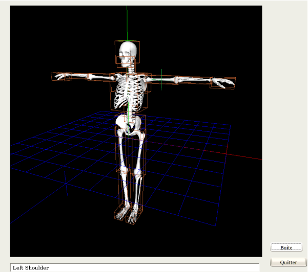
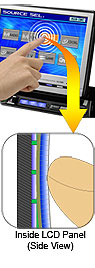
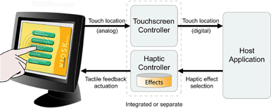

# Conclusion et perspectives

## Des dispositifs, des interactions, de l’accessibilité

Du travail réalisé pour cette thèse, nous pouvons tirer plusieurs
 enseignements quant à nos questions initiales :

* L’utilisation de la modalité haptique détient un
 réel potentiel en matière d’interaction, en général, et en matière
 d’accessibilité, en particulier ;
* concernant le potentiel d’interaction, l’abus de
 retour de force réduit les performances; pour autant, une modélisation
 dynamique de la force, permet de corriger en partie ce problème.
* les dispositifs de pointage à retour de force
 permettent d’améliorer l’accessibilité à l’information en l’absence du mode
 visuel, pour autant que l’on considère les limites de ces dispositifs (voir
 point suivant) ;
* la localisation relative, illustrée par la métaphore
 du levier de vitesse, restreint l’utilisation des dispositifs de pointage à
 retour de force à la prise de connaissance des positions, en évitant les
 informations de formes et de textures. Pourtant, sa mise en œuvre s’est
 avérée viable dans des domaines aussi varié que la géographie et la
 musique.

De plus, nous avons produit et utilisé un schéma de conception
 enseignant-élève basée sur MVC, dans un contexte Web. Les communications
 client-serveurs de ce schéma étant asynchrones (AJAX), il autorise une
 interaction continue sans re-chargement des pages.

## Pour aller plus loin...

### D’autres applications de la localisation relative

Nous pouvons imaginer d’autres utilisations à la localisation relative, en
 passant en revu quelques utilisations du formalisme XML.

* Chimie haptic : Le format de fichier CML (Chemical
 Markup Language) est l’implémentation XML de descriptions de molécules
 chimiques. Nous présentons en
 [annexe](#La feuille de style XSL pour transformer du CML en SVG) une feuille
 de style XSLT (le langage de transformation d’un formalisme XML en un autre)
 qui transforme un fichier
 CML décrivant une molécule en deux dimension, en un fichier SVG exploitable
 avec notre approche.

* Body’Haptic (figure \@ref(fig:body)): L’approche est ici plus indirecte.
 Nous avons cherché
 à appliquer à la 3D, la localisation relative. Le SVG ne serait ici d’aucun
 secours, et nous nous sommes tourné vers son équivalent en 3D : le X3D. Du
 côté périphérique, c’est toujours un dispositif de pointage qui a été
 utilisé, mais tridimensionnel : le PHANTOM de Sensable.

 Nous avons choisi comme champ d’application, l’exploration du corps
 humain. L’approche s’est encore avérée viable, mais ce sont les données
 qui sont plus difficile à obtenir. Le format X3D n’est de plus pas encore
 normalisé par le W3C, et son affichage dans un navigateur internet n’est
 possible que par l’utilisation de plugins dont le développement est plus
 ou moins avancé. Nous avons donc développé une application qui n’est pas
 en ligne pour tester, et en sommes resté à une exploration des os du
 corps humain.

* à plus long terme, les interfaces graphiques : le
 XUL de Mozilla et le XAML de Microsoft sont des applications du XML visant
 à décrire des interfaces graphiques. Nous n’avons pas plus développé dans
 ce sens; cependant, l’approche semble possible.

### D’autres dispositifs : les écrans tactiles à retour haptique

#### Motivations, justifications

Comme nous l’avons plusieurs fois noté, tout au long de ce document, nous
 avons souffert de la nature même des dispositifs que nous avons étudiés : les
 périphériques de pointage telles que la souris ou le PHANTOM.

L’idée est alors venue qu’une approche quasi magique viendrait d’un écran
 tactile disposant d’un retour de force. Écran tactile pour permettre
 l’interaction directe, avec pourquoi pas plus d’un doigt à la fois. Et la
 boucle kinesthésique serait réalisée directement sur le dispositif, et non
 pas au travers de celui-ci.

#### Réalisations industrielles récentes

La firme Alpine ^[http://www.alpine-usa.com/products/leading_technology/leading_tech_iva-d300.htm]
 a proposé un écran tactile
 disposant d’un retour tactile (figure \@ref(fig:iva2)). Le
 rôle de ce dispositif est la manipulation de l’autoradio, sans avoir
 nécessairement besoin de regarder l’écran. Cette approche reprend exactement
 notre positionnement dans le domaine de l’accessibilité. Néanmoins, le
 dispositif n’est à priori pas programmable.

La société Immersion ^[http://immr.client.shareholder.com/ReleaseDetail.cfm?ReleaseID=164236],
 conceptrice de la souris que
 nous avons utilisée a également proposé récemment un écran tactile à retour
 tactile, le TouchScreen (figure \@ref(fig:touchscreen))). La
 société immersion est déjà spécialisée dans les périphériques à retour de
 force (manettes de jeu, souris, outils chirurgicaux), et le touchscreen
 semble particulièrement adapté aux domaines de la recherche dans
 l’interaction haptique. C’est le dispositif, qui selon nous, permettrait
 d’exploiter au mieux la localisation relative, avec d’autres possibilités, en
 matière de bi-manualité notamment.

Enfin, Tactiva ^[http://tactiva.com/tactapad.html], une start-up californienne a
 proposé le tactapad (figure \@ref(fig:tactiva)). Ce dispositif
 propose la bi-manualité et le retour tactile. Néanmoins, il ne s’agit pour le
 moment que d’un prototype, non encore disponible sur le marché, et encore
 moins accessible dans un but de recherche. Il s’agit pourtant de la tentative
 la plus avancée, et la plus prometteuse en la matière.

#### Problèmes subsistants

Toutes ces tentatives n’ont pas encore montré leur potentiel. D’après les
 caractéristiques techniques, il semblerait de plus que tous ces écrans
 manquent de précision, et ceci pourrait être préjudiciable : il faudrait par
 exemple qu’ils soient capables de rendre des caractères brailles, dans un but
 d’accessibilité.

### Le mot de la fin

Au final, cette thèse illustre bien le domaine de l’interaction
 homme-machine, du fait de sa pluri-disciplinarité. Notre étude nous aura en
 effet amené à traiter des neurosciences, de génie logiciel, d’interaction
 haptique, de la problématique de l’accessibilité, des architectures logiciels
 en contexte Web avec la problématique de la communication client-serveur
 asynchrone, et enfin de la représentation des données (en passant d’une
 partition musicale à un plan d’hexagones).

>
>  Les multiples aspects de l’Interaction
>  Homme-Machine auront été à la base du plaisir que j’ai eu à travailler
>  sur cette thèse.
>

