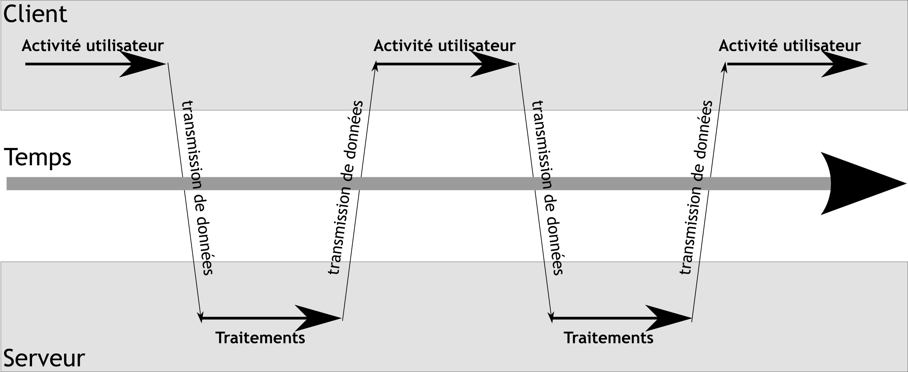

# Annexes


## La feuille de style XSL pour transformer du CML en SVG

```xslt
<xsl :stylesheet
    version="1.0"
    xmlns :xsl="http://www.w3.org/1999/XSL/Transform" >

  <xsl :output
      method="xml"
      indent="yes"
      doctype-public="-//W3C//DTD SVG 1.0//EN"
      doctype-system=
"http://www.w3.org/TR/2001
/REC-SVG-20010904/DTD/svg10.dtd"/>

  <xsl :template match="/">
    <svg
 xmlns="http://www.w3.org/2000/svg"
 viewBox ="-10 -10 20 20">
      <xsl :apply-templates/>
    </svg>
  </xsl :template>


  <!--le template pour les atomes :
      on lit les coordonnées x2, y2 et le nom a de l atome-->

  <xsl :template match="atom">
    <xsl :call-template name="coord">
      <xsl :with-param name="a"
        select="string"/>
      <xsl :with-param name="x2"
        select="float[@builtin='x2']"/>
      <xsl :with-param name="y2"
        select="float[@builtin='y2']"/>
    </xsl :call-template>
  </xsl :template>


  <!--le template pour les liaisons atomiques :
      on lit les ids des 2 atomes, et le type de de liason ord-->

  <xsl :template match="bond">
    <xsl :call-template name="makeBond">
      <xsl :with-param name="id"
        select="@id"/>
      <xsl :with-param name="id1"
        select="string[1]"/>
      <xsl :with-param name="id2"
        select="string[2]"/>
      <xsl :with-param name="ord"
        select="string[3]"/>
    </xsl :call-template>
  </xsl :template>


  <!--le template de creation d un cercle pour un atome-->

  <xsl :template name="coord">
    <xsl :param name="id">foo</xsl :param>
    <xsl :param name="a">H</xsl :param>
    <xsl :param name="x2">0</xsl :param>
    <xsl :param name="y2">0</xsl :param>
    <xsl :choose>
      <xsl :when test="$a='C'" >
 <circle id="{$id}"
  xmlns="http://www.w3.org/2000/svg"
  cx="{$x2}"
  cy="{$y2}"
  r="0.3"
  style="fill :#00F0D0;
         stroke :#000000;
         stroke-width :0.027014193;
         stroke-miterlimit :4.0000000;
         stroke-dasharray :none"/>
      </xsl :when>
      <xsl :when test="$a='N'" >
 <circle id="{$id}"
  xmlns="http://www.w3.org/2000/svg"
  cx="{$x2}"
  cy="{$y2}"
  r="0.35"
  style="fill :#F0D0D0;
         stroke :#000000;
         stroke-width :0.027014193;
         stroke-miterlimit :4.0000000;
         stroke-dasharray :none"/>
      </xsl :when>
      <xsl :when test="$a='O'" >
 <circle id="{$id}"
  xmlns="http://www.w3.org/2000/svg"
  cx="{$x2}"
  cy="{$y2}"
  r="0.4"
  style="fill :#D000F0;
         stroke :#000000;
         stroke-width :0.027014193;
         stroke-miterlimit :4.0000000;
         stroke-dasharray :none"/>
      </xsl :when>
      <xsl :when test="$a='H'" >
 <circle id="{$id}"
  xmlns="http://www.w3.org/2000/svg"
  cx="{$x2}"
  cy="{$y2}"
  r="0.05"
  style="fill :#00D0FF;
         stroke :#000000;
         stroke-width :0.027014193;
         stroke-miterlimit :4.0000000;
         stroke-dasharray :none"/>
      </xsl :when>
      <xsl :when test="$a='Na'" >
 <circle id="{$id}"
  xmlns="http://www.w3.org/2000/svg"
  cx="{$x2}"
  cy="{$y2}"
  r="0.55"
  style="fill :#D000FF;
         stroke :#000000;
         stroke-width :0.027014193;
         stroke-miterlimit :4.0000000;
         stroke-dasharray :none"/>
      </xsl :when>
      <xsl :when test="$a='Cl'" >
 <circle id="{$id}"
  xmlns="http://www.w3.org/2000/svg"
  cx="{$x2}"
  cy="{$y2}"
  r="0.85"
  style="fill :#D0FFD0;
         stroke :#000000;
         stroke-width :0.027014193;
         stroke-miterlimit :4.0000000;
         stroke-dasharray :none"/>
      </xsl :when>
      <xsl :otherwise>
 <circle id="{$id}"
  xmlns="http://www.w3.org/2000/svg"
  cx="{$x2}"
  cy="{$y2}"
  r="0.2"
  style="fill :#A0FFA0;
         stroke :#000000;
         stroke-width :0.027014193;
         stroke-miterlimit :4.0000000;
         stroke-dasharray :none"/>
      </xsl :otherwise>
    </xsl :choose>
    <text
 xmlns="http://www.w3.org/2000/svg"
 x="{$x2}"
 y="{$y2}"
 style="fill:#000;text-anchor : start;font-size :0.4pt">
      <xsl :value-of select="$a"/>
    </text>
  </xsl :template>


  <!--le template de creation
    des lignes pour les liasons-->

  <xsl :template name="makeBond">
    <xsl :param name="id">foo</xsl :param>
    <xsl :param name="id1">foo1</xsl :param>
    <xsl :param name="id2">foo2</xsl :param>
    <xsl :param name="ord">1</xsl :param>

    <!--on retrouve ici les coordonnees
   des atomes dont on connait l id-->
    <xsl :variable name="X1"
    select="//molecule
    /atomArray/atom
    [@id=$id1]/float[@builtin='x2']"/>
    <xsl :variable name="Y1"
    select="//molecule
    /atomArray/atom
    [@id=$id1]/float[@builtin='y2']"/>
    <xsl :variable name="X2"
    select="//molecule
    /atomArray/atom
    [@id=$id2]/float[@builtin='x2']"/>
    <xsl :variable name="Y2"
    select="//molecule
    /atomArray/atom
    [@id=$id2]/float[@builtin='y2']"/>


    <xsl :choose>
      <xsl :when test="$ord=1" >
 <line id="{$id}"
       xmlns="http://www.w3.org/2000/svg"
       x1="{$X1}"
       y1="{$Y1}"
       x2="{$X2}"
       y2="{$Y2}"
       style="fill :#fff;
       stroke :#000000;
       stroke-width :0.047014193;
       stroke-miterlimit :4.0000000;
       stroke-dasharray :none"/>
      </xsl :when>
      <xsl :otherwise>
 <line id="{$id}"
       xmlns="http://www.w3.org/2000/svg"
       x1="{$X1}"
       y1="{$Y1}"
       x2="{$X2}"
       y2="{$Y2}"
       style="fill :#f00;
       stroke :#000;
       stroke-width :0.167014193;
       stroke-miterlimit :4.0000000;
       stroke-dasharray :none"/>
      </xsl :otherwise>
    </xsl :choose>

  </xsl :template>

</xsl :stylesheet>


```


## Les technologies utilisées


### Pour les périphériques à retour kinesthésique


<table class="table table-bordered">

  <tbody>
    <tr>
      <th>Technologie</th>

      <th>Description</th>

      <th>Avantages</th>

      <th>Inconvénients</th>
    </tr>

    <tr>
      <td>Moteurs électromagnétiques</td>

      <td>Produit un couple grâce à 2 champs
        magnétiques créés par 2 bobines ou une bobine et un aimant.</td>

      <td>
        <ul class="itemize">
          <li class="li-itemize">Simple à contrôler</li>

          <li class="li-itemize">Propre, silencieux</li>

          <li class="li-itemize">Conception et installation facile</li>
        </ul>
      </td>

      <td>
        <ul class="itemize">
          <li class="li-itemize">Composants lourds</li>

          <li class="li-itemize">Puissance faible sur les petites
            distances</li>

          <li class="li-itemize">Dissipation de la chaleur</li>

          <li class="li-itemize">Forces statiques</li>
        </ul>
      </td>
    </tr>

    <tr>
      <td>Hydraulique</td>

      <td>Un fluide hydraulique est pressurisé
        par un générateur, contrôlé par des servo-valves et acheminé aux
        activateurs</td>

      <td>
        <ul class="itemize">
          <li class="li-itemize">Forces, puissance en sortie, rigidité et
            bande passante</li>
        </ul>
      </td>

      <td>
        <ul class="itemize">
          <li class="li-itemize">Masse importante</li>

          <li class="li-itemize">Maintenance (gestion des liquides)</li>

          <li class="li-itemize">Conception ardue</li>

          <li class="li-itemize">Prix</li>
        </ul>
      </td>
    </tr>

    <tr>
      <td>Pneumatique</td>

      <td>Un gaz (couramment de l’air) est
        pressurisé par un générateur, contrôlé par des servo-valves et
        acheminé aux activateurs</td>

      <td>
        <ul class="itemize">
          <li class="li-itemize">Force statiques</li>

          <li class="li-itemize">Assez légers</li>

          <li class="li-itemize">Maintenance assez simple</li>
        </ul>
      </td>

      <td>
        <ul class="itemize">
          <li class="li-itemize">Faible bande passante</li>

          <li class="li-itemize">Faible rigidité pour la mise en
            action</li>

          <li class="li-itemize">Faible puissance</li>
        </ul>
      </td>
    </tr>

    <tr>
      <td>Piézoélectrique</td>

      <td>Transcrit les vibrations du moteur
        piézoélectrique en forces utilisables tels que les couples ou les
        forces à basses vitesses</td>

      <td>
        <ul class="itemize">
          <li class="li-itemize">Grandes forces pour les petites vitesses,
            dans un petit volume</li>
        </ul>
      </td>

      <td>
        <ul class="itemize">
          <li class="li-itemize">Nécessite gestion ardue de la
            précision</li>

          <li class="li-itemize">Bruit gênant et potentiellement
            dangereux</li>
        </ul>
      </td>
    </tr>

    <tr>
      <td>Magnéto-restrictive</td>

      <td>Les dispositifs magnéto-restrictifs
        changent de forme sous l’effet d’un champ magnétique</td>

      <td>
        <ul class="itemize">
          <li class="li-itemize">Grandes forces pour les petites vitesses,
            dans un petit volume</li>
        </ul>
      </td>

      <td>
        <ul class="itemize">
          <li class="li-itemize">Bruit gênant et potentiellement
            dangereux</li>

          <li class="li-itemize">Dissipation de la chaleur</li>

          <li class="li-itemize">Nécessite une gestion ardue de la
            précision</li>
        </ul>
      </td>
    </tr>

    <tr>
      <td>Alliage à mémoire de forme (SMA&nbsp;:
        Shape Memory Alloy)</td>

      <td>Les fils et les ressorts de SMA se
        contractent quand ils sont chauffés et s’étendent pendant qu’ils se
        refroidissent sous l’effort</td>

      <td>
        <ul class="itemize">
          <li class="li-itemize">Bon rapport puissance/masse</li>
        </ul>
      </td>

      <td>
        <ul class="itemize">
          <li class="li-itemize">Peu efficace pendant une contraction</li>

          <li class="li-itemize">Dissipation de la chaleur</li>

          <li class="li-itemize">Bande passante limitée</li>
        </ul>
      </td>
    </tr>


  </tbody>
</table>


### Pour les périphériques à retour tactile


<table class="table table-bordered">

  <tbody>
    <tr>
      <th>Technologie</th>

      <th>Description</th>

      <th>Avantages</th>

      <th>Inconvénients</th>
    </tr>

    <tr>
      <td>Cristaux piézoélectriques</td>

      <td>Les changements du champ électrique
        provoquent la contraction et l’extension des cristaux</td>

      <td>
        <ul class="itemize">
          <li class="li-itemize">Bonne résolution spatiale</li>
        </ul>
      </td>

      <td>
        <ul class="itemize">
          <li class="li-itemize">Restreint aux fréquences sonores</li>
        </ul>
      </td>
    </tr>

    <tr>
      <td>Pneumatique</td>

      <td>
        Plusieurs formes&nbsp;:

        <ul class="itemize">
          <li class="li-itemize">jets d’air</li>

          <li class="li-itemize">anneaux d’air</li>

          <li class="li-itemize">ballons d’air</li>

          <li class="li-itemize">tableaux de ballons d’air</li>
        </ul>
      </td>

      <td>Faible masse sur la main</td>

      <td>Faibles résolutions spatiale et
        temporelle Faible bande passante</td>
    </tr>

    <tr>
      <td>Alliage à mémoire de forme</td>

      <td>Les fils et les ressorts de SMA se
        contractent quand ils sont chauffés et s’étendent pendant qu’ils se
        refroidissent sous l’effort</td>

      <td>
        <ul class="itemize">
          <li class="li-itemize">Bon rapport puissance/masse</li>
        </ul>
      </td>

      <td>
        <ul class="itemize">
          <li class="li-itemize">Dissipation de la chaleur</li>

          <li class="li-itemize">Faible efficacité pendant la
            contraction</li>
        </ul>
      </td>
    </tr>

    <tr>
      <td>Solénoïde</td>

      <td>Une bobine magnétique applique une
        force à un piston métallique</td>

      <td>
        <ul class="itemize">
          <li class="li-itemize">bande passante</li>

          <li class="li-itemize">équilibre des forces</li>
        </ul>
      </td>

      <td>
        <ul class="itemize">
          <li class="li-itemize">Non linéaire</li>

          <li class="li-itemize">nécessite un dispositif de contrôle</li>

          <li class="li-itemize">Lourd</li>
        </ul>
      </td>
    </tr>

    <tr>
      <td>Voice coil (haut-parleur)</td>

      <td>Une bobine magnétique vibre afin de
        transmettre un signal de basse amplitude et haute fréquence à une
        peau</td>

      <td>
        <ul class="itemize">
          <li class="li-itemize">Haute résolution temporelle</li>

          <li class="li-itemize">taille relativement réduite</li>
        </ul>
      </td>

      <td>
        <ul class="itemize">
          <li class="li-itemize">Faible résolution spatiale</li>

          <li class="li-itemize">Taille du dispositif peu flexible</li>
        </ul>
      </td>
    </tr>

    <tr>
      <td>Pompe à chaleur</td>

      <td>Dispositif semi-conducteur qui déplace
        l’énergie thermique pour chauffer ou refroidir la peau</td>

      <td>
        <ul class="itemize">
          <li class="li-itemize">pas de matière fluide à utiliser</li>
        </ul>
      </td>

      <td>
        <ul class="itemize">
          <li class="li-itemize">Faibles résolutions spatiale et
            temporelle</li>

          <li class="li-itemize">Encombrant</li>

          <li class="li-itemize">Faible bande passante</li>
        </ul>
      </td>
    </tr>

  </tbody>
</table>


## Le PHANTOM


C’est le périphérique le plus populaire sur le marché, utilisé par de
 nombreux laboratoires dans le cadre de la recherche sur l’interaction
 haptique. Il est décliné en 6 versions que nous allons détailler dans le
 tableau \@ref(tab:phantoms).

Table: (\#tab:phantoms) La gamme des PHANTOMs

| |
|-|

<table class="table table-bordered">

  <tbody>
    <tr>
      <th>&nbsp;</th>

      <th>Modèle</th>

      <th>Degrés de liberté (in/out)</th>

      <th>Espace de travail (H x L x P)</th>

      <th>Forces (en pic / continues)</th>
    </tr>

    <tr>
      <td></td>

      <td>Premium 1.0</td>

      <td>6/3</td>

      <td>18 x 25 x 13 cm</td>

      <td>8.5 / 1.4 N</td>
    </tr>

    <tr>
      <td></td>

      <td>Premium 1.5</td>

      <td>6/3</td>

      <td>27 x 37.5 x 19.5 cm</td>

      <td>8.5 / 8.5 / 1.4 N</td>
    </tr>

    <tr>
      <td></td>

      <td>Premium 3.0</td>

      <td>6/3</td>

      <td>59 x 84 x 41 cm</td>

      <td>22 / 3 N</td>
    </tr>

    <tr>
      <td></td>

      <td>6 DoF</td>

      <td>6/6</td>

      <td>16 x 13 x 13 cm</td>

      <td>8.5 / 1.4 N</td>
    </tr>

    <tr>
      <td></td>

      <td>Desktop</td>

      <td>6/3</td>

      <td>12 x 16 x 7 cm</td>

      <td>6.4 / 1.7 N</td>
    </tr>

    <tr>
      <td></td>

      <td>Omni</td>

      <td>6/3</td>

      <td>&nbsp;</td>

      <td>3.3 / 0.88 N</td>
    </tr>


  </tbody>
</table>


## La *Web Accessibility Initiative* (WAI) du *World Wide Web Consortium* (W3C) {#accessibilite}


Le *World Wide Web Consortium*, abrégé W3C^[http://www.w3.org], est un
 consortium fondé en octobre 1994 pour promouvoir la compatibilité des
 technologies du *World Wide Web* telles que HTML, XHTML, XML, CSS,
 PNG, SVG et SOAP. Le W3C n’émet pas des normes, mais des recommandations.


Le consortium laisse le soin aux fabricants de suivre les recommandations.
 Contrairement à l’Organisation internationale de normalisation ou d’autres
 corps internationaux de standardisation, le W3C ne possède pas de programme
 de certification, et beaucoup de standards ne définissent pas formellement un
 niveau de conformité. Ils sont ainsi souvent implantés partiellement.


Concernant l’accessibilité, le W3C a créé des recommandations à travers le
 projet WAI (*Web Accessibility Initiative*) en 1996. Ces
 recommandations s’adressent à tous les distributeurs de contenu numérique par
 Internet : navigateurs, documents HTML, logiciels d’édition de HTML, logiciel
 du publication de site Web créant le code HTML.


Les recommandations de la WAI actuellement en vigueur sont :


* les *Authoring Tool Accessibility Guidelines*
 (ATAG) qui posent les règles d’accessibilité pour les outils d’édition :


>
>  Cette spécification fournit les règles pour les développeurs d’éditeurs
>  Web. Elle a deux objectifs :
>
>
> 	+ assister les développeurs dans la conception
> 	 des outils d’édition qui permettent de produire un contenu web
> 	 accessible;
> 	+ assister les développeurs dans la création
> 	 d’interface d’édition accessible.Les outils d’édition peuvent rendre possible, encourager et
>  assister les utilisateurs ("auteurs") dans la création d’un contenu Web
>  accessible à travers des messages d’invité et d’alerte, des fonctions
>  de vérification et de correction, des fichiers d’aides et des outils
>  automatisés. Il est aussi important que toutes personnes puissent
>  rédiger du contenu autant qu’elle puissent accéder à celui-ci. Par
>  conséquent, les outils utilisés pour créer cette information doivent
>  être eux-même accessibles. L’adoption de ces règles contribuera à la
>  prolifération d’un contenu Web qui pourra être lu par une plus large
>  proportion de lecteurs et à la prolifération d’outil d’édition qui
>  pourront être utilisés par une plus large proportion d’auteurs.
> ^[tiré de http://www.la-grange.net/w3c/atag10/]
>
* les *Web Content Accessibility Guidelines*
 (WCAG) montrent comment rendre un site web accessible^[tiré de
 http://www.la-grange.net/w3c/WAI-WEBCONTENT-TECHS/]
* les *User Agent Accessibility Guidelines*
 (UAAG), enfin, posent les règles pour l’accessibilité des agents
 utilisateurs.
	1. Les composants logiciels et la documentation
	 qui ensemble se conforment aux conditions requises par ce document.
	 C’est l’utilisation la plus courante du terme dans ce document et c’est
	 celle trouvée dans les points de contrôle ;
	2. Tout logiciel qui récupère et restitue un
	 contenu Web pour les utilisateurs. Cela peut comprendre les navigateurs
	 Web, les lecteurs de média, les modules d’extension et d’autres
	 programmes ( y compris les technologies d’assistance ) qui participent
	 à la récupération et la restitution d’un contenu Web.^[tiré de
 http://www.yoyodesign.org/doc/w3c/uaag/cover.html]


## Asynchronous Javascript and XML : AJAX {#ajax}


Classiquement, les applications Web permettent aux utilisateurs
 d’effectuer des choix (suivre un lien, remplir et valider un formulaire). Une
 requête est alors envoyée au serveur HTTP, qui agit en fonction de l’action
 et des données reçues, et retourne une nouvelle page (figure \@ref(fig:ajax1)).
 Ce fonctionnement consomme inutilement une partie de la
 bande passante, une grande partie du code (X)HTML étant commune aux
 différentes pages de l’application. Et parce qu’une requête au serveur HTTP
 doit être réalisée à chaque interaction avec l’application, le temps de
 réponse de l’application dépend fortement du temps de réponse du serveur
 HTTP. Cela conduit à des interfaces utilisateurs plus lentes que leurs
 équivalents natives.




Les applications utilisant les techniques AJAX quant à elles peuvent
 envoyer des requêtes au serveur HTTP pour récupérer uniquement les données
 nécessaires en utilisant la requête HTTP XMLHttpRequest. Les applications
 sont alors plus réactives, la quantité de données échangées entre le
 navigateur et le serveur HTTP étant fortement réduite. Le temps de traitement
 de la requête côté serveur est également légèrement réduit, une partie du
 traitement étant réalisé sur l’ordinateur d’où provient la requête
 (figure \@ref(fig:ajax2)).


